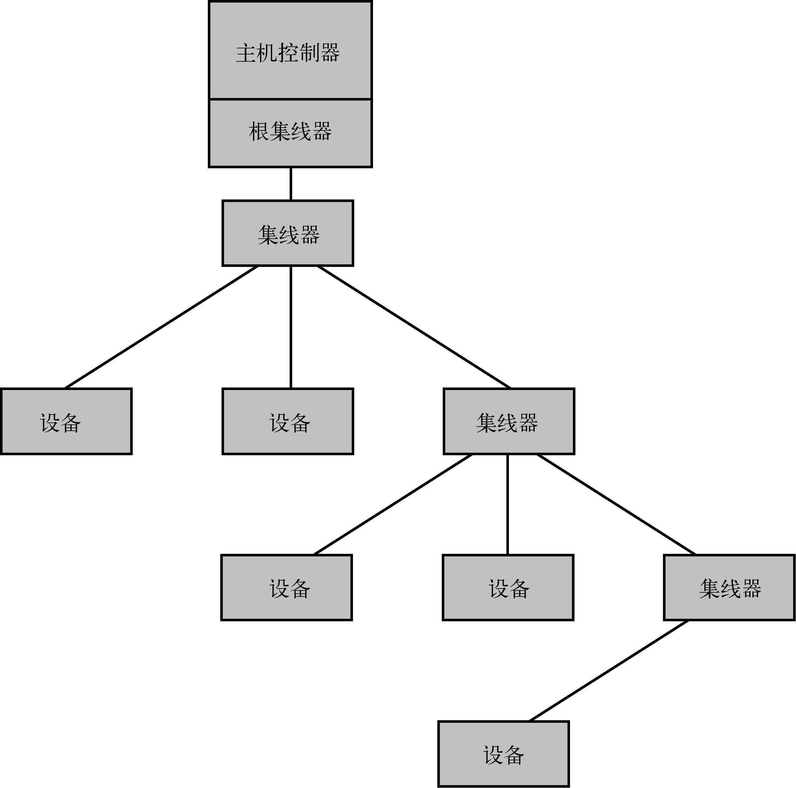

### 18.1.1　USB的物理拓扑结构

USB采用主/从（master/slave）式的总线拓扑结构。每条USB总线上只有一个主设备（master），它被称为主机控制器（host controller）。图18-1说明了基本的拓扑结构。

<b class="my_markdown">图18-1　简单的USB拓扑结构</b>

主机控制器总是和根集线器（root hub）相关联。根集线器提供了到主机控制器的附着点，并且在USB拓扑结构的顶部提供了集线器的功能。最常见的安排方式是主机控制器和根集线器组合在一起（通过一个收发器芯片）直接连接至板卡边缘的连接器，也就是最终用户看到的连接器。

图18-1中显示的设备（device）代表端点——插入USB集线器的物理USB装置。一个设备可能支持几种功能（function），比如一个提供输入输出功能的音频接口。这里的重点是每个USB设备只会插入到唯一一个集线器中，在拓扑结构中它位于USB设备的上游。

主机控制器会以查询方式来控制USB总线上的设备。某个时刻只有一个设备能够在总线上通信，而具体选择哪个设备是由主机控制器决定的。USB规范中还规定了一种机制，它可以专门分配一部分带宽给某个设备中的一个特定功能。

USB最有用的特性之一是支持动态热插拔，设备可以随时插入USB总线中。当USB设备出现在拓扑结构中时，计算机上的软件（这里当然指Linux）负责配置它们，而计算机中包含了主机控制器。

