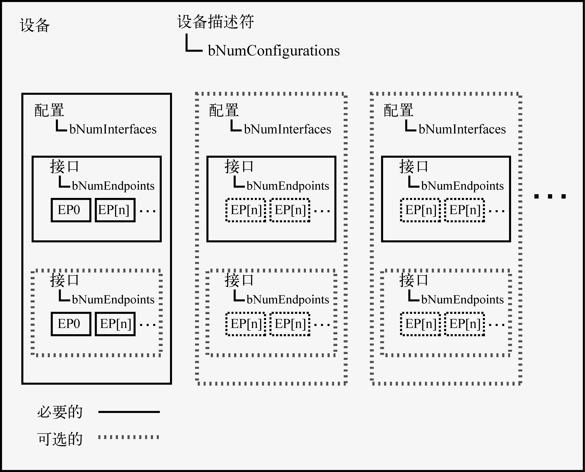

### 18.1.2　USB的逻辑拓扑结构

为了更好地理解USB系统中的软件组件和数据流，我们需要理解USB的逻辑拓扑结构。图18-2显示了一个假想的USB设备的逻辑组成。

<b class="my_markdown">图18-2　USB设备的功能框图</b>

每个USB设备都包含许多描述符<a class="my_markdown" href="['#anchor181']">[1]</a>，它们允许软件了解设备的能力并配置其功能。每个设备必须有一个设备描述符，其中包含的信息有厂商（ `idVendor` ）、产品（ `idProduct` ）、序列号（ `iSerialNumber` ）和配置数目（ `bNumConfigurations` ）。括号中的标识符都是USB 2.0规范中实际使用的字段名称。

<a class="my_markdown" href="['#ac181']">[1]</a>　第9章（涉及USB 2.0规范）讲述了这些描述符，请参考本章末尾的文献。

设备描述符中的每个配置都有一个配置描述符。配置描述符中包含了每个配置可用的接口数目（ `bNumInterfaces` ）和该配置在运行时需要的最大功耗（ `bMaxPower` ）。最常见的情况是一个USB设备只包含一个单独的配置。不过，有些设备可能有高功耗和低功耗两种模式，或者一个设备上可能包含多个不同的功能，这类设备就会包含多个配置。例如，如果将iPod插入电脑的USB接口中，可以看到它包含了多个配置，接口和端点！

配置描述符中的每个接口有一个接口描述符。接口描述符中有一个字段指定了它所包含的端点数目（ `bNumEndpoints` ）。这个数目不包括端点0，端点0默认总是存在的。接口描述符中还包含了USB规范定义的接口类型、子类型和协议等信息。

在USB设备运行的过程中，USB端点是实际与软件进行通信的逻辑组件。接口描述符中的每个端点（除了端口0以外）都有一个端点描述符。端点描述符定义了端点的通信参数，包括端点地址和各种端点属性，它们描述了每个端点传输数据的特点。

在这一章的后面部分我们将会介绍一个实用工具lsusb，它能够读取设备中的这些描述符。

USB规范中包含了更多详细信息，请参考本章末尾的文献。

