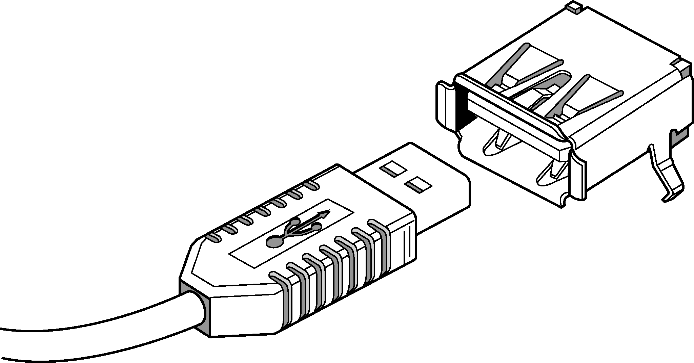
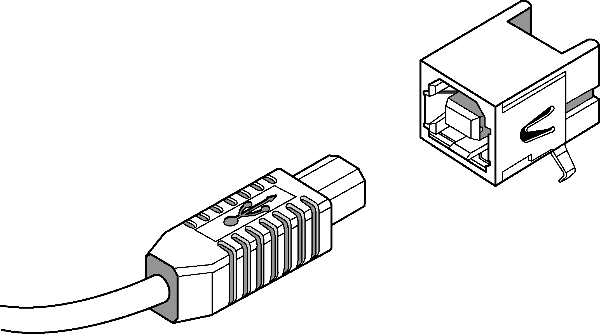

### 18.1.4　USB连接器

除非你是一位USB方面的专家，否则各种各样的USB连接器和线缆配置会让你感到困惑。原始USB规范中定义的USB A型连接器是我们最熟悉的一种，这种长方形开口的连接器常见于笔记本电脑和台式机上。USB A型连接器的插头总是指向拓扑结构的上游，向着主机控制器/根集线器。图18-3显示了一个标准的USB A型连接器（插头和插座）。

<b class="my_markdown">图18-3　USB A型连接器</b>

外围设备（比如打印机或扫描仪）通常有一个USB B型插座，可以将USB B型插头插入其中，这种类型的USB连接器也是由原始的USB规范定义的。连接主机（比如PC）和外设（比如打印机）的USB线缆的两头分别是A型插头和B型插头。B型插头比A型插头要窄，而且它的开口形状不是长方形的，而是像英文字母D。USB B型连接器的插头总是指向拓扑结构的下游，或者说是远离主机控制器/根集线器。图18-4显示了一个USB B型连接器（插头和插座）。

<b class="my_markdown">图18-4　USB B型连接器</b>

除了以上介绍的标准连接器之外，还有一些小型的USB连接器，用于连接较小的设备（比如手机和PDA）。其中，USB Mini-A型连接器虽然还在使用，但它已经被USB规范废弃了，而Mini-B型连接器则广泛使用于小型外设上。

Micro-USB规范还定义了另外3种连接器——Micro-B型插头和插座、Micro-AB型插座和Micro-A型插头。Micro-AB型插座只用于USB OTG（On-The-Go）设备，后面我们会讨论它。

下面总结一下标准的A型和B型连接器，A型插座总是位于主机一侧（A型插头总是指向上游），而B型插座总是位于外设一侧（B型插头总是指向下游）。表18-1总结了这些连接器的特点。

<b class="my_markdown">表18-1　USB连接器小结</b>

| 连接器 | 插头 | 插座 |
| :-----  | :-----  | :-----  | :-----  | :-----  |
| A系列 | 指向主机（或集线器） | 作为主机（或集线器）的输出 |
| B系列 | 指向外设 | 作为外设（或集线器）的输入 |

