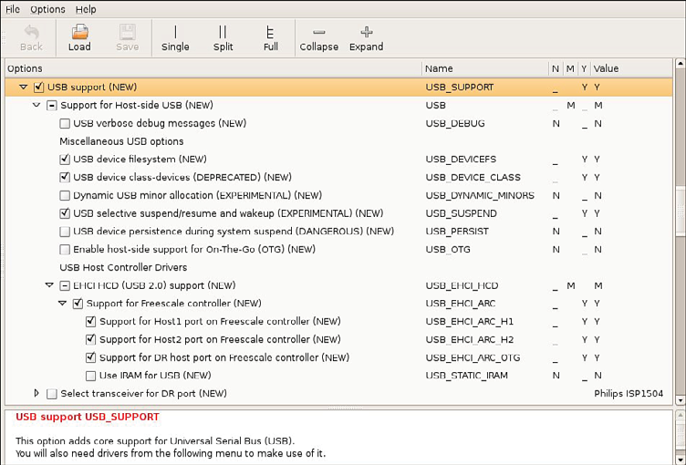
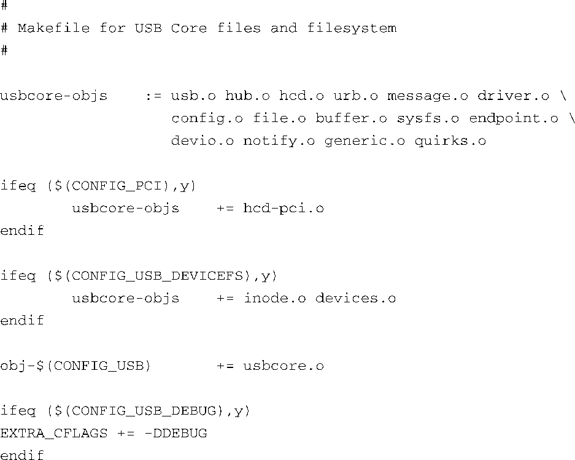
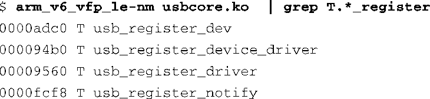
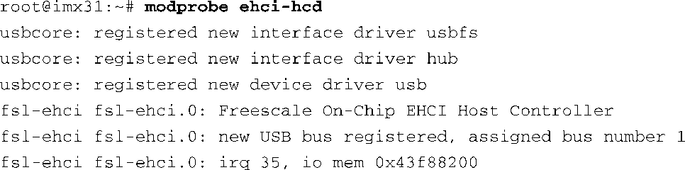
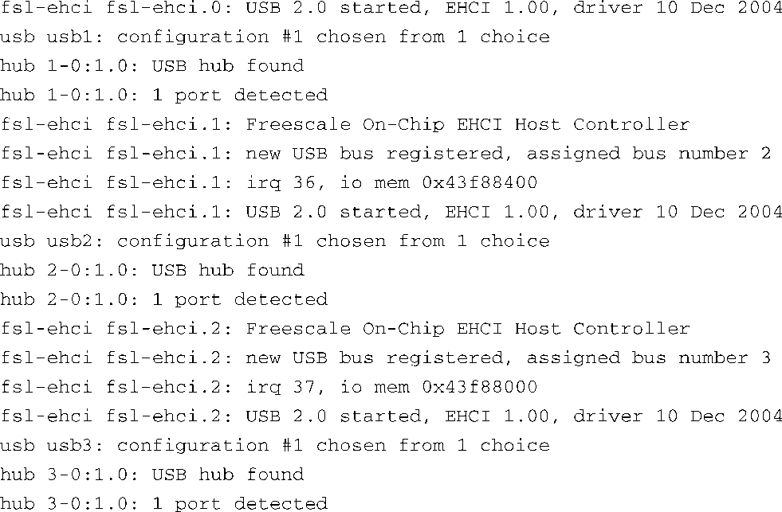

### 18.2　配置USB

USB并不是Linux内核的核心功能，相反，它是一个可选功能，所以必须在内核配置中开启它。和其他大多数辅助功能一样，USB可以被编译到内核镜像中或是被配置为可加载模块，以便于动态加载进内核。在下面的讨论中，我们将使用可加载模块，因为这种方式能够帮助我们看清楚某个特定功能所需的组件。

正确配置USB的一个难点就在于内核配置中关于USB的选项非常多。在一个最新的被配置为allmodconfig<a class="my_markdown" href="['#anchor184']"><sup class="my_markdown">[4]</sup></a>的内核中，差不多有300个与USB相关的设备驱动模块（*.ko文件）。当然，这些设备驱动主要是针对特定的USB设备的，但通过浏览USB的配置选项，我们可以发现掌握一些窍门显然是很有用的！

<a class="my_markdown" href="['#ac184']">[4]</a>　这是Linux内核makefile中的一个make目标，它会尽可能地以模块方式构建每项功能，通常用于测试。

在下面的例子中，我们将研究i.MX31 PDK开发平台中的i.MX31应用处理器（由飞思卡尔半导体公司出品）。这个平台很有趣，因为它包含3个主机控制器，而且可以配置为各种操作模式。

图18-5显示了Linux内核配置中的部分USB配置选项，这是针对ARM架构和飞思卡尔半导体公司的i.MX31 PDK参考平台而配置的。


<center class="my_markdown"><b class="my_markdown">图18-5　i.MX31的部分USB配置选项</b></center>

上图中只显示了最开始的一部分选项，还有很多配置选项没有能够显示在这里。必须首先选择 `USB_SUPPORT` 才能看到更多的USB配置选项。注意，USB被配置为M（模块），这意味着内核构建系统会把USB驱动编译成可加载模块。

现在让我们看一看i.MX31最少需要哪些配置选项才能让USB正常工作。所有的USB配置都需要一个名为 `usbcore.ko` 的模块。选择 `CONFIG_USB` 时<a class="my_markdown" href="['#anchor185']"><sup class="my_markdown">[5]</sup></a>，该模块会自动被选上。只需要看一下用于支持核心USB驱动的makefile文件就清楚了，文件内容如代码清单18-1所示。这个makfile的具体路径是.../drivers/usb/core/Makefile<a href="#anchor186" id="ac186"><sup>[6]</sup></a>。

代码清单18-1　针对USB Core的Makefile



<a class="my_markdown" href="['#ac185']">[5]</a>　回顾一下前面几章内容，你会发现实际的配置变量都是以 `CONFIG_` 开头的，但在内核配置工具的GUI（图形用户界面）中它们被省略了。例如，图18-3中的 `USB_SUPPORT` 实际上会转换为内核配置文件.config中的 `CONFIG_USB_SUPPORT` 。

<a class="my_markdown" href="['#ac186']">[6]</a>　回忆一下，这里的省略号代表内核源码的顶层目录。

如果想要了解系统需要哪些功能组件，或相反——某个具体功能需要哪些配置选项，一个屡试不爽的方法是查看内核构建系统中的各种makefile文件。例如，在代码清单18-1中，可以看到我们需要开启 `CONFIG_USB` 才能将 `usbcore` 包含在构建中。正如我们在第4章中所了解到的，如果 `CONFIG_USB` 被设置为 `m` ，这个设备驱动会被编译成可加载模块并提供USB 主机功能。

```c
obj-$(CONFIG_USB) += usbcore.o
```

### USB初始化

启动了i.MX31之后，我们可以使用以下命令加载 `usbcore` 模块：


`usbcore` 是USB子系统的核心模块，它实现了众多USB驱动程序的通用功能，包括注册和去注册各种组件，同时还提供了用于驱动USB硬件的接口。这就大大降低了编写USB硬件驱动的复杂度。可以通过交叉版本的nm工具来查看这个模块中的公共符号。第13章已讲述了nm实用程序。下面就是一个使用交叉nm来显示模块中有关USB注册函数的例子：



`usbcore` 还包含缓冲区处理功能，对usbfs和hub class驱动的支持以及很多其他与底层USB控制器通信的功能。

usbcore本身的用处不是很大。它不包含任何底层的主机控制器驱动。这些驱动都是独立的模块，它们的功能随着具体硬件的不同而各有差异。以BeagleBoard开发板为例，它包含一块德州仪器OMAP3530应用处理器，其中有一个内置的双重角色（dual-role）<a class="my_markdown" href="['#anchor187']"><sup class="my_markdown">[7]</sup></a>控制器。这个控制器是Inventra™USB高速双重角色控制器，针对这个主机控制器的驱动程序被称为musb_hdrc。

<a class="my_markdown" href="['#ac187']">[7]</a>　双重角色控制器能够充当USB主机或USB外设，而且能够在运行时在这两种功能之间切换。你很快就会了解到，这被称为USB On-The-Go（OTG）。

很多平台上的USB主机控制器都是按照EHCI（Enhanced Host Controller Interface，增强主机控制器接口）规范<a class="my_markdown" href="['#anchor188']"><sup class="my_markdown">[8]</sup></a>设计的，这个规范为工业级USB主机控制器定义了寄存器级别的接口。在这种情况下，当驱动被编译成可加载模块时，它的名称为ehci-hcd.ko。下面我们在飞思卡尔i.MX31参考板上加载这个驱动，并观察输出信息，如代码清单18-2所示。

代码清单18-2　在i.MX31上安装USB主机控制器驱动






<a class="my_markdown" href="['#ac188']">[8]</a>　请参考本章末尾列出的EHCI规范。

这里有很多有用的信息。注意，我们已经事先设置了控制台的日志级别，以便这些消息能够显示在控制台上。首先，我们看到了 `usbcore` 的注册函数在起作用。一共有3条注册消息，分别注册了usbfs接口驱动，hub接口驱动和EHCI（usb主机模式）驱动本身。你很快就会了解usbfs。

接着，我们看到有3个主机控制器正在被初始化。回顾一下，飞思卡尔i.MX31应用处理器中包含3个独立的USB控制器。我们看到这些控制器分别被枚举为fsl-ehci.0、fsl-ehci.1和fsl-ehci.2。还可以看到系统为每个USB控制器分配的中断（IRQ）号和寄存器阵列（register bank）的基地址。注意，在每次设备枚举的过程中，根集线器都会被枚举。根集线器是USB体系结构的基本组成部分，而且总是和主机控制器相关联。它是将外围设备（集线器或其他USB设备）连接到主机控制器必需的一个组件。

值得注意的是，这里我们不需要单独安装 `usbcore` （本节开始时我们也没有安装），因为modprobe能够理解和确定某个模块的依赖关系，只需执行以下命令即可：


这条命令会在加载ehci-hcd驱动之前先加载它所依赖的 `usbcore` 。我们在第8章中讲述过这个机制。实际上，在很多使用udev系统的平台中，这些步骤都是由udev自动完成的。我们会在第19章中讲述udev。

