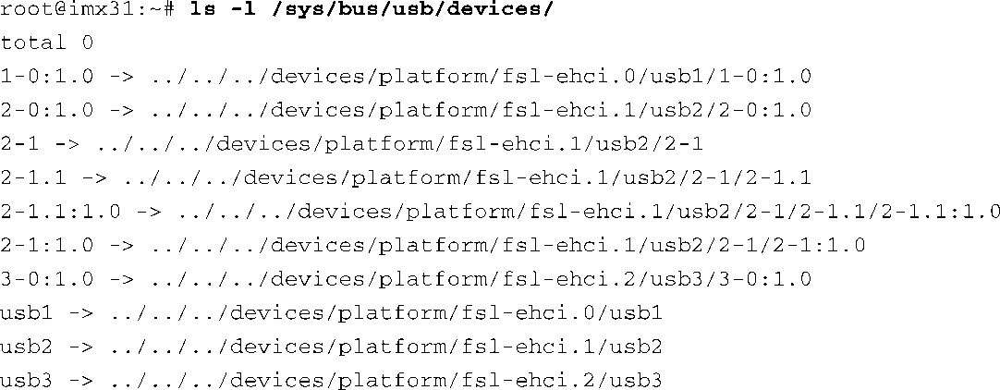
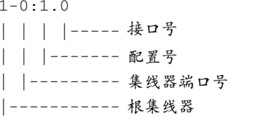

### 18.3　sysfs和USB设备命名

第9章介绍过，从根本上说，sysfs文件系统是描述内核对象（ `kobject` ）的一个视图。每个USB设备在sysfs中都有对应的代表，它们位于目录/sys/bus/usb/devices中。代码清单18-3显示了在飞思卡尔i.MX31 PDK参考板上显示的该目录的内容。注意，为了适应页面宽度，我已经调整了 `ls -l` 命令的输出格式，删除了文件名以外的列。

代码清单18-3　i.MX31上的/sys/bus/usb/devices目录

目录/sys/bus/usb/devices中的所有条目都是链接，指向sysfs层次结构的其他位置。注意其中的数字式名称，比如 `1-0:1.0` 。在这种命名方式中，第一个数字代表根集线器，或这个特定总线上的USB层次结构的顶层。第二个数字代表该设备连接的集线器端口号。第三个数字（冒号后的那个数字）代表USB设备的配置数目，最后的数字是设备的接口数目。正如18.1.2节所讲述的，配置和接口都是USB设备的逻辑组成部分。

命名方式总结如下：

如果有其他集线器被添加到了拓扑结构中，设备名称中的集线器端口号之后会多出一个点号（ `.` ），表示这个新集线器连接到了上游集线器的某个端口中。例如，如果我们在刚才显示的拓扑结构中添加一个集线器，设备名称会变为1-0.2:1.0。这里假设我们添加了一个下游的集线器，它至少包含两个端口，而且设备被插入到2号端口中。

目录/sys/bus/usb/devices中的每个链接都指向一个目录，查看一下目录的内容，你就可以确定链接所引用的具体组件。例如，在代码清单18-3中，通过查看第一个条目（符号链接1-0:1.0）所指向的目录中的文件（也被称作 `sysfs` 属性），你可以判断出它代表一个逻辑上的USB接口。这个目录中包含了接口描述符的一些属性，比如 `bInterfaceNumber` 和 `bNumEndpoints` ，它们都是USB 2.0接口描述符中的成员。代码清单18-3中的前两个条目代表接口，分别与飞思卡尔i.MX31处理器中的两个内部USB控制器/根集线器相关联。

代码清单18-3中的第三个条目代表一个连接至第二条USB总线的外部集线器。具体来说，它代表了这个集线器的 `struct usb_device` 结构体。

代码清单18-3中以usb开头的3个条目代表总线本身。你可以看到这个系统有3条总线，因为飞思卡尔i.MX31处理器中包含3个USB控制器。名称中usb后面的数字代表总线号，USB总线是从1开始计数的。

作为总结，下面列举了几个例子。

+ `3-0:1.0` 代表一个连接至3号总线的接口（ `struct usb_interface` ）。这是3号总线的根集线器接口。
+ `2-1` 代表一个设备（ `struct usb_device` ）。在这个例子的配置中，它是一个连接至2号总线根集线器的外部集线器。
+ `2-1.3` 代表一个位于设备2-1下游的设备（ `struct usb_device` ），它连接至集线器的3号端口。
+ `usb2` 代表一条USB总线，编号为2（也是一个 `struct usb_device` ）。
+ `2-1.3.4:1.0` 代表一个运行于配置1的接口（作者的iPod），连接至上游集线器的4号端口，而这个集线器又连接到更上游集线器的3号端口，它又连接至2号总线的根集线器！

