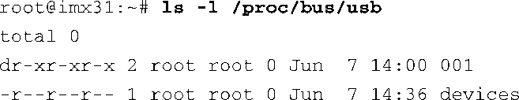
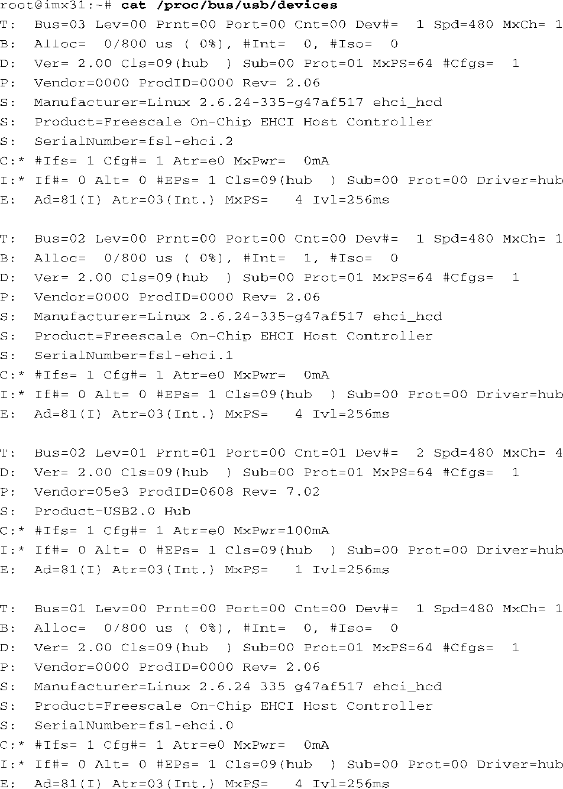

### 18.4.1　USB文件系统

USB文件系统（USBFS）是另一种虚拟文件系统，需要先挂载它才能使用。有些Linux系统会自动挂载USBFS，但也有很多不会自动挂载。要使用USBFS，必须在内核配置中开启它。在内核配置的USB Support菜单下选择CONFIG_USB_DEVICEFS。注意，这个系统已经被淘汰了，但最新的Linux内核中仍然包含它，它也有助于理解USB系统的配置。因为有几个工具依赖它，所以它还会存在一段时间。

在内核配置中开启USB_DEVICEFS（大多数Linux发行版会默认开启这个选项）之后，在使用这个虚拟文件系统之前，必须挂载它：

以上命令执行完毕之后，应该可以查看文件系统的内容了，类似代码清单18-4。

代码清单18-4　目录列表: /proc/bus/usb

USBFS被挂载之后，可以从中读取USB拓扑结构中的设备列表，如代码清单18-5所示。

代码清单18-5　读取文件/proc/bus/usb/devices

这里输出信息的格式是在内核源码树的以下文档中定义的：.../Documentation/usb/proc_ usb_info.txt。总的来说，每个T行描述一种新的USB设备，T代表拓扑。T行中包含的其他信息可用于建立当前USB总线的拓扑结构图。每个T行按顺序包含以下信息：总线号（Bus）、拓扑结构中的层次（Lev）、父层次设备（Prnt）、连接到父设备的端口（Port）、这一层次中的设备数目（Cnt）、设备号（Dev#）、速率（Spd）和子设备的最大个数（MxCh）。

其他行分别描述了带宽需求（ `B:` ）、设备描述符（ `D:` ）、产品ID（ `P:` ）、设备的字符串描述（ `S:` ）、配置描述符（ `C:` ）、接口描述符（ `I:` ）和端点描述符（ `E:` ）。

