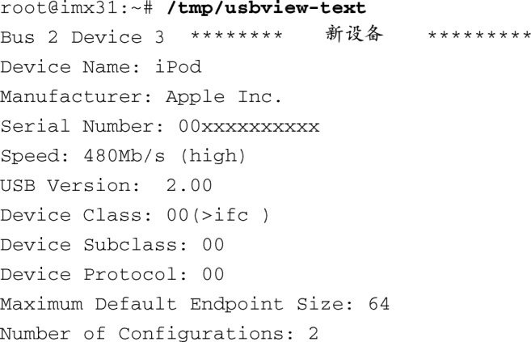
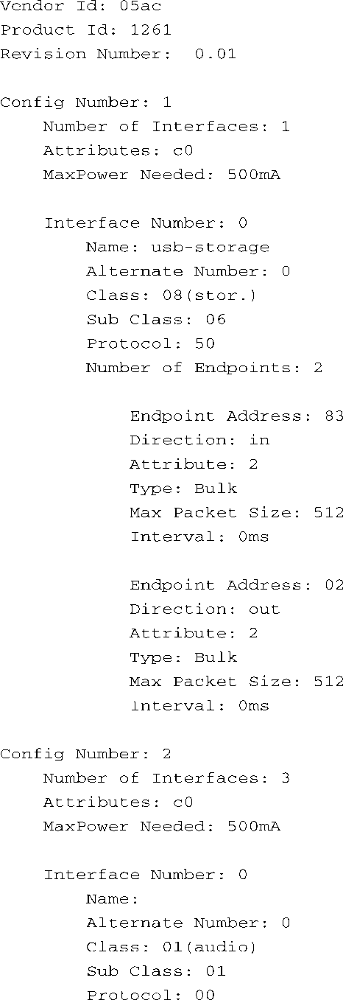
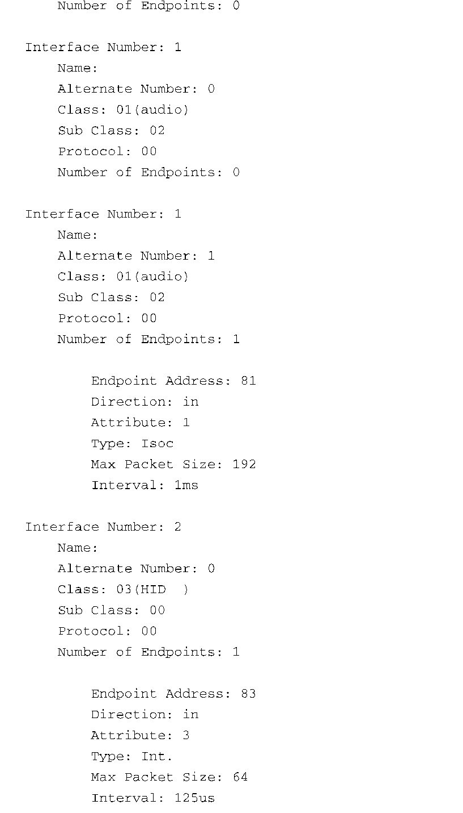

### 18.4.2　使用usbview

利用这些信息的最佳途径是使用它们来构建一个总线拓扑结构图。为此，Greg Kroah-Hartman 编写了一个usbview程序（目前在许多Linux发行版上还可用）。这个程序使用GTK程序库图形化地显示出USB总线的拓扑结构，而其中的拓扑信息则是从usbfs文件系统中获取的。我对这个程序作了修改，去掉了其中的GTK部分，以便它能够以文本模式运行在没有图形界面的嵌入式系统上。可以在本书的配套网站上找到这个程序，搜索usbview-text即可。

代码清单18-6显示了在飞思卡尔i.MX31上运行usbview-text时的输出信息。由于篇幅关系，这里只显示了一种设备（作者的iPod）的信息。这个设备包含多个配置并且说明了我们之前介绍的很多概念。

代码清单18-6　usbview-text的输出

这里列出了iPod中各种描述符（设备、配置、接口和端点描述符）的信息。首先要注意的是它包含两个配置——分别代表大容量存储设备和音频录放设备。

配置1包含1个接口，其中有两个端点，它们都用于批量数据传输，每个方向一个端点。这些端点用于读取和存储设备内部闪存中的数据。

配置2包含3个接口。接口0中没有端点。接口1包含一个等时（isochronous）类型的端点。这种端点传输类型常用于实时数据（比如音频或视频）的连续播放，这类数据会占用预先定义的一段带宽。接口2包含一个中断（interrupt）类型的端点。这种端点传输类型常用于及时而可靠地传输数据，比如来自鼠标或键盘的输入数据。

