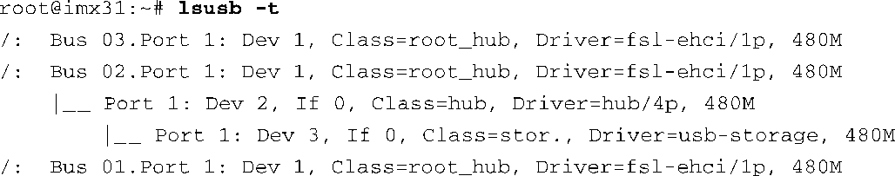

### 18.4.3　USB 实用程序（lsusb）

usbutils软件包中有一个名为lsusb的实用程序，它提供了类似lspci的功能。因为lsusb使用了libusb，所以在使用lsusb之前必须首先确保系统中有libusb。检查一下你的嵌入式Linux发行版并确保其中包含这两个软件包（这是必须要做的）。

lsusb能够枚举系统中的所有USB总线并显示总线上每个设备的信息。将 `-t` 选项传递给lsusb，就可以显示出物理总线的拓扑结构，如代码清单18-7所示。

代码清单18-7　USB总线的物理拓扑结构

这里可以看到i.MX31的3条总线，有一个集线器插在第二条总线中，而作者的iPod又插在这个集线器的1号端口中。

还可以显示所有设备或单个设备的描述符：

以上命令显示了2号总线上的3号设备。在命令行中加上 `-v` 选项会显示出设备的所有描述符信息。如果你有一部iPod，可以尝试一下，lsusb的输出信息会很有趣，因为它有两种配置以及多个接口和端点。

