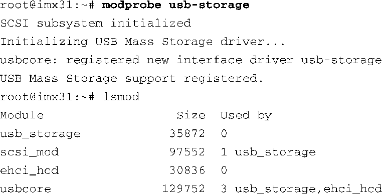
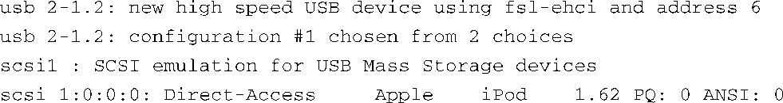
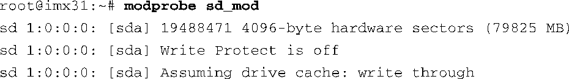
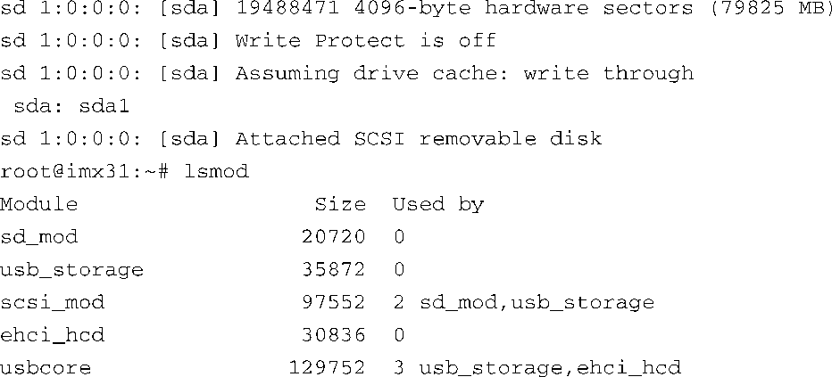
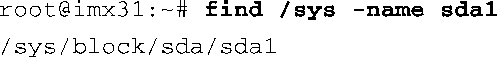
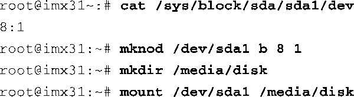
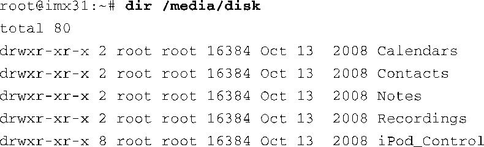

### 18.5.1　USB大容量存储类

USB大容量存储类可能是嵌入式系统中最主要的USB“类”（也可以叫子系统）。它能够驱动外部USB闪存驱动器（U盘）和其他一些带有内部存储功能的外围设备，以及高速移动硬盘（比如西部数据的My Book™）。必须在内核中配置USB存储。USB存储有一个比较令人费解的方面，那就是它需要SCSI子系统的支持。实际上，对最新的内核，当你选择支持USB大容量存储时，CONFIG_SCSI和CONFIG_BLK_DEV_HD都会自动被选上。

和往常一样，可以将这些模块静态编译到内核中或是配置为动态可加载的模块。我们将在下面的例子中使用模块，因为这种方式能够说明系统正常工作所需要的组件和相应的配置。当然，现在你应该知道 `usbcore` 和 `ehci-hcd` 是两个必需的模块，它们是USB驱动的基础。（注意，这里假设我们在这些例子中继续使用飞思卡尔i.MX31应用处理器。其他参考板可能需要不同的主机控制器驱动，例如，BeagleBoard开发板使用的是musb_hdrc。）

为了识别USB存储类，需要加载usb_storage驱动。不过，这个驱动依赖scsi_mod，所以也需要加载它。如果系统配置正确，加载usb_storage时，modprobe应该能够检测出模块的依赖关系并自动加载scsi_mod。这些模块间的依赖关系是在文件modules.dep中描述的，它的完整路径是/lib/modules/、uname –r、/modules.dep。只需要在这个文件中搜索usb-storage就可以找到它的依赖关系。

现在让我们看看加载usb-storage的情况，代码清单18-8显示了结果。

代码清单18-8　usb-storage依赖的模块

现在将一个USB存储设备插入某个集线器端口中，usb-storage驱动就会检测到一个 `usb_storage` 设备：

然而，要想访问USB存储设备上的分区，我们还需要其他驱动。这就是SCSI模拟层发挥作用的地方。sd_mod驱动负责管理SCSI磁盘设备。加载这个模块后，它会枚举USB存储设备中的“磁盘设备”，以及设备上的所有分区。代码清单18-9显示了结果。

代码清单18-9　加载sd_mod驱动

现在万事俱备，可以挂载磁盘分区并访问其中的内容了。从代码清单18-9中可以看到USB存储设备上的唯一分区被枚举为sda1。假设我们有一个设备节点/dev/sda1，而且内核支持这种文件系统类型，我们现在就可以挂载这个设备：

如果嵌入式设备中安装和配置了udev，所有设备节点的创建工作都会由它自动完成。下一章会详细介绍udev。出于完整性考虑，我们看一下在没有udev的情况下如何创建设备节点。sysfs文件系统中包含一个与sda1对应的条目：

这个sysfs条目（目录）中包含一个名为 `dev` 的属性（文件）。这个属性列出了内核分配给/dev/sda1的主设备号和次设备号。在飞思卡尔i.MX31参考板上，内核为它分配的主设备号是8，次设备号是1。我们先使用这一信息创建设备节点，然后就能挂载并访问分区内容了。代码清单18-10显示了最终结果。

代码清单18-10　创建设备节点并挂载SD设备

第8章详细讲述了mknod。

