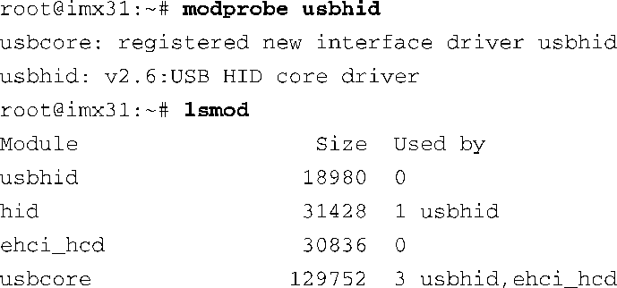
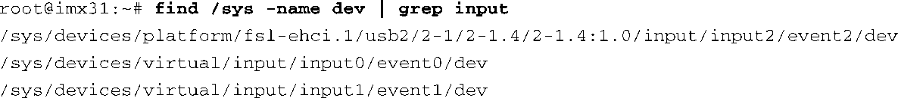

### 18.5.2　USB HID类

USB HID（Human Input Devices，人体学输入设备）可能是安装Linux系统的台式电脑中最常见的USB设备，同时也见于一些嵌入式设备中。HID设备使用起来相对简单。有关USB HID的内核配置选项位于Device Drivers菜单下的HID Devices。你需要开启其中的 `CONFIG_HID_SUPPORT` 、 `CONFIG_HID` 和 `CONFIG_USB_HID` 。USB HID是通用的HID驱动，它实现了USB规范定义的HID类的驱动支持。加载usbhid模块时，modprobe会自动加载它依赖的HID核心驱动（hid）：

这些基础设施到位之后，大多数遵循HID类驱动规范的HID设备（比如鼠标、键盘和游戏手柄）都应该能够被识别并正常工作。比如，插入Kensington USB无线鼠标会看到以下信息：

和前面的USB存储设备一样，我们可以在sysfs文件系统中找到内核分配给鼠标的主从设备号。因为我们已经知道设备号存放在 `dev` 属性中，可以据此进行搜索：

因为我们是将鼠标设备插入一个外部集线器的4号端口，所以选择物理地址为2-1.4:1-0的设备：

最后，使用以上设备号来创建设备节点：

你现在就可以使用鼠标了。和USB存储设备一样，如果系统中配置了udev，你就不需要手动创建设备节点了，因为这正是udev的工作。

