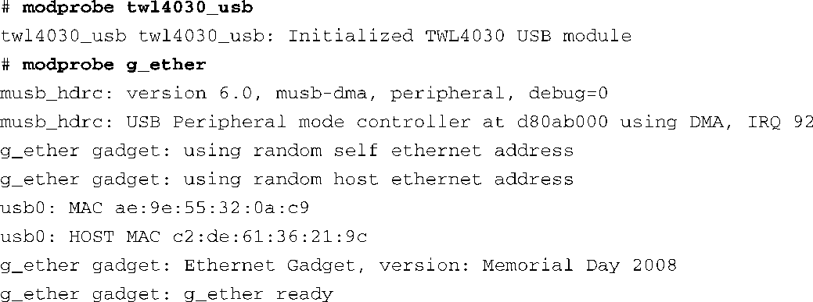
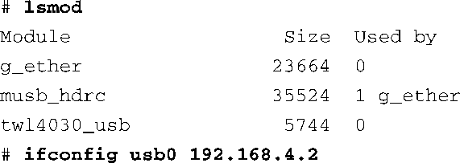
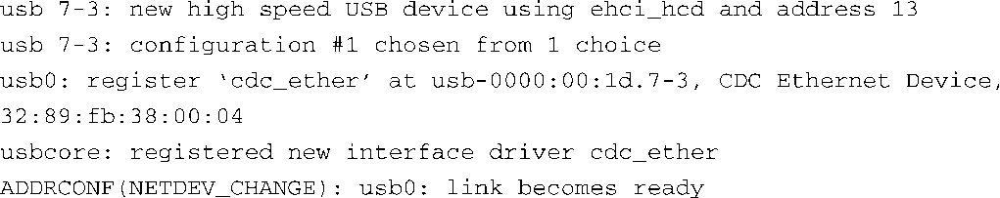

### 18.5.3　USB CDC类驱动

USB通信设备类（CDC）驱动为众多通信设备提供了一个通用的驱动框架。USB规范已经定义了几种标准的CDC类，包括ATM、以太网、ISDN PSTN（普通电话）、无线移动设备和有线调制解调器等。

以太网CDC功能最大程度地利用了CDC类驱动。一个不带以太网接口的嵌入式设备可以通过这个功能连接到以太网中，从而给我们的开发带来便利。这类设备的例子有很多，比如手机和PDA。

有两种方法能够实现这个功能。第一种方法是使用标准USB线缆在主机和外设之间建立一条点到点的链路。另一种方法是使用以太网“转接器”（USB网卡），它的一端是以太网接口，另一端是USB插头。下面分别讲述这两种方法<a class="my_markdown" href="['#anchor189']">[9]</a>。

<a class="my_markdown" href="['#ac189']">[9]</a>　虽然以太网转接器会用到CDC的一些通用组件，但严格来说，它不是通过CDC类驱动实现通信的。

在主机和外设之间建立一条直连的USB链路是很简单的。当然，必须有合适的硬件。例如，单独一根USB线缆是不能将笔记本电脑和台式电脑连接起来的。这是因为所有USB链路的一端必须是“上游”设备（主机或集线器），而另一端必须是“下游”设备（外设或小装置）。回忆一下，USB是一种主/从式总线协议。

我们将以BeagleBoard开发板为例，演示如何使用CDC类驱动来实现USB-USB直连网络。必须首先在内核配置中开启这个功能。当然，还必须有主机控制器的驱动程序，对于BeagleBoard开发板来说，这就是musb_hdrc.ko。与这个驱动对应的内核配置选项是 `USB_MUSB_HDRC` 。对于BeagleBoard开发板，还需要选择其他几个配置选项。要开启USB收发器，需要选择 `TWL4030_USB` <a class="my_markdown" href="['#anchor1810']">[10]</a>。要开启外设模式，需要选择USB Gadget support下面的 `USB_GADGET_MUSB_HDRC` 。最后，还需要选择USB Gadget Drivers下面的Ethernet Gadget（ `USB_ETH` ）。这就是支持CDC以太网功能的驱动，它负责链路外设（从属）侧的通信。

<a class="my_markdown" href="['#ac1810']">[10]</a>　因为没有什么删除它的理由，所以将TWL4030_USB直接编译进内核（ `y=` ）会更加方便。所有的USB模式都需要它，而且它占用的空间也很少。

台式电脑或笔记本电脑需要加载usbnet.ko。在大多数主流桌面发行版上，将USB线缆（另一端连接到BeagleBoard开发板）插入电脑中时，udev会自动完成这项工作。这里假设你已经在BeagleBoard开发板上加载了g_ether驱动，并配置了接口。代码清单18-11显示了相关的步骤。

代码清单18-11　在BeagleBoard开发板上加载g_ether

如代码清单18-11所示，当我们加载了两个设备驱动之后，usb0接口已经被创建和枚举了。lsmod显示了已加载的模块。注意，modprobe自动加载了musb_hdrc模块。

最后一步是为接口配置一个有效的IP地址。配置完成后，usb0上的以太网接口就可以使用了。当另一端连接BeagleBoard开发板的USB线缆连接到作者的Ubuntu 8.04笔记本上时，产生了以下日志消息：

注意，链路的主机侧（笔记本电脑）已经自动安装了 `cdc_ether.ko` 和它依赖的 `usbnet.ko` 模块。在作者的Ubuntu 8.04笔记本上显示：

现在需要为主机侧的usb0接口配置一个有效的IP地址（最简单的情况是它们处于相同的子网中），配置好之后全部工作就完成了。现在我们有了一个可以正常工作的以太网接口，将BeagleBoard开发板连接到笔记本的USB主机接口中。注意，如果你电脑上的Linux发行板没有运行udev（因为某些想象不到的原因）或者它的配置不正确，那么你就必须在链路的主机侧手动加载usbnet和cdc_ether。如果将一个配置好的外设（比如BeagleBoard开发板）连接到电脑的USB主机接口中，加载这些模块就会创建和枚举一个usb0接口。

