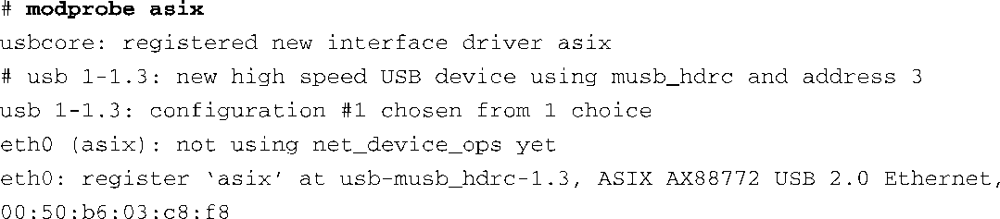
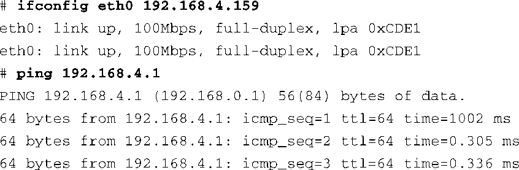

### 18.5.4　USB网络支持

另一种为嵌入式设备添加以太网功能的方法是使用以太网“转接器”，并将它插入到设备的USB主机端口中。这些转接器在电子市场上很容易买到。下面的例子中使用的是从Radio Shark购买的一款产品。它是在中国生产的，其中包含一块ASIX芯片。将它插入USB主机端口中，它就成为了一个功能完备的以太网端口。

要使用这个功能，需要在内核配置中开启相关选项。对于这个转接器来说，必须开启USB_USBNET 和USB_NET_AX8817X。这些选项位于内核配置工具的以下位置：Device Drivers → Network Devices → USB Network Support。加载了必需的USB底层驱动之后，我们接着加载ASIX驱动并插入以太网转接器。ASIX驱动的加载过程如下：

首先你看到了底层USB驱动打印出的消息，表明它正在枚举新的USB设备（1-1.3）。接着，ASIX驱动接手并创建了一个新的以太网接口eth0。除非在加载ASIX驱动时通过传递参数修改了默认设置，否则它会生成一个随机的MAC地址。

下一步是为接口配置一个有效的IP地址。

大功告成了，就这么简单！

