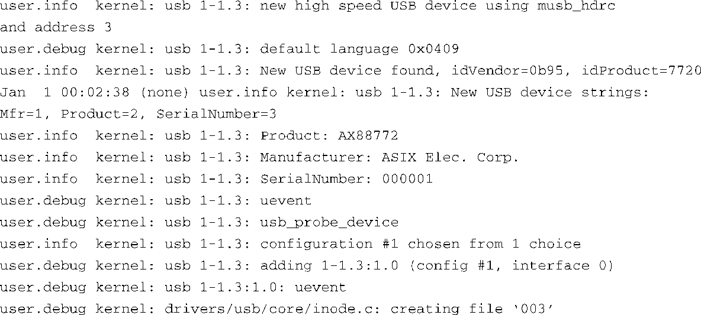

### 18.6　USB调试

内核配置中有很多关于USB调试的选项。详细的调试消息能够帮助你观察系统中正在发生的事情。在内核配置中开启USB_DEBUG就可以看到由usbcore和集线器驱动（usbcore的一部分）打印的调试消息。如果开启了USB_ANNOUNCE_NEW_DEVICES，每当有新设备插入时，usbcore就会打印出设备的详细信息，包括厂商、产品名称、生产商以及设备描述符中的序列号字符串。这两个选项都会将消息打印到syslog，它们的位置是USB Support → Support for Host-side USB。

如果内核配置中开启了上述的调试选项，当你插入前面例子中的以太网转接器后，syslog中就会有相应的调试消息，如代码清单18-12所示。

代码清单18-12　插入以太网转接器之后的调试输出

大多数的日志消息都一目了然。不过，你也许会对最后一条消息感到疑惑，它声称有一个名为003的文件被创建了。当你在目标系统上找不到这个文件时就更加困惑了。实际上，它是usb设备文件系统（usbfs）的一部分，在挂载usbfs之前它是不可见的：

挂载usbfs之后，可以在/proc/bus/usb/001下面看到这个新创建的文件，它代表刚刚被实例化的USB接口。001是总线号，003代表设备。这个文件不方便阅读，它包含了来自USB接口描述符的数据。

有些平台和驱动可能还会有一些特殊的调试选项。例如，使用musb_hdr驱动的BeagleBoard开发板就是如此。在内核配置中开启 `USB_MUSB_DEBUG` 就可以打开调试功能。要使用它，必须在加载musb_hdrc驱动的时候向它传递一个调试级别。这个特定的内核配置选项能够打印出详细的调试信息，包括设备之间发送的每条USB消息。你也许已经回想起来了，可以在modprode命令行中或是发行版指定的配置文件中向模块传递参数。下面这个例子将musb_hdrc驱动的调试级别设置为3：

