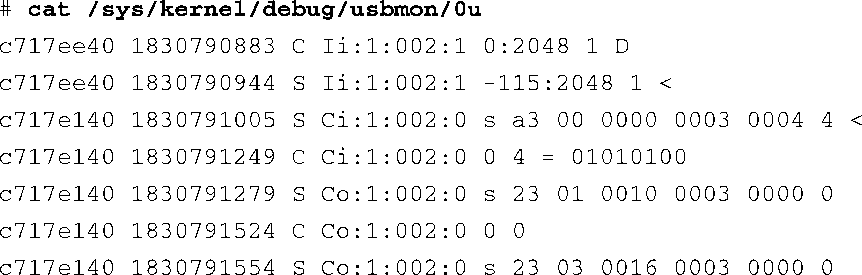

### 18.6.1　usbmon

如果你喜欢挑战难题，可以尝试一下usbmon。这是一个类似于tcpdump的USB数据包（packet）捕获工具 。USB实际上并不使用“数据包”一词，但概念是一样的。usbmon允许你捕捉USB总线上设备之间的原始数据传输。如果你正在从头开始开发一个USB设备，这也许会很有用。

要使用usbmon，必须首先在内核配置中开启DEBUG_FS，它位于内核配置的Kernel Hacking菜单下。此外，必须开启USB_MON，位置是Device Drivers → USB Support → Support for host side USB。

启用了这些配置选项后，必须挂载debugfs文件系统，命令如下：

然后加载usbmon.ko驱动：

这些步骤都完成之后，usbmon驱动会在目录/sys/kernel/debug/usbmon中创建一些调试套接字。内核会将数据包发送到这些调试套接字中。和tcpdump一样，数据包是以文本格式存储的，这样我们看起来会（稍微）方便一些。只需启动cat进程就可以查看套接字的内容。代码清单18-13显示了将USB闪存驱动器（U盘）插入BeagleBoard开发板中产生的追踪消息。

代码清单18-13　usbmon产生的追踪消息

在插入USB闪存驱动器之前我们就已经启动了cat进程。一共生成了53行输出消息，表示传输了53个USB数据包<a class="my_markdown" href="['#anchor1811']">[11]</a>。我们不再仔细研究这些追踪消息的格式和细节，它们已经超出了本书的讨论范畴。要了解这些细节，可以参考内核源码树中的一篇文档：.../Documentation/usb/usbmon.txt。然而，要想完全理解这篇文档的内容，你还需要详细了解USB的内部架构。本章末尾列出的参考文献可以帮助你进一步研究USB。

<a class="my_markdown" href="['#ac1811']">[11]</a>　USB的术语中没有“数据包”（packet）一词。然而，相关细节的讨论超出了本书的范围。请参考本章末尾的文献以了解更多详细信息。

