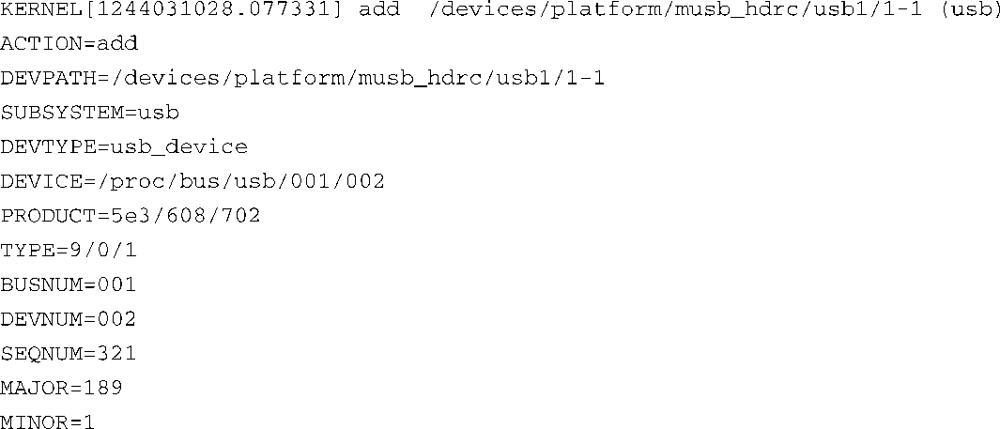

### 19.2　设备发现

当内核发现一个新的设备时，它会创建一个 `uevent` 事件，并通过netlink套接字<a class="my_markdown" href="['#anchor191']">[1]</a>将它发送给一个用户空间的侦听者。这个侦听者正是udev。代码清单19-1显示了一个典型的由内核发送的 `uevent` 。我们先启动了用于捕捉uevent事件的实用程序udevadm，然后将一个4端口USB集线器插入到BeagleBoad开发板的USB主机端口中：

<a class="my_markdown" href="['#ac191']">[1]</a>　请参考 http://en.wikipedia.org/wiki/Netlink。

（注意，早期版本的udev使用单独的命令，比如 `udevmonitor` 或 `udevtrigger` 。新版本已经将它们都整合到udevadm管理程序中了，如上所示。如果这个命令无效的话，请检查一下你使用的udev版本。）

代码清单19-1　典型的 `uevent` ：插入USB设备

代码清单19-1显示了当内核检测到这个4端口USB集线器被插入时发出的第一个 `uevent` 。第一行表示这个 `uevent` 是个“添加”（add）操作，意味着内核检测到了一个新的USB设备。它的内核名称是

当内核检测到一个新设备时，它采取的默认操作之一是在sysfs文件系统（通常挂载于/sys目录）中创建一个条目。 `DEVPATH` 属性代表它在/sys目录中的位置，udev规则和工具的很多地方都引用了这个属性。其他属性描述了设备类型、设备、产品（厂商ID和/或设备ID）和设备在USB总线物理拓扑结构中的位置。 `DEVICE` 属性描述了内核中的设备节点信息。内核在001号USB总线上发现了这个设备，并将设备号002分配给它。

在代码清单19-1中，产品厂商ID是5e3，设备ID是608。通过参考<a class="my_markdown" href="[]">www.linux-usb.org/usb.ids</a> 中维护的设备列表，我们了解到05e3代表Genesys Logic公司，而产品ID 608则是代表一款4口USB 2.0集线器。

每个 `uevent` 都有一个序列号，内核每发送一个uevent，序列号就递增1。Uevent序列号的最后是设备驱动程序的主次设备号。在这个例子里，内核分配的主设备号是189，次设备号是1。

当udev接收到 `uevent` 时，它会扫描其规则数据库（参考19.4节）。udev将使用设备的属性在数据库中查找匹配的条目，这些条目规定了它要执行的动作。如果找不到任何匹配的规则，udev的默认动作只是创建一个设备节点，其名称由内核提供，主次设备号由 `uevent` 指定。在这个例子里，udev会创建以下设备节点，如 `ls -l` 命令所示：

系统设计人员或发行版维护人员可以定制udev的规则，从而让它执行适合具体应用的操作。在大多数情况下，默认规则是在/dev目录中创建合适的设备节点。此外，它们一般还会生成符号链接，指向这些新创建的设备节点。符号链接的名称可能是一个大家熟知的简短名称，应用程序使用它来访问设备。我们一会儿就会详细介绍udev的规则。

