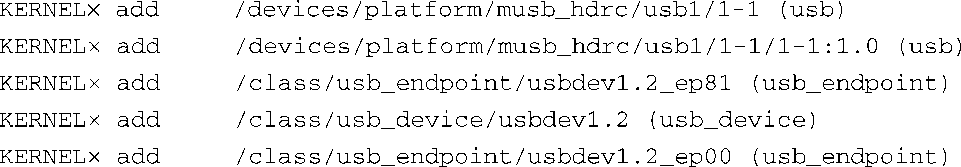
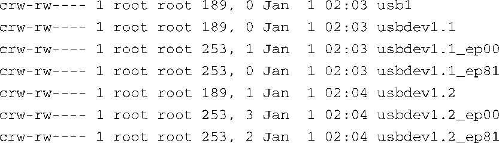
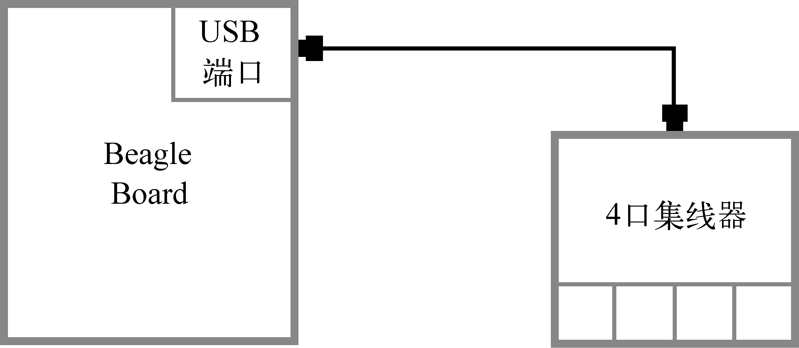
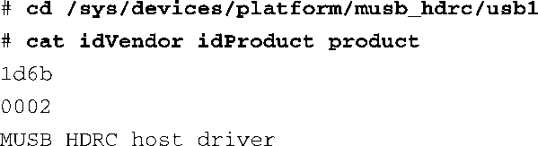

### 19.3　udev的默认行为

你也许会惊讶地发现代码清单19-1中uevent是内核发送的众多uevent中的第一条。代码清单19-2显示了当插入4口USB集线器时内核生成的每个 `uevent` 。这个代码清单是由以下udev命令生成的：

代码清单19-2　插入4口集线器时内核生成的 `uevent`

注意，我们已经去除了时间戳并用×代替，以便这个代码清单能够适应页宽，同时也让我们阅读起来更加容易。实际上，每个 `uevent` 都带有一个类似代码清单19-1所示的时间戳。可以看到，在插入4口USB集线器时内核生成了5个uevent。它们代表了USB设备层次结构中的各种成员。第18章介绍了USB及其架构。

代码清单19-3中显示了到此为止udev已经创建的设备节点。这些设备节点位于/dev目录中，它们代表了udev的默认行为。在这个介绍性的例子中，我们没有定制任何udev规则。

代码清单19-3　udev创建的初始USB设备

图19-1显示了与代码清单19-3相对应的硬件配置。

<b class="my_markdown">图19-1　4口USB集线器</b>

代码清单19-3中的第一行代表BeagleBoard开发板上的主机控制器。正如我们在第18章中所学习到的，可以通过查看它在/sys中的属性来了解它。它是德州仪器OMAP3530芯片中内置的高速双速率USB控制器（一般被称作USB主机控制器）。使用以下命令查看了/sys中的设备属性：

代码清单19-3中接下来的3行代表内部的单端口集线器，在USB架构中它总是和主机控制器关联在一起。这就是第18章中所讨论的根集线器。可以将开发板上的物理USB连接器看成这个单口集线器。正如第18章所讨论的，USB设备中包含接口和端点等逻辑实体。名为usbdev1.1的设备代表USB接口，而名为usbdev1.1_ep00和usbdev1.1_ep81的设备则代表集线器中的逻辑端点——它们是实际在USB总线上进行通信的逻辑实体。

当我们将4口集线器插入BeagleBoard开发板的USB端口中后，udev默认创建了代码清单19-3中的最后3个设备。注意这些设备节点的编号，名称中的.2代表级联的USB集线器层次结构中的第二个集线器。

你也许想知道是否有其他名称能够更好地代表这类设备。如果应用程序需要直接使用某个设备，比如USB鼠标，像usbdev1.3_ep00<a class="my_markdown" href="['#anchor192']">[2]</a>这样的名称是不易于使用的。这时，udev的规则就派上用场了。

<a class="my_markdown" href="['#ac192']">[2]</a>　如果将鼠标（或其他设备）直接插入到4口USB集线器中，设备节点的名称就会是这样。

