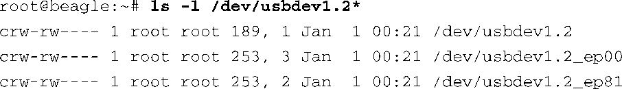
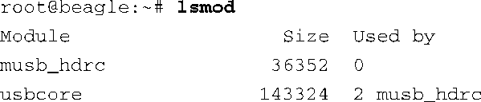
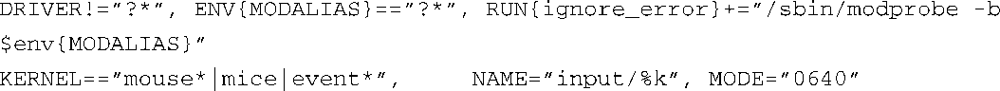
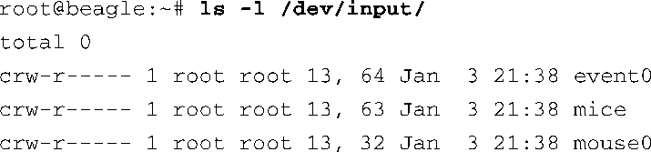
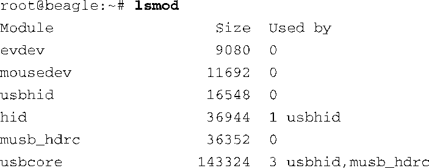

### 19.4　理解udev规则

udev真正的强大功能来自于它的规则引擎。系统设计人员和发行版维护人员可以使用udev的规则来组织/dev目录中的层次结构、创建设备节点以及为这些设备节点分配易于使用的名称。通常情况下，udev会用内核提供的名称创建设备节点，并用一个易于使用的名称创建相应的符号链接，从而将这两个名称关联起来。

udev的规则引擎还可用于加载设备驱动程序（模块）。实际上，通过使用udev规则，你可以在系统检测到设备插入或拔出时执行几乎任何你能想到的操作。然而，udev规则最常用于设备的重命名（创建具有易读名称的符号链接）和设备驱动程序的加载。

让我们看一组典型的udev规则，它们决定了udev在收到内核uevent时该做哪些操作。在最新的udev版本中，udev规则（文件）的默认存放位置是目录/lib/udev/rules.d。在接下来的讨论中，我们会将它作为默认位置。很多发行版都将udev规则存放在目录/etc/udev/rules.d中，规则文件一般都是由发行版维护人员定制的。常常根据功能将它们分类，从而易于维护。如果你正坐在一台Linux电脑前，可以花点时间浏览一下这些规则文件。

虽然udev查看的默认目录是/lib/udev/rules.d，udev同样会查看目录/etc/udev/rules.d。如果这两个目录中有同名的规则文件，以后一个目录中的为准，你能够覆盖默认规则。

在主流的Linux发行版中，多个规则文件合在一起形成了一张路线图，它们共同决定了在发现或删除设备时的需要执行的操作。作者笔记本上的发行版中有31个规则文件，总共有差不多1400行的内容，定义了将近700条规则！浏览一下这些规则文件，你就会感受到udev的灵活和强大。

当udev第一次启动时，它会读取/lib/udev/rules.d/中的所有规则，并创建一个内部的规则表。当内核发现一个设备时，udev使用内核 `uevent` 中的动作和属性在规则表中查找匹配项。当找到匹配项时，udev就会执行那条规则（或一组规则）规定的动作。让我们看一个例子。

继续以前面的BeagleBoard开发板为例，让我们看一下在插入一个普通USB鼠标时会发生什么情况。在没有规则的情况下，udev会使用内核在uevent中提供的原始名称创建必要的设备节点。

这些设备代表了基本的USB基础设施。udev没有创建其他设备。如果你很熟悉Linux中的输入设备，你也许想找到一个名称中有mouse的设备。很多常见的应用程序都期望能找到一个这样命名的鼠标设备。此外，也没有加载处理这个新插入鼠标的驱动程序。在一个配置好的桌面系统中，假设其中安装了主流的Linux发行版且能够正常工作，你就会找到一个以通用名称（比如mouse*）命名的设备，而且也加载了输入设备驱动程序和鼠标驱动。<a class="my_markdown" href="['#anchor193']">[3]</a>

<a class="my_markdown" href="['#ac193']">[3]</a>　这里假设系统被配置为动态加载设备驱动。

回顾一下第8章的内容，我们可以使用 `lsmod` 命令来查看系统中已经加载了哪些模块：

请记住，这是一个非常基本的系统，其中没有任何udev规则。当前只加载了主机控制器驱动（musb_hdrc）和USB核心子系统（usbcore），而且它们是为了这个例子的需要而手动加载的。我们将会在后面看到udev如何能够自动加载这些平台驱动。这里有趣的一点是处理鼠标（输入）设备的驱动程序还没有被加载到内核中！

现在让我们添加一些udev规则，如代码清单19-4所示。

代码清单19-4　简单的udev规则

我们将这两条规则存放在一个随机命名的规则文件中，文件的后缀名为.rules，并将这个文件放到目录/lib/udev/rules.d中<a class="my_markdown" href="['#anchor194']">[4]</a>。第一条规则用于加载设备驱动程序。这条规则的匹配条件是没有设置内核 `uevent` 中的 `DRIVER` 属性（表示内核不知道或没有提供驱动的名称）。这条规则指示udev运行modprobe程序，并将环境变量 `MODALIAS` 的值传递给它。我们一会儿就会介绍 `MODALIAS` ，现在只需要知道它是一条“线索”，modprobe利用它来加载合适的设备驱动程序。

<a class="my_markdown" href="['#ac194']">[4]</a>　当然，在真实产品中，我们会为规则文件起有意义的名称，并合理组织它们的结构。

加载了设备驱动程序之后，鼠标设备就可以被识别出来，而不仅仅是被当作一个普通的USB设备。驱动能够识别鼠标的功能并将其自身注册为鼠标驱动。当这个驱动被加载时，内核会产生另外一系列 `uevent` ，从而使udev开始处理其他规则。这时第二条规则便起作用了。

第二条规则的匹配条件是内核 `uevent` 中的设备名称是mouse*、mice或event*。当找到匹配项时，这条规则指示udev在一个名为input的子目录中创建设备节点。除非另外指定（在一个实际产品中永远都不应该这么做），udev假设/dev是设备节点的根目录。设备节点的名称就是内核设备的名称，这是由替换操作符 `%k` 指定的。设备节点的模式是0640，这意味着文件的拥有者可以读写该设备，同一组中的用户只能读，而其他用户则不能访问。代码清单19-5显示了加载设备驱动程序之后产生的设备节点，代码清单19-6则显示了插入鼠标，udev处理完规则之后系统中已加载的模块。注意， `usbhid` 、 `mousedev` 和 `evdev` 模块都已经被加载了，应用设备可以使用它们。还可以输入以下命令以确认模块都已经被正确加载了：

输入这条命令后，移动鼠标就可以看到设备接收到的控制字符。当然，它们并不方便阅读，终端设备也可能会报错！不过，在作者安装了Ubuntu 80.4的电脑上，运行于ttyUSB0（USB转串行端口线）上的screen程序完美地显示了这些数据。

代码清单19-5　/dev中有关鼠标设备的条目

名为event0的设备代表第一个事件流，它是输入事件的高层描述。名为mice的设备代表所有鼠标设备（所以这里用了mouse的复数形式）的混合输入！名为mouse0的设备则是底层鼠标设备本身。

代码清单19-6　udev处理完成后执行 `lsmod`

你也许想知道代码清单19-4中的两条简单规则是如何加载代码清单19-6中的所有模块的。这些设备驱动程序都是通过modalias（模块别名）定位和加载的。

