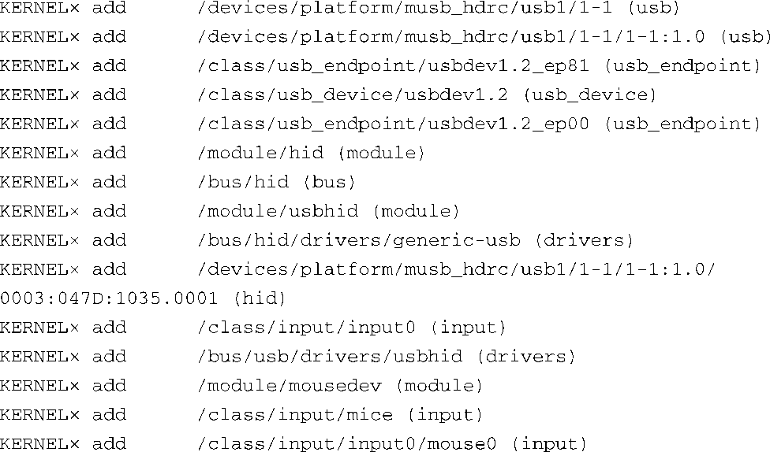
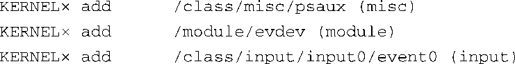
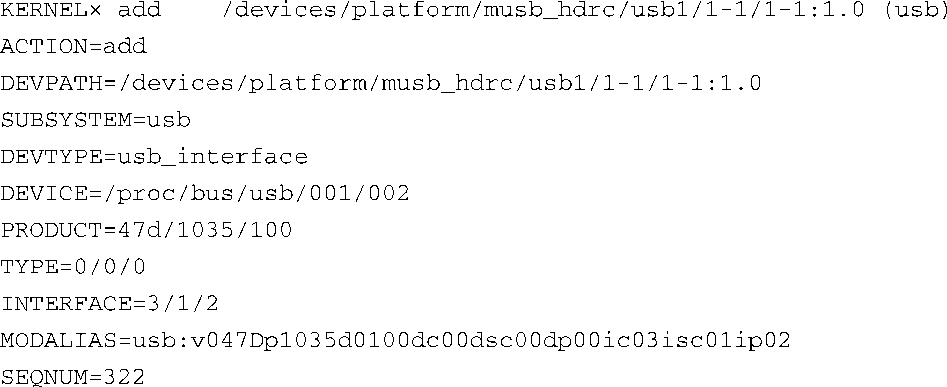
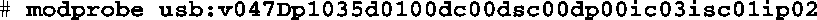
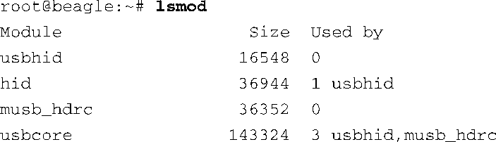
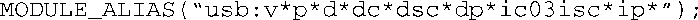

### 19.4.1　Modalias

当检测到一个设备，比如USB鼠标时，内核会发出一系列 `uevent` ，宣告它添加了这个设备。代码清单19-7详细显示了当USB鼠标插入BeagleBoard开发板的USB端口时内核发送的uevent。代码清单19-7的内容是由以下命令生成的：

代码清单19-7　插入USB鼠标时内核生成的 `uevent`

为了提高可读性，代码清单中的时间戳已经被简化为×。实际上，每个内核事件都会包含一个类似代码清单19-1所示的时间戳。你也许会惊讶地发现插入一个简单的USB鼠标竟然导致内核发送了18个事件。前5个事件表示内核添加了原始的USB设备本身，它们代表USB的架构成员。它们是USB设备、接口和端点。让我们仔细查看一下针对USB接口1-1:1.0<a class="my_markdown" href="['#anchor195']">[5]</a>的 `uevent` 。代码清单19-8显示了这个内核 `uevent` 的完整内容，它是由 `udevadm` 生成的：

代码清单19-8　针对USB接口1-1:1.0的内核 `uevent`

<a class="my_markdown" href="['#ac195']">[5]</a>　这种命名方式是在第18章中介绍的。

注意其中的 `MODALIAS` 字段。乍看起来它像是乱码。实际上，这个字符串可以被分解为多个单独的字段，它们是USB设备暴露给设备驱动程序的属性。其中一些字段的含义是显而易见的：

v047D 厂商ID（047D代表Kensington）

p1035 产品ID（1035是Kensington生产的一款无线鼠标的产品ID）

其他字段是与设备、设备类和子系统具体相关的。它们可能包含设备、设备类和子类等方面的属性。这些属性为驱动提供了设备的底层硬件细节。有关这些细节的讨论超出了本书的范围。重要的是认识到modprobe工具可以使用 `MODALIAS` 来加载模块。让我们看看这是如何工作的。

在BeagleBoard开发板的命令行中执行以下命令会加载两个驱动。这里假设你已经事先加载了平台USB驱动（musb_hdrc）和usbcore，而且udevd没有运行：

执行这条 `modprobe` 命令会加载两个模块—— `hid` 和 `usbhid` 。可以通过再次执行 `lsmod` 命令来确认这一点：

`modprobe` 会尝试加载 `usbhid` 。因为 `usbhid` 依赖 `hid` ，所以 `hid` 先被加载。执行 `modprobe` 时，它会查看位于目录/lib/modules/‘uname -r’中的文件module.alias。这个文件是由depmod生成的，depmod的作用是创建模块依赖关系的数据库。看一下文件modules.alias的内容，你会发现其中的很多行都和代码清单19-8中的 `MODALIAS` 字符串类似。 `modprobe` 使用命令行中的参数在文件modules.alias中寻找匹配的行。如果找到匹配行，其中指定的模块就会被加载。下面显示了modules.alias中的匹配行：

仔细看一下这一行的内容，其中 `ic` 字段的含义是很清楚的。USB接口类0x03定义了人体学输入设备（HID）。这一行的意思是：如果其他字段是任意值（因为其中的通配符 `*` ），并且接口类（interface class，ic）字段是0x03，那么就加载 `usbhid` 。那就是了！

文件modules.alias中的 `modalias` 条目来自设备驱动程序本身。在这个例子中，你会在内核源码文件hid.mod.c中发现下面这行代码：

当模块被编译和安装到系统中时，depmod工具会收集所有这些字符串并将它们放到文件modules.alias中，以供 `modprobe` 引用。看一下你的Linux电脑中的modules.alias文件，然后再看一下最新的Linux内核源码的drivers子目录，你会发现其中的条目可以匹配起来。udev就是通过这种方式使得模块自动加载的——通过 `MODALIAS` 。在代码清单19-4所示的示例规则中，第一条规则的实际含义是：如果没有设置环境变量 `DEVICE` ，而且内核 `uevent` 中的 `MODALIAS` 环境变量不为空，那么就将 `MODALIAS` 传递给 `modprobe` ，让它加载此模块。这个模块依赖的其他模块（比如示例中的 `hid` ）也会一同被加载。这是udev的一个非常强大的功能。

