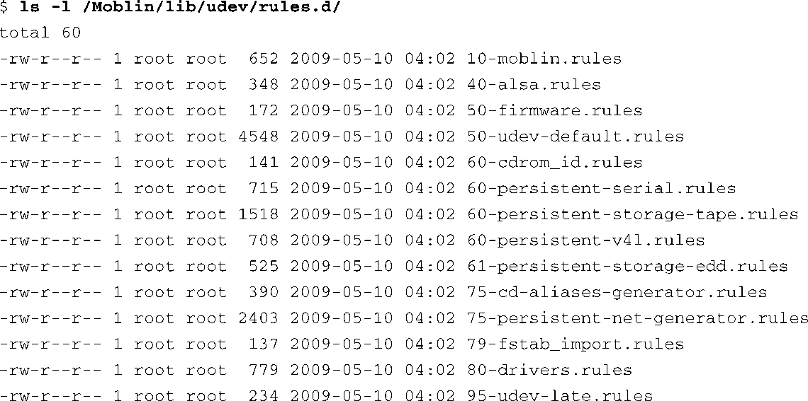

### 19.4.2　典型的udev规则配置

如前所述，在嵌入式Linux系统中，用于控制udev行为的规则是由系统设计人员或嵌入式发行版的维护人员负责制定的。在某些情况下，软件包的提供者也会添加规则，从而支持一些特定的功能。主流Linux发行版中一般都有这样的例子。代码清单19-9显示了一个最新的Moblin发行版中的默认规则。

代码清单19-9　Moblin Linux发行版中的默认udev规则

注意这些规则文件的分组。它们的命名方式类似于system V风格的init脚本，文件名中的数字确定了文件的读取顺序。udev就是以代码清单19-9所示的顺序处理这些规则文件的，其中有几个文件值得研究一番。

规则文件50-udev-default.rules是udev软件包的一部分（来自当前的udev版本），并且是udev开发小组提供的一个示例。事实表明，Moblin版本非常接近于udev软件包中的默认版本。这个规则文件为很多通用的Linux设备定义了一组默认规则，包括字符设备（比如tty、pty和串行端口设备），内存设备（比如/dev/null和/dev/zero）和其他很多Linux系统中常见的设备。

其他规则文件提供了与具体发行版相关的属性和操作，以访问特定类别的设备。在Moblin发行版中，它们包括针对声卡设备的ALSA规则，针对CD-ROM的规则和几组用于为几类设备提供持久设备名称的规则。可以从udev文档（请参考本章末尾的文献）中了解更多细节。

关于udev规则还有一点值得一提。除非使用特殊的语法规则改变了它的行为，否则udev规则的作用是累加的。也就是说，可以为单个设备定义多个规则，它们分布在多个不同的规则文件中，每条规则匹配不同的属性。这些规则中定义的动作都会被应用到相关设备或子系统上。例如，可以将为设备命名的规则和设置设备访问权限的规则分开。最新的Ubuntu发行版中就有一个这样的例子，两个相关的规则文件分别是20-names.rules和40-basic-permissions.rules。

20-names.rules和40-basic-permissions.rules很好地说明了udev规则的“累加”属性。单个设备能够匹配多条规则，而这些规则合在一起定义了对某个子系统或设备执行的操作。例如，考虑一个通用的声卡设备controlC0（声卡接口）。规则文件20-names.rules中有如下规则：

这条规则会和名称为controlC0、controlC1之类的内核设备匹配，并为设备分配名称 `snd/%k` 。 `%k` 代表内核传递给udev的实际名称——这里是controlC。设备名称前面的 `snd/` 则是让udev在/dev目录的snd子目录中创建设备节点。结果是/dev/snd/controlC0成为第一个声卡接口的设备节点。

下一条来自40-permissions.rules的规则看上去会像是这样：

当udev扫描这条规则时，它会将这条规则和前面那条规则合并在一起。这条规则中指定的模式（0666）使所有用户（文件拥有者、组成员和其他用户）都可以访问新创建的设备节点。

通过这种方式，Linux发行版能够根据规则的功能将它们划分到不同的文件中，以便于维护。在这里的讨论中，可以看到两个规则文件，一个专门用于分配设备的名称并将它们归类（比如将不同种类的设备节点放在/dev目录的不同子目录中），另一个专门用于设置这些设备的访问权限。这样的结构很清晰，同时也容易维护。

如果想成为这方面的专家，你应该研究一下由Daniel Drake撰写的一篇出色文档“编写udev规则”，本章末尾也引用了这篇文献。

关于规则最后还需要注意一点：udev是事件驱动的。除非有事件触发，否则udev什么都不会做。例如，虽然udev会使用inotify检测它的规则目录，并在你修改了规则文件后重新扫描规则，但是直到某个使用此规则文件的设备被移除或重新安装时，udev才会采取动作并允许对规则的修改生效<a class="my_markdown" href="['#anchor196']">[6]</a>。

<a class="my_markdown" href="['#ac196']">[6]</a>　可以使用 `udevadm trigger` 手工触发，从而使修改生效。

