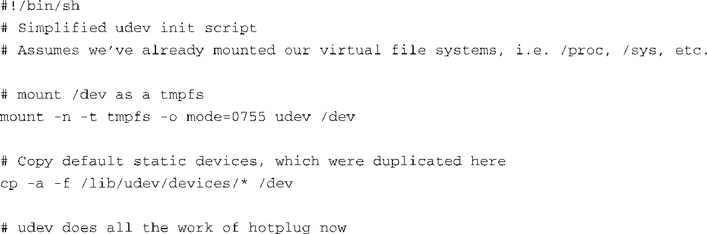
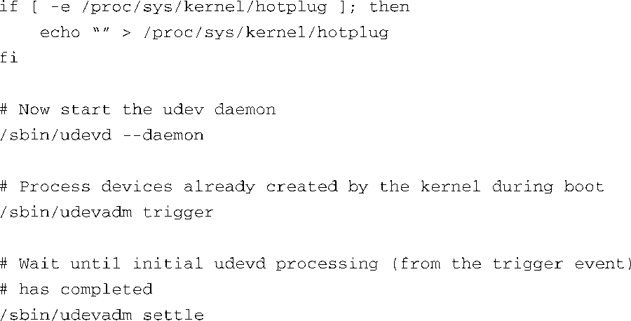
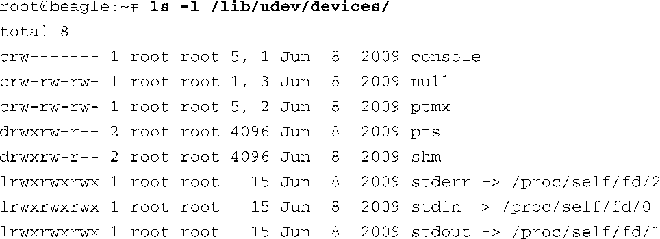
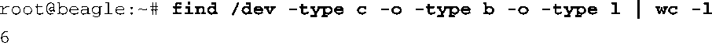
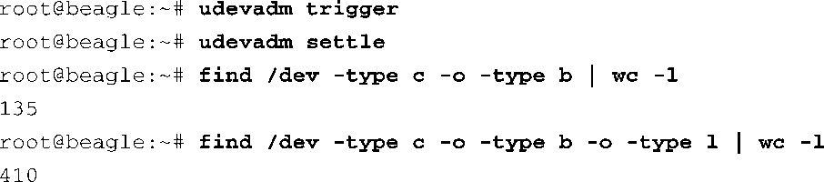

### 19.4.3　udev的初始系统设置

udev是一个用户空间程序。因此，在内核启动完毕并挂载了根文件系统之前它不能运行。正如第6章所述，大多数的嵌入式或非嵌入式Linux系统都会首先运行init进程。如果udev负责创建系统中的设备节点，那么我们必须提供某种机制，确保init进程和它的子进程能够在udev运行之前访问一些必要的设备，这通常包括控制台设备、输入/输出设备（包括stdin、stdout和stderr）和其他一些设备。

对于小型嵌入式系统来说，最简单也是最常用的方法是在/dev目录中事先创建几个静态的设备节点，然后将tmpfs文件系统挂载到/dev目录，之后再启动udev。代码清单19-10显示了一个简化的udev启动脚本的例子。

代码清单19-10　简单的udev启动脚本

为了配置系统使用udev动态创建设备节点，它所需的最少功能都包含在这个脚本中了。脚本的第一个动作将tmpfs（一种基于RAM的文件系统，使用的是虚拟内存）挂载到/dev。挂载成功后，之前/dev目录中的内容都不可见了，现在/dev是一个空目录。

下一步动作是复制一组静态设备节点到/dev目录，以取代启动所需的那些设备，比如控制台、标准输入/输出等。代码清单19-11显示了这些设备，它们是在创建文件系统时被放置在/lib/udev/devices中的。这个原始位置由你决定，它并不是特别重要。

代码清单19-10中脚本的最后一步动作是确认/proc中没有指定任何hotplug代理程序。内核会将 `uevent` 发送给它指定的用户空间代理程序。然而，如前所述，我们希望udev通过netlink套接字接收这些消息，所以将这个文件（/proc/sys/kernel/hotplug）的内容清空。

代码清单19-11　默认的静态设备节点

现在一切都已设置完毕，可以启动udevd守护进程了。你可以在代码清单19-10中看到调用/sbin/udevd的那行命令。如果已经研究过这个启动脚本，你也许想知道最后几项操作的意图。

#### coldplug处理

在内核的启动过程中，各个子系统都会得到初始化，而且内核会发现和注册很多设备，并创建/sys中的对应条目。在BeagleBoard开发板的/sys中有差不多200个设备，通常情况下，它们应该由udev处理，以创建设备节点或加载设备驱动程序。问题是init运行一段时间之后udev才会运行。因此，这将近200个设备并没有得到udev的处理。这就是udev中存在触发机制的原因。

看一下代码清单19-10中的最后两条shell命令。 `udevadam trigger` 命令使udev回放内核 `uevent` ，并按正常方式处理/sys中的所有条目。为了简要说明这个处理过程，使用以下命令分别显示触发事件前后/dev中的设备数量：

注意这条 `find` 命令找到的3个设备节点与代码清单19-11的内容完全匹配。最初的静态设备正好包含3个字符设备和3个符号链接，一共6个条目。代码清单19-11中还有两个条目是目录，这里的 `find` 命令将它们过滤掉了。

运行了代码清单19-10所示启动脚本中的 `udevadam trigger` 命令（会引导Udev回放所有的内核Uevent）之后，我们看到100多 个新的设备和400多个符号链接被创建了。以下一系列命令说明了这一点：

现在udev已经处理了内核在启动过程中发现的所有设备，我们找到了132个新的设备节点，设备总数为135（加上之前静态创建的3个）。算上符号链接，/dev中总共有410个能够用于访问设备的文件。这就说明了udev如何“事后处理”内核在启动过程中创建的设备。从现在起，只要udevd守护进程一直运行，内核会向udev报告设备的添加和删除情况，udev也会根据其规则做相应处理。

