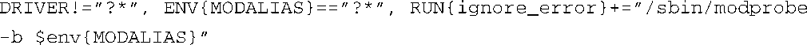
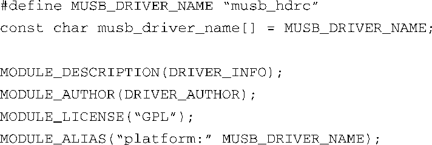
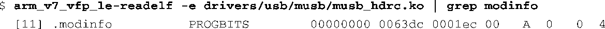
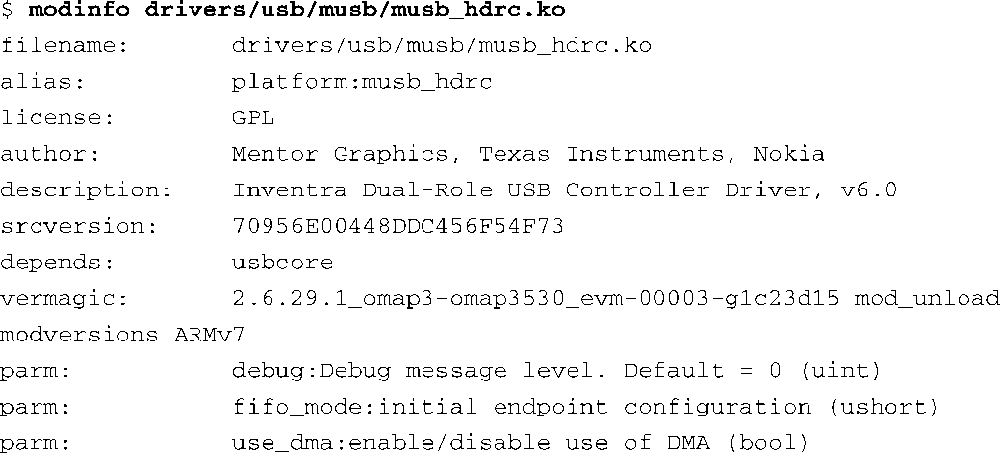

### 19.5　加载平台设备驱动程序

使用udev可以很容易地动态加载平台驱动程序。嵌入式系统中可以安装一条udev软件包中的默认规则。这条规则看起来应该和代码清单19-4中的第一条规则类似。为了方便引用，我们将它复制在这里：

这条规则的含义是：如果驱动设置了 `MODALIAS` 并且环境变量 `DRIVER` 没有被设置，那么就运行modprobe，并将 `MODALIAS` 传递给它。只要你在驱动中以正确格式包含了 `MODULE_ALIAS` 宏，它会被depmod收集并放置在文件modules.alias中。modprobe在运行时会使用传递给它的 `MODALIAS` 在这个文件中查找匹配的条目。19.4.1节详细讲述了这个过程。

BeagleBoard开发板上的OMAP3530处理器中内置了一个Inventra双重角色USB控制器，让我们以此为例看一下它的平台驱动。代码清单19-12显示了这个USB主机控制器驱动程序中的几行内容。其中的最后一行中会被收集到文件modules.alias中，而modprobe也会使用它来加载对应的驱动。

代码清单19-12　musb_hdrc.c的一部分内容

`MODULE_ALIAS` 宏实际上会创建一个常量字符串（ `const char` ），而它会被放置到设备驱动程序（模块）目标文件的一个特殊的段中。这个字符串类似于环境变量，存在形式是 `alias="string"` 。这个特殊段的名称是 `.modinfo` ，其中包含的属性描述了驱动的各方面特征。可以使用交叉版本的 `readelf` 来查看这个段的头部信息。回顾一下第13章中介绍的readelf细节，具体命令如下所示：

这里显示的 `.modinfo` 的内容并不便于阅读，为此，我们可以使用module-init-tools软件包中的modinfo工具：

注意其中的模块别名（alias）—— `platform:musb_hdrc` 。如果一切准备就绪，你应该可以使用 `modalias` 字符串手工加载设备驱动程序，而udev也正是将这个字符串传递给modprobe：

当然，如果udev配置正确，而且有类似代码清单19-4所示的规则，udev会使用 `modalias` 字符串替你加载这个模块。代码清单19-10中显示了一个示例的udev启动脚本，当其中的 `udevadam trigger` 命令执行完毕后，这个驱动就会被加载。如此而已！

