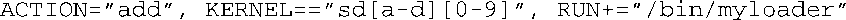
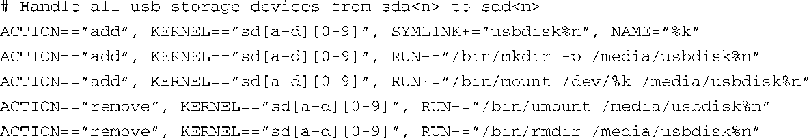
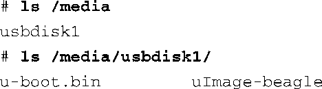

### 19.6　定制udev的行为

在使用udev时，想象力可能会限制你的作为。首先，可以在插入或拔出设备时运行你自己的程序。例如，当一个USB存储设备被插入嵌入式Linux设备中时，下面这条规则可用于启动软件的升级程序：

/bin/myloader就是你自己的程序，udev会传递给它一份与此设备相关的环境参数。接着，你的程序可以验证刚刚安装的USB设备中的内容，并开始执行必要的操作。这是一种在嵌入式Linux设备中实现自动安装新软件镜像的方法。

如果你选择了这种方法，比较明智的做法是在程序中派生出一个新的进程，然后与udev父进程分离，从而让父进程完成工作并返回。如果udev现在或将来决定终止那些占用太多时间的子进程，这么做可以避免产生一些不愉快的意外结果。同时，还要考虑一下程序独特的执行环境。当你的程序运行时，它只继承udev提供的必需的执行环境。这可能无法满足你的需求，你也许需要创建自己的环境，从而让处理函数程序能够顺利完成任务。

### udev定制示例：USB自动挂载

代码清单19-13展示了一组规则，它们能够自动挂载一个插入嵌入式Linux设备中的USB闪存驱动器（U盘）。

代码清单19-13　实现USB自动挂载的规则

当检测到设备时，udev会创建一个名为usbdiskn（n是设备号）的符号链接，指向实际的设备。例如，考虑一下usbdisk0，当udev处理完毕后，你会拥有一个名为/dev/usbdisk0的符号链接指向实际的设备。接着，规则中的 `RUN` 指令会在/media目录下创建一个相同名称的目录。注意，因为 `mkdir` 命令中带 `-p` 选项，所以文件路径的中间目录如果不存在的话新目录也会被创建。最后，新发现的设备会被挂载到/media目录中新创建的挂载点上。相应地，移除设备时， `umount` 命令会被执行，而且目录也会被删除。

上述规则位于文件/lib/udev/rules/99-usb-automount.rules中，将U盘插入BeagleBoard开发板中时，结果如下：

