### 19.7　持久的设备命名

udev默认实现了持久的设备命名，它使用了最初由Hannes Reinecke提出的方案。与持久命名相关的规则都位于文件名包含 `"persistent"` 的规则文件中。下面让我们看一下它是如何工作的。

在一个使用udev的系统中查看它的/dev目录，你会发现udev为磁盘设备（比如U盘）分配了持久的名称。

代码清单19-14中显示了BeagleBoard开发板上/dev/disk目录中的文件，作者事先将两个U盘插入USB集线器中，而这个集线器则是连接到BeagleBoard开发板的USB端口中。

代码清单19-14　目录/dev/disk/by-id中的符号链接

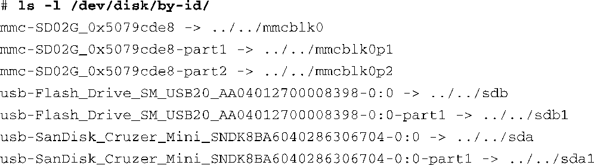
我们精简了 `ls -l` 命令的输出信息，只保留那些我们感兴趣的内容。这个目录（by-id）中的7个符号链接都是以id命名的。每个符号链接指向一个由udev为相关设备创建的设备节点。这里一共有3个设备，从上至下依次是：SD卡、通用USB闪存驱动器和Cruzer Mini USB闪存驱动器。这里列出了每个磁盘设备以及设备上的每个分区。例如，SD卡上有两个分区（mmcblk0是磁盘设备本身，mmcblk0p1和mmcblk0p2是上面的分区）。类似地，USB闪存驱动器上的每个分区也被列举出来。

这些符号链接就是设备的持久名称。可以拔出U盘并将它们重新插入集线器的其他端口中。udev会通过它的辅助工具usb_id为设备分配相同的名称（符号链接），它们指向正确的原始设备节点，而这些原始设备节点的名称可能和你第一次插入设备时的原始设备节点名称不同。

### udev辅助工具

在代码清单19-14中，每个符号链接的名称中都包含一个唯一的ID字符串，这是由udev辅助工具通过读取原始设备或查询/sys中的data属性生成的。这组辅助工具位于udev源码树的extras目录中。（可以使用git下载udev的源码。）这些工具包括scsi_id、cdrom_id、path_id和volume_id等。以usb_id为例来看一下它们的工作原理。

生成持久名称（唯一ID）的规则来自于udev源码树中的规则文件60-persistent-storage.rules：

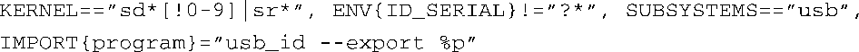
这条规则的含义是：对于任何内核设备，如果 `uevent` 中的 `ACTION` 是 `add` 或 `change` <a class="my_markdown" href="['#anchor197']">[7]</a>，设备名称是 sd*或sr*且不包含设备号（这代表磁盘设备本身，而不是其中的一个分区），那么就执行程序usb_id，并将它在 `stdout` 中的输出信息作为环境变量。 `%p` 是udev的一个字符串替换操作符，代表DEVPATH——/sys中的设备路径。让我们看看如果在控制台中手工执行这条命令会是什么情况：

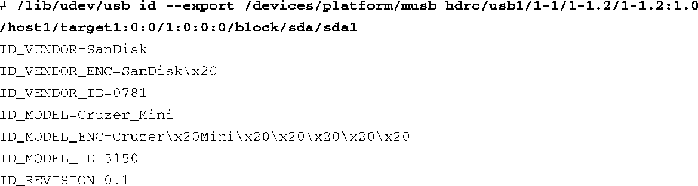

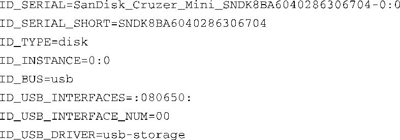
<a class="my_markdown" href="['#ac197']">[7]</a>　在规则文件60-persistent-storage.rules的最上方有一条伪 `if` 语句用于判断 `ACTION` 的类型，如果 `ACTION` 不是 `add` 或 `change` ，那么整个规则文件的内容都会被忽略。

当这条 `usb_id` 命令作为规则的一部分被执行时，其输出信息会成为这个udev事件的一部分环境变量。在同一个规则文件（60-persistent-storage.rules）的后面，可以找到以下规则：

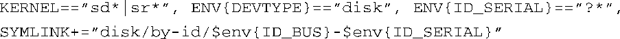
这条规则实际上是使用 `usb_id` 生成的环境变量创建了设备的持久名称。这条规则的含义是：如果内核uevent的 `ACTION` 是 `add` 或 `change` ，内核设备名称是sd*或sr*（SCSI类型的磁盘设备），udev环境变量 `DEVTYPE` 是 `disk` ，udev环境变量 `ID_SERIAL` 是一个非空字符串，那么就创建一个符号链接，它的名称是由ID_BUS和ID_SERIAL通过短横（-）串联而成的。这就是代码清单19-14中显示的最终的符号链接。

这些工具并不一定是为终端用户设计的。如果你想获取有关持久设备名称的信息，使用 `udevadm info` 命令会方便很多。代码清单19-15是一个使用 `udevadm info` 的例子，这条命令查询了Cruzer Mini USB闪存驱动器的相关环境变量。这个工具更容易使用，适合系统管理员或开发人员。我们将/dev中的设备名称传递给它——在这个例子中是sda设备的第一个分区。

代码清单19-15　使用 `udevadm` 查询设备信息

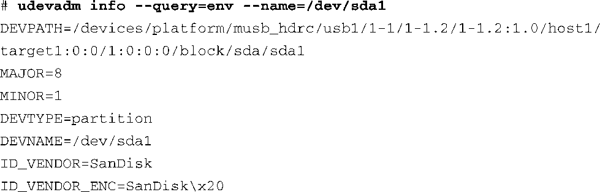

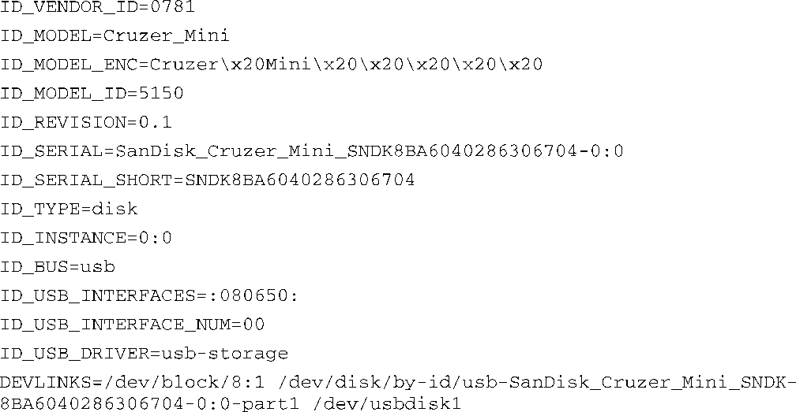
那么我们怎样使用这些数据呢？我们在前面看过一种使用udev规则挂载USB闪存驱动器的方法。我们可以利用这里由 `udevadm info` 生成的唯一ID在规则文件中创建规则。注意，我们可以使用其中任何有意义的属性。

最常见的方法是使用这些信息为设备提供易读或方便识别的名称（持久命名方式）。例如，考虑以下规则：

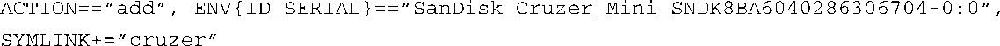
这会在/dev目录中添加一个新的符号链接，指向内核和udev为这个设备创建的设备名称：

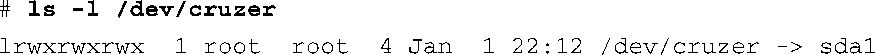
回顾一下代码清单19-13中的自动挂载USB的规则，我们可以创建规则，始终将Cruzer Mini USB闪存驱动器的分区挂载到某个特定的目录上，而不论它的插入顺序和它在USB设备层次结构中的位置：

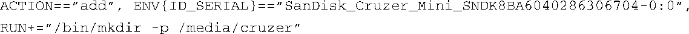

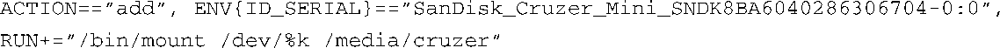
将这些规则添加到规则文件99-usb-automount.rules中，每当插入Cruzer Mini USB闪存驱动器时（不论何时插入，或插入集线器的哪个端口），它总是会被挂载到目录/media/cruzer，从而可以通过这个目录访问U盘中的内容。这就是udev和持久设备命名的神奇之处！

