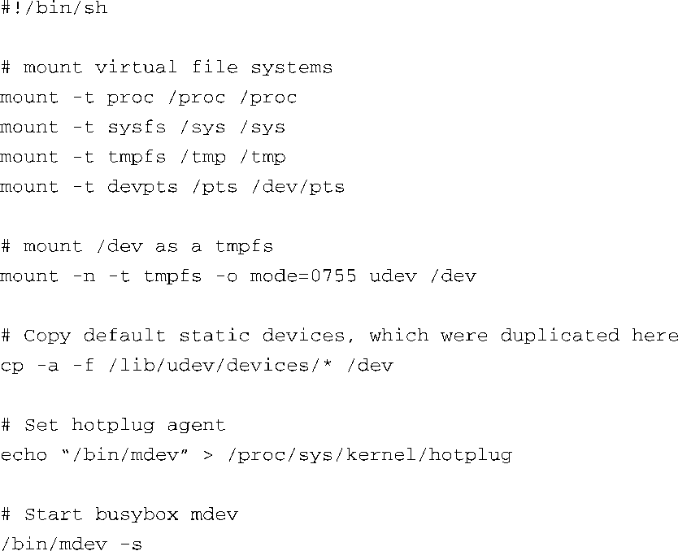
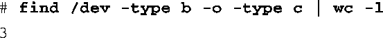
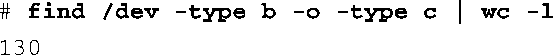

### 19.8.1　busybox mdev

busybox中包含了很多流行的实用Linux工具的简化版本，那么为什么不实现一个简化版的udev呢？简单来说，mdev就是busybox版的udev。发现设备时，mdev会在/dev目录中动态创建设备节点。因为它是简化的实现版本，它的功能和灵活性都不如独立的udev软件包。

和udev一样，busybox mdev需要内核支持sysfs和热插拔。很难想象一个主流的嵌入式Linux系统不包含这些内核子系统<a class="my_markdown" href="['#anchor199']">[9]</a>。

<a class="my_markdown" href="['#ac199']">[9]</a>　实际上，可以想象出一个不支持sysfs和热插拔的最小系统，但它的功能会非常特殊和有限。

mdev使用早期的热插拔机制来接收内核uevent。回顾代码清单19-10中的udev启动脚本，我们需要确认/proc文件系统中热插拔代理的名称为空字符串（禁用），从而内核不会将 `uevent` 传递给这个代理。然而，busybox mdev需要将热插拔代理设置为其自身，也就是/bin/mdev。所以启动脚本的首要工作是设置这个/proc中的文件指向mdev：

当然，启动脚本必须事先挂载/proc文件系统。另外，它还需要挂载/sys，这一点不太明显。当这些步骤都完成后，就可以启动程序了。代码清单19-16是一个使用busybox mdev的示例启动脚本。

代码清单19-16　使用busybox mdev的示例启动脚本

mdev的默认行为只是使用uevent中的内核设备名称在/dev目录中创建设备节点。如果你不需要udev的灵活性，这个功能相当有用。相关设备的名称一般也都是大家所熟知的。

在代码清单19-16中，脚本在执行mdev时使用了 `-s` 标志，这类似于 `udevadm trigger` 的功能。它会让mdev扫描/sys目录并为其中的设备创建设备节点。在init（在使用busybox的情况下是指busybox init）运行之前，内核已经发现一些初始设备，通过这种方式，mdev就可以为这些设备创建设备节点。

启动一个配置了busybox但不包含udev的系统。在启动mdev之前，/dev目录中的设备数量如下：

执行/bin/mdev（这是一个busybox链接或scriptlet，指向/bin/busybox本身）之后，结果是：

