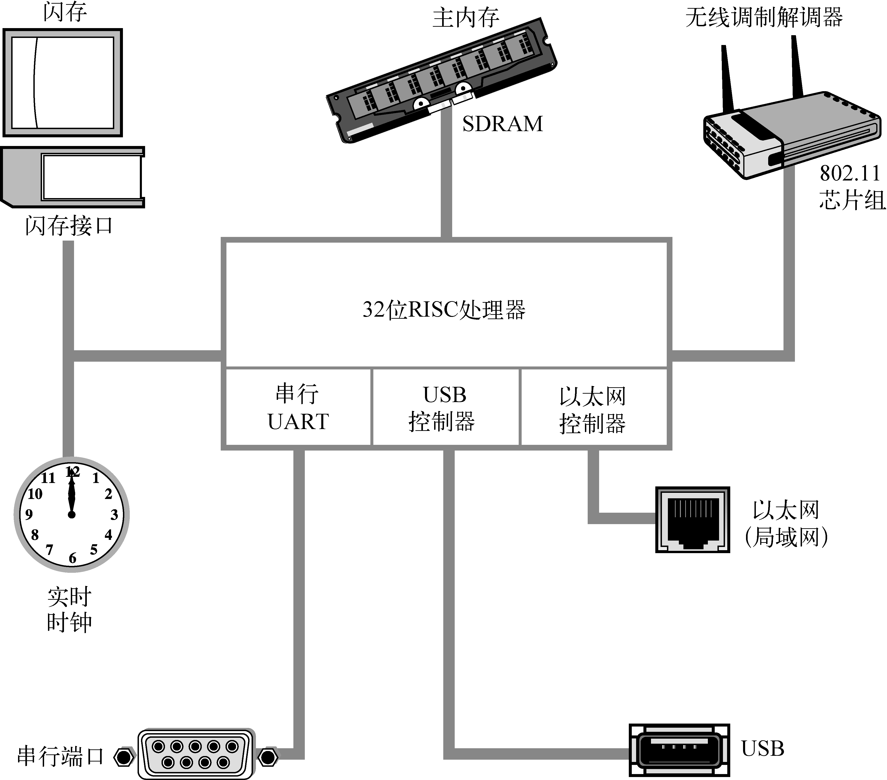

### 2.2　剖析嵌入式系统

图2-1是一个典型嵌入式系统的框图。这个例子很简单，描述了一个系统的高层硬件架构，无线接入点设备可能就是采用这种硬件构架。这个系统架构以一个32位的RISC处理器为中心，系统中的闪存用于存储非易失性程序和数据，主存储器是SDRAM（同步动态随机存储器），其容量可以从几兆至几百兆字节，视应用而定。一个通常由电池供电的实时时钟模块记录着当前时间（包括日期）。这个例子里面包含以太网和USB接口，也包含串行端口，利用串行端口可基于RS-232标准访问控制台。802.11芯片组或模块实现了无线调制解调器的功能。

<b class="my_markdown">图2-1　嵌入式系统</b>

通常，嵌入式系统的处理器完成很多功能，不仅仅是处理传统的核心指令流。图2-1中的假想处理器包含集成的串行接口UART、集成的USB和以太网控制器。很多处理器都包含集成在处理器中的外设，有时这些处理器被称为片上系统（SOC，System On Chip）。第3章会考察几个集成处理器的例子。

