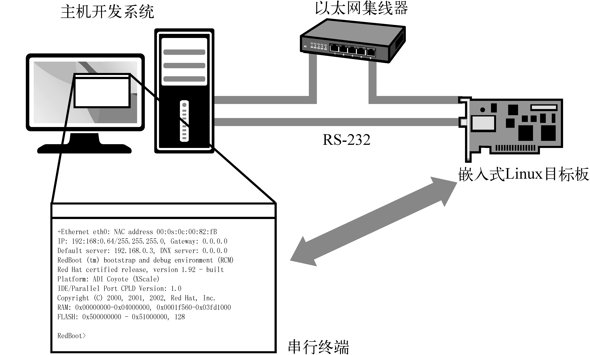

### 2.2.1　典型的嵌入式Linux开发环境

嵌入式Linux开发新手经常提出的一个问题，就是开发之前需要准备些什么。为了回答这个问题，图2-2展示了一个典型的嵌入式Linux开发环境。

<b class="my_markdown">图2-2　典型的嵌入式Linux开发环境</b>

图中展示了一个主机开发系统，其中运行你最喜欢的桌面Linux发行版，比如Red Hat、SUSE或Ubuntu Linux。嵌入式Linux目标板通过一根RS-232串行端口线与开发主机相连。目标板的以太网接口插接到本地以太网集线器或交换机上，开发主机也通过以太网连接到上面。开发主机包含开发工具和程序以及目标文件，通常这些都可从一个嵌入式Linux发行版中获得。

在这个例子中，主机和嵌入式Linux目标板主要通过一个遵循RS-232标准的串行端口连接。主机上运行的串行端口终端程序用于和目标板通信。minicom是最常用的串行端口通信应用程序之一，几乎所有的桌面Linux发行版中都有这个应用程序<a class="my_markdown" href="['#anchor022']">[2]</a>。本书使用screen作为串行端口通信程序，这个程序可以取代minicom的功能，而且更灵活，特别是在trace捕捉方面。对于系统启动或解决故障时串行端口线上的垃圾信息， `screen` 也更加宽容。为了在USB转串行端口线上使用screen，可以在主机终端调用它并指定速率：

<a class="my_markdown" href="['#ac022']">[2]</a>　你也许需要在自己的发行版上安装minicom。例如，在Ubuntu上，可以使用命令 `sudo apt-get install minicom` 来安装minicom。

