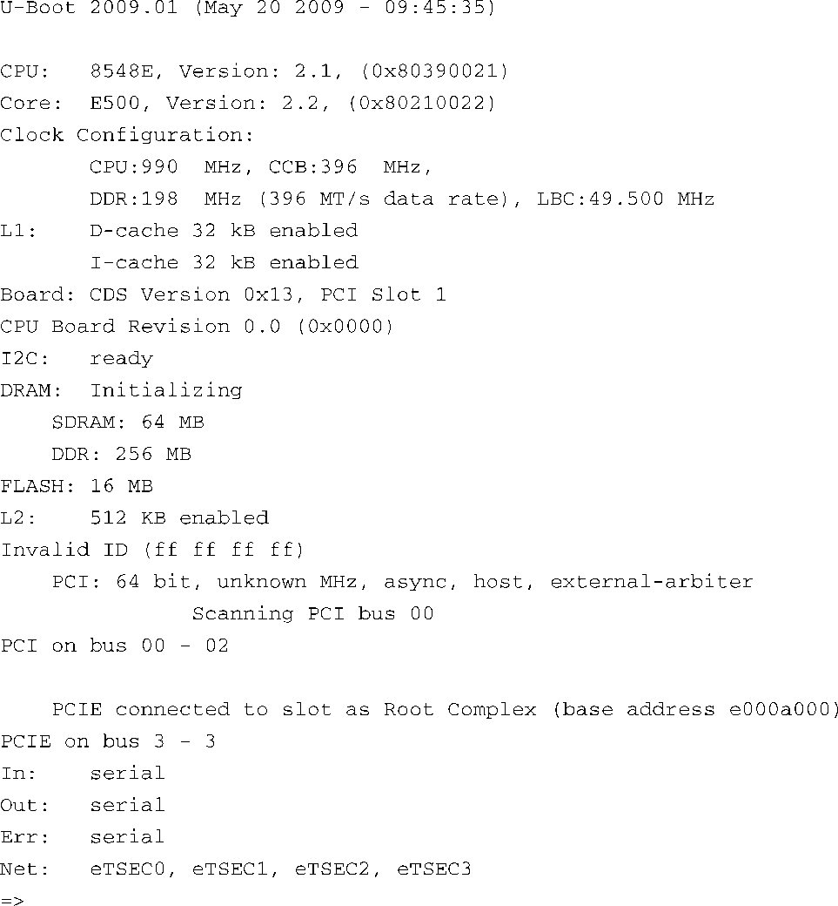

### 2.2.2　启动目标板

第一次加电时，目标板上的引导加载程序立即获得处理器的控制权。该程序执行一些非常底层的硬件初始化，包括处理器和内存的设置，初始化UART用于控制串行端口，以及初始化以太网控制器。代码清单2-1显示了目标板加电后从串行端口接收到的字符。在这个例子中，我们选择了飞思卡尔半导体公司的目标板PowerQUICC III MPC8548 可配置开发系统（Configurable Development System，CDS）。这个开发系统包含了PowerQUICC III MPC8548处理器。这个目标板从飞思卡尔出厂时就预装了U-Boot引导加载程序。

代码清单2-1　引导加载程序从串行端口输出的初始信息

当MPC8548CDS目标板加电时，U-Boot执行一些底层的硬件初始化，包括配置串行端口，然后打印标题行，见代码清单2-1中显示的第一行。接着显示了CPU和核心（Core）的型号及版本，接下来是描述时钟配置和缓存配置的数据，再后面是一串文字描述了这个目标板。

初始的硬件配置完成后，U-Boot根据其静态设置来配置其他硬件子系统。这里，我们看到U-Boot配置了I2C、DRAM、闪存（FLASH）、2级缓存（L2 cache）、PCI和网络子系统。最后U-Boot等待来自串行端口控制台的输入，显示为命令行提示符“ `=>` ”。

