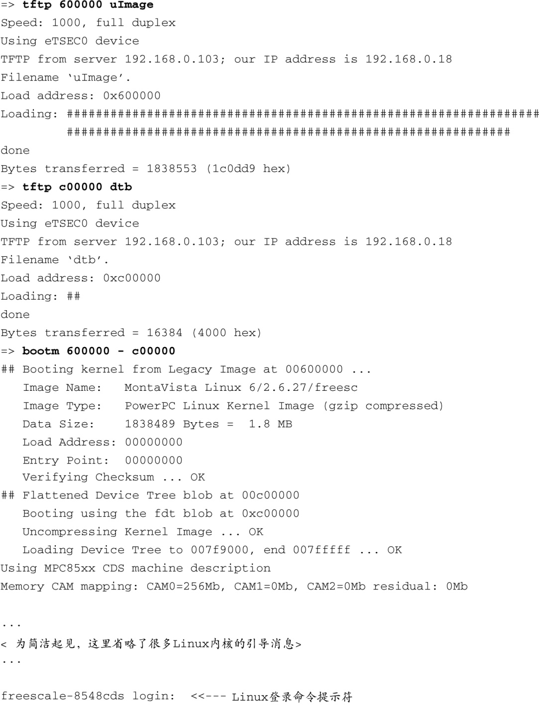

### 2.2.3　引导内核

现在U-Boot已经初始化了硬件、串行端口和以太网接口，在其短暂但有益的生命中还剩一件工作：加载并引导Linux内核。所有的引导加载程序都提供了命令用于加载和执行操作系统镜像。代码清单2-2显示了使用U-Boot手动加载并引导Linux内核的一种常用方法。

代码清单2-2　加载Linux内核

代码清单2-2开头的 `tftp` 命令指示U-Boot使用TFTP<a class="my_markdown" href="['#anchor023']">[3]</a>协议将内核镜像 `uImage` 通过网络加载到内存。在这个例子中，内核镜像存放于开发工作站（通常，这个开发工作站就是通过串行端口与目标板相连的那台主机）。执行 `tftp` 命令时，需要传入一个地址参数，这个地址用于指定内核镜像将要被加载到的目标板内存的物理地址。读者现在不用担心这些细节，第7章将会详细介绍U-Boot。

<a class="my_markdown" href="['#ac023']">[3]</a>　我们会在第12章介绍这些协议和相关服务器程序。

第2次执行 `tftp` 命令加载了一个目标板配置文件，称为设备树（device tree），这个文件还有其他的名字，包括扁平设备树（flat device tree）和设备树二进制文件（device tree binary）或dtb。你将在第7章了解到这个文件的更多信息。现在，你只要知道这个文件与具体目标板相关，包含了内核所需的用于引导目标板的信息就足够了。这些信息包括内存大小、时钟速率、板载设备、总线和闪存布局。

接着，执行 `bootm` （从内存镜像引导）命令来让U-Boot引导刚才加载至内存的内核，起始地址就是在 `tftp` 命令中指定的地址。在这个使用 `bootm` 命令的例子中，我们让U-Boot加载放在地址0x600000处的内核，并将加载到地址0xc00000处的设备树二进制文件（dtb）传给内核。 `bootm` 命令会将控制权移交给Linux内核。假设内核配置正确，这个命令的结果是引导Linux内核直至在目标板上出现控制台命令行提示符，如同登录提示符所示。

注意 `bootm` 命令为U-Boot敲响了丧钟。这是一个重要的概念。与桌面PC的BIOS不同，大多数的嵌入式系统都采用这样一种架构：当Linux内核掌握控制权时，引导加载程序就不复存在了。Linux内核会要求收回那些之前被引导加载程序所占用的内存和系统资源。将控制权交回给引导加载程序的唯一方法就是重启目标板。

最后还需要注意一点。在代码清单2-2的串行端口输出中，下面这行之前的信息（包含这一行）都是由U-Boot引导加载程序产生的：

其余引导信息是由Linux内核产生的。对于这一点，我们在后续章节还要详细说明，但我们需要注意U-Boot是在哪儿离开的以及Linux内核是在哪儿取得控制权的。

