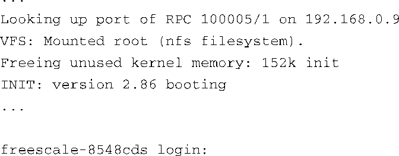

### 2.2.4　内核初始化：概述

当Linux内核开始执行时，它会在其相当复杂的引导过程中输出大量状态消息。在当前讨论的这个例子中，在显示登录提示符之前，Linux内核大约显示了200行 `printk` <a class="my_markdown" href="['#anchor024']">[4]</a>打印信息（代码清单中省略了这些打印行以便讨论的重点更加清晰）。代码清单2-3再现了登录提示符之前的最后几行输出。这个练习的目的不是要深入到内核初始化的细节中去（第5章会讲述这方面的内容），而是要对正在发生的事情，以及对嵌入式系统中引导Linux内核需要哪些组件有一个概览。

代码清单2-3　Linux内核加载的最后几行引导消息

<a class="my_markdown" href="['#ac024']">[4]</a>　 `printk()` 是一个内核函数，负责将消息打印到系统控制台上。

Linux在串行端口终端上显示登录提示符之前，会挂载一个根文件系统。在代码清单2-3中，Linux通过一系列必要步骤，从一个NFS<a class="my_markdown" href="['#anchor025']">[5]</a> 服务器来远程（通过以太网）挂载其根文件系统，这个NFS服务器程序运行于IP地址为192.168.0.9的主机之上。通常这个主机就是你的开发工作站。根文件系统包含构成整个Linux系统的应用程序、系统库和工具软件。

<a class="my_markdown" href="['#ac025']">[5]</a>　我们会在第12章中介绍NFS和其他相关服务器程序。

重申一下这里讨论的重点：Linux必须有一个文件系统。很多老式的嵌入式操作系统不需要文件系统，因此那些从老式嵌入式操作系统迁移到嵌入式Linux系统的工程师往往会感到惊讶。一个文件系统由一组预定义的系统目录和文件组成，这些目录和文件按照特定的布局存储在硬盘或其他存储介质上，而Linux内核可以挂载这些介质作为其根文件系统。

注意Linux也可以从其他设备挂载根文件系统。最常见的情况当然是挂载一个硬盘分区作为根文件系统，就像笔记本或工作站中的Linux系统所做的那样。实际上，当你将嵌入式Linux小玩意带出房门或远离开发环境时，NFS就没什么用处了。然而，在读这本书的过程中，你会逐渐体会到在开发环境中挂载NFS根文件系统带来的威力和灵活性。

