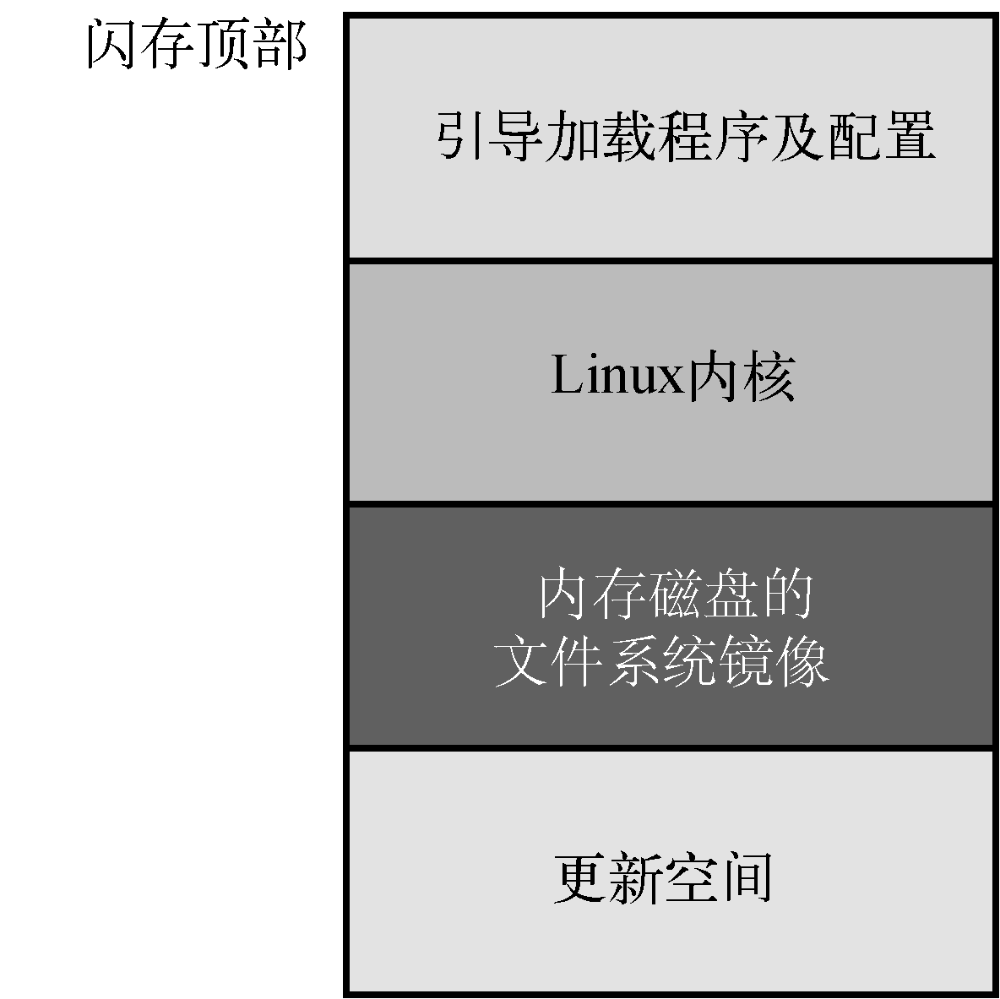

### 2.3.3　闪存的用途

有多种闪存布局和使用方法可供嵌入式系统的设计者选择。在最简单的系统中，资源没有过度受限，可以将原始的二进制数据（可能是压缩过的）存储在闪存设备中。系统引导时，存储在闪存中的文件系统镜像被读入Linux内存磁盘（ramdisk）块设备中。这个块设备由Linux挂载为一个文件系统，并且只能从内存中访问。当闪存中的数据几乎不需要更新时，这种方式通常是很好的选择。相比于内存磁盘的容量，需要更新的数据量是很少的。但是，当系统重启或断电时，对内存磁盘中文件的修改会丢失，务必牢记这一点。

图2-4说明了一个简单嵌入式系统中的典型闪存组织结构。在这个系统中，动态数据对非易失性存储的需求很少且更新不频繁。

<b class="my_markdown">图2-4　典型的闪存布局</b>

引导加载程序通常存放在闪存阵列的顶部或底部。引导加载程序之后的存储空间被分配给Linux内核和内存磁盘文件系统镜像<a class="my_markdown" href="['#anchor0210']">[10]</a>，这个镜像中包含了根文件系统。一般来说，Linux内核和ramdisk文件系统镜像都被压缩过，并由引导加载程序在系统引导时解压。

<a class="my_markdown" href="['#ac0210']">[10]</a>　我们会在第9章详细介绍内存磁盘文件系统。

可以在闪存中专门开辟一小块区域，或者使用其他类型的非易失性存储设备<a class="my_markdown" href="['#anchor0211']">[11]</a>来存放那些重启或掉电后仍需保留的动态数据。对于需要保存配置数据的嵌入式系统，这种方式很常见。例如，针对消费者市场的无线接入点设备可能采用这种方式。

<a class="my_markdown" href="['#ac0211']">[11]</a>　如果只需存储少量数据，可以选择实时时钟模块或串行EEPROM作为非易失性存储设备。

