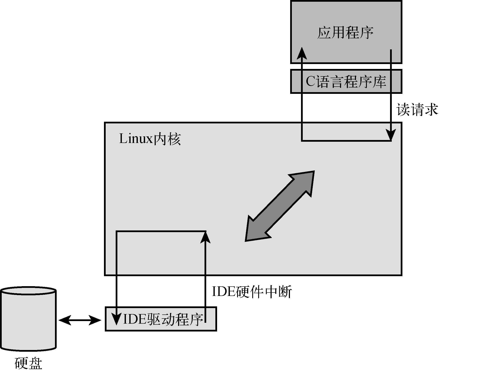

### 2.3.6　执行上下文

系统引导时，Linux最先要完成一项琐碎工作，即配置处理器中的硬件MMU以及相应的数据结构，并使之能够进行地址转换。这一步完成后，内核运行于自己的虚拟内存空间中，这个空间称为内核空间。在当前的Linux内核版本中，这个虚拟内存空间的起始地址是由内核开发者选择的，其默认值为0xC0000000<a class="my_markdown" href="['#anchor0214']">[14]</a>。对于大多数硬件架构，这是个可以配置的参数<a href="#anchor0215" id="ac0215">[15]</a>。在内核符号表中，可以看到内核符号的链接地址都是以0xC0xxxxxx开头的。所以，当内核在内核空间中执行代码时，处理器的指令指针（程序计数器）所包含的值都在这个范围之内。

<a class="my_markdown" href="['#ac0214']">[14]</a>　对于32位CPU而言，内核空间的地址范围是从0xC0000000到0xFFFFFFFF。 ——译者注

<a class="my_markdown" href="['#ac0215']">[15]</a>　不过，一般不需要修改。

Linux中有两个明显分隔开的运行上下文，由线程<a class="my_markdown" href="['#anchor0216']">[16]</a>的执行环境所决定。那些完全在内核中执行的线程被认为运行在内核上下文中，而应用程序运行在用户空间上下文中。用户空间进程只能访问它自己拥有的内存，如果它要访问文件或设备I/O等特权资源，则必须使用内核系统调用。下面举个例子，让你更好地理解这一点。

<a class="my_markdown" href="['#ac0216']">[16]</a>　“线程”这个词的含义在这里比较宽泛，代表任意一个指令流的序列。

假设一个应用程序打开一个文件并读取其中的内容，如图2-6所示。对读函数的调用是从用户空间开始的，由应用程序调用C库中的 `read()` 函数。接着，C库向内核发起一个读请求。这个读请求造成一次上下文的切换，从用户程序切换到内核，以服务这个请求并读取文件中的数据。在内核中，这个读请求最终转变成对硬盘驱动器的访问，从包含文件内容的扇区中读取相应数据。

<b class="my_markdown">图2-6　简单的文件读请求</b>

通常，这个对硬盘驱动器的读请求是以异步的形式发往硬件自身的。也就是说，处理器将这个请求发给硬件，并不会等待其完成请求。硬件收到请求后读取数据，当数据准备好的时候，通过中断的方式来告知处理器读请求已经完成了。等待数据的应用程序会阻塞在一个等待队列中，直到有数据可用。当硬盘准备好数据时，它将向处理器发送一个硬件中断（这里只是描述了一个简化的过程）。当内核接收到这个硬件中断时，它会挂起正在执行中的任何进程，并从硬盘驱动器中读取应用程序所等待的数据。

下面对我们的讨论做一个概括，我们学习了两个通用的执行上下文——用户空间和内核空间。当应用程序执行系统调用，造成上下文的切换而进入内核时，内核会代表这个进程执行内核代码。你会经常听到，这种情况称为内核运行于进程上下文中。相反，处理IDE驱动器的中断处理程序（ISR）也是内核代码，但在运行时并不代表任何特定的进程。这种情况通常被称为内核运行于中断上下文中。

内核运行于中断上下文中时会受到一些限制，包括中断处理程序不能够阻塞（睡眠）或调用任何可能造成阻塞的内核函数。如果想要更多地了解这些概念，请阅读本章末尾的参考文献。

