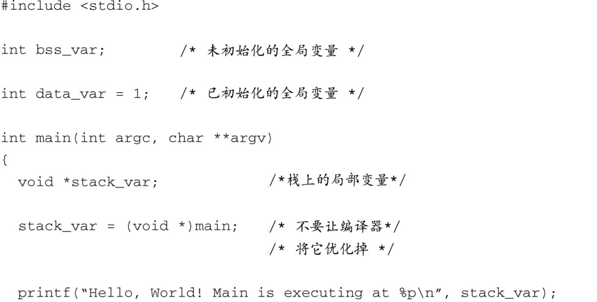
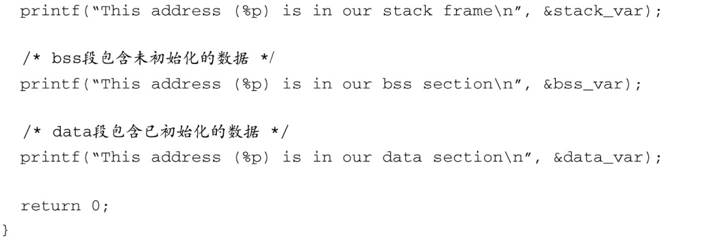
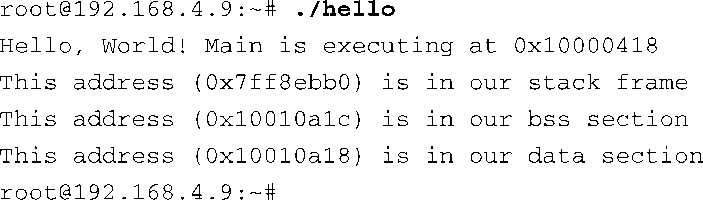

### 2.3.7　进程虚拟内存

一个进程产生时——例如，当用户在Linux的命令提示符后面输入 `ls` 的时候——内核就会为这个进程分配内存及相应的虚拟内存地址范围。这些地址与内核中的地址或其他正在运行的进程的地址没有固定的关系。此外，这些进程所看到的虚拟地址跟目标板上的物理内存的地址也没有直接的关系。实际上，由于系统中存在分页（paging）和交换（swapping）机制，一个进程在其生命周期中常常会占用内存的多个不同的物理地址。

代码清单2-4是程序员所熟知的“Hello World”程序，这里做了点修改来说明刚刚讨论的一些概念。这个例子的目的是解释说明内核分配给进程的地址空间。这段代码编译后，在一个拥有256 MB DRAM内存的嵌入式系统上运行。

代码清单2-4　嵌入式风格的Hello World

代码清单2-5显示了运行编译后的程序hello时，控制台输出的信息。注意，hello进程认为它的运行地址位于高地址内存的某个地方，刚好超过256 MB的边界（0x10000418）。还需注意，栈的地址大概处于32位地址空间一半的地方，远远超过了内存的大小256 MB（0x7ff8ebb0）。怎么会这样呢？在这种系统中，DRAM通常是一块连续的内存。乍一看，我们几乎有将近2 GB的DRAM可以使用。这些虚拟地址是由内核分配的，并且有嵌入式目标板上的256 MB的物理内存在背后支持。

代码清单2-5　Hello的输出

虚拟内存系统的一个特点是当可用的物理内存的数量低于某个指定的阈值时，内核可以将内存页面交换到大容量存储媒介中，通常是硬盘驱动器。内核检查正在使用中的内存区域，并判断哪些区域最近使用得最少，然后将这些内存区域交换到磁盘中，并释放这些内存区域给当前进程使用。嵌入式系统的开发者常常会因为性能原因或资源限制而禁用嵌入式系统中的交换功能。多数情况下，使用慢速且写寿命有限的闪存设备作为交换设备是很不明智的。如果没有交换设备可用，就必须仔细地设计应用程序，使其能够运行在有限的物理内存中。

