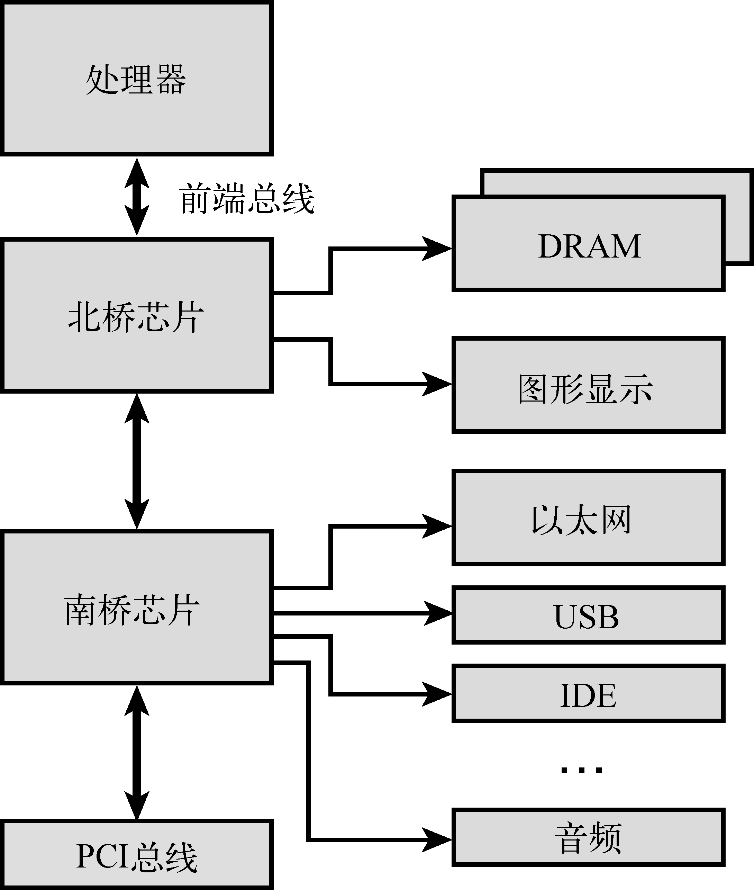

### 3.1.5　配套芯片组

我们刚刚介绍的单独处理器都需要连接支撑逻辑芯片才能访问外设，这些外设包括系统主内存（DRAM）、ROM或闪存、系统总线（比如PCI）和其他外设，比如键盘控制器、串行端口和IDE接口，诸如此类。支撑逻辑芯片的功能一般由配套的芯片组来完成，而这个芯片组很可能是专门为某个系列的处理器设计的。

举例来说，奔腾M的配套芯片组为855GM。855GM芯片组包含了图形（Graphics）和内存（Memory）系统的主要接口，这也是名称中GM后缀的由来。855GM作为奔腾M的配套芯片组使用进行了优化。图3-1显示了在这种硬件设计中处理器和芯片组的关系。

<b class="my_markdown">图3-1　处理器和芯片组的关系</b>

注意描述这些芯片组时常用的一些术语。英特尔855GM是我们通常所说的北桥芯片的例子，因为这个芯片直接和处理器的高速前端总线（Front-Side Bus，FSB）相连。类似地，另外一个提供I/O和PCI总线连接的配套芯片被称为南桥芯片，这个名字来源于它在系统架构中的位置。这些硬件架构中的南桥芯片（实际上是一个I/O控制器）负责提供像图3-1中显示的那些外设接口，包括以太网、USB、IDE、音频、键盘和鼠标控制器。

Power架构的独立处理器也有其配套的芯片组，Tundra Tsi110 主桥（Host Bridge）就是这样一款产品。Tsi110芯片支持飞思卡尔MPC74xx和IBM PPC750xx系列处理器。这些处理器可以使用Tundra芯片来提供对下列这些外设的直接访问接口。

+ 双数据速率（Dual Data Rate，DDR）DRAM，集成内存控制器。
+ 以太网（Tundra提供4个吉比特以太网端口）。
+ PCI Express（支持2个PCI Express端口）。
+ PCI/X（PCI 2.3、PCI-X和Compact PCI[cPCI]）。
+ 串行端口。
+ I2C。
+ 可编程的中断控制器。
+ 并行端口。

芯片组的生产厂商有很多，包括威盛科技（VIA Technologies）、Marvell、Tundra（现在属于IDT）、英伟达（nVidia）、英特尔等。Marvell和Tundra主要服务于Power架构市场，而其他厂家则专注于英特尔架构。基于英特尔x86架构、IBM或飞思卡尔Power架构的处理器，都需要配备配套芯片组，以建立和系统设备之间的接口。

采用Linux作为嵌入式操作系统的一个优势是它能快速支持新型芯片组。Linux目前支持上面提到的这些芯片组以及其他多种类的芯片组。请参考Linux源代码和配置工具，以了解你所选择的芯片组。

