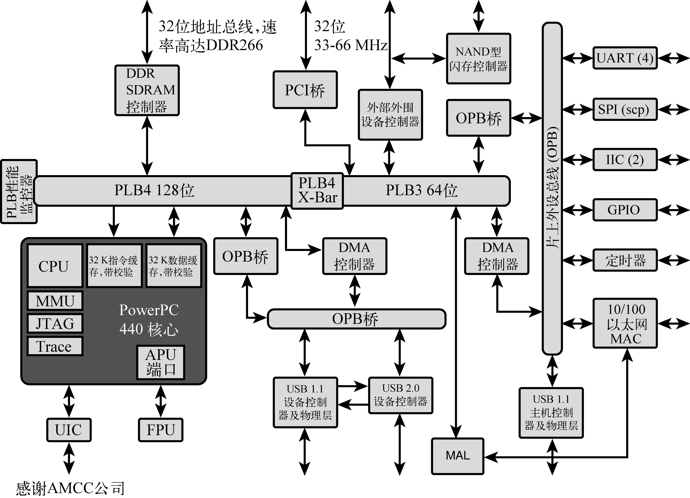

### 3.2.8　AMCC Power架构

本书后面章节中的一些例子是基于AMCC Power架构的400EP嵌入式处理器。440EP是一个流行的集成嵌入式处理器，应用于很多网络和通信设备。下面列出440EP的一些特性：

+ 片上双数据速率（Dual Data Rate，DDR）SDRAM控制器；
+ 集成的NAND闪存控制器；
+ PCI总线接口；
+ 双10/100 Mbit/s以太网端口；
+ 片上USB 2.0接口；
+ 多至4个用户可配置的串行端口；
+ 双I2C控制器；
+ 可编程中断控制器；
+ 串行外设接口（Serial Peripheral Interface，SPI）控制器；
+ 可编程时钟；
+ JTAG调试接口。

这实际上是一个完整的片上系统。图3-2是一个框图，描述了AMCC Power架构的440EP嵌入式处理器。加上内存芯片和物理I/O设备，我们只需少数几个接口电路，就可以围绕这个集成微处理器搭建一个高端嵌入式系统。

<b class="my_markdown">图3-2　AMCC PPC 440EP 嵌入式处理器</b>

很多厂家都会向开发者提供参考硬件平台，以帮助他们深入研究处理器或其他硬件的功能。第14章和第15章中的例子都是在AMCC 的Yosemite板上运行的，图3-2就是AMCC公司提供的参考平台，其中包含了一个440EP处理器。

Power架构包括大量不同配置的处理器产品。如图3-2所示， AMCC 440EP处理器包含了足够的针对普通产品的I/O接口，使用时只需要很少额外电路。这个处理器包含了一个片上浮点计算单元（Floating-Point Unit，FPU），因此很适合用于以下这些产品：联网图像处理系统、通用工业控制和网络设备。

AMCC的Power架构产品线包含几种不同的配置，都采用两个久经考验的处理器核心。基于405核心的处理器产品有2种配置：集成或不集成以太网控制器。所有采用405核心的处理器都集成了SDRAM控制器、2个串行UART、针对底层板上管理通信的I2C、通用I/O引脚和集成时钟。基于AMCC 405核心的集成处理器广泛应用于那些不需要硬件FPU的产品，可节省开支并保证一定的性能。

AMCC生产的基于440核心的处理器产品进一步提升了性能等级，并增加了一些外设。在我们的例子中使用的440EP处理器包含一个硬件FPU。440GX增加了两个3速 10/100/1000 Mbit/s以太网接口（除了有两个10/100 Mbit/s以太网端口之外）和针对高性能网络应用的TCP/IP硬件加速功能。440SP增加了面向RAID 5/6应用的硬件加速功能。所有这些处理器都有成熟的Linux支持。表3-8总结了AMCC 405xx系列处理器产品的特性。

<b class="my_markdown">表3-8　AMCC Power架构405xx系列产品特性</b>

| 特征 | 405CR | 405EP | 405GP | 405GPr |
| :-----  | :-----  | :-----  | :-----  | :-----  | :-----  | :-----  |
| 核心 | PPC 405 | PPC 405 | PPC 405 | PPC 405 |
| 核心频率 | 133~266 MHz | 133~333 MHz | 133~266 MHz | 266~400 MHz |
| DRAM控制器 | SDRAM/133 | SDRAM/133 | SDRAM/133 | SDRAM/133 |
| 以太网10/100 | 否 | 2 | 2 | 1 |
| GPIO引线 | 23 | 32 | 24 | 24 |
| UART | 2 | 2 | 2 | 2 |
| DMA控制器 | 4通道 | 4通道 | 4通道 | 4通道 |
| I2C控制器 | 是 | 是 | 是 | 是 |
| PCI主机控制器 | 否 | 是 | 是 | 是 |
| 中断控制器 | 是 | 是 | 是 | 是 |

表3-9总结了AMCC 440xx家族处理器产品的特性。

<b class="my_markdown">表3-9　AMCC Power架构440xx系列产品特性</b>

| 特征 | 440EP | 440EP | 440GX | 440SP |
| :-----  | :-----  | :-----  | :-----  | :-----  | :-----  | :-----  |
| 核心 | PPC 440 | PPC 440 | PPC 440 | PPC 440 |
| 核心频率 | 333~667 MHz | 400~500 MHz | 533~800 MHz | 533~667 MHz |
| DRAM控制器 | DDR | DDR | DDR | DDR |
| 以太网10/100 | 否 | 2 | 2 | 通过吉比特以太网 |
| 吉比特以太网 | 否 | 否 | 2 | 1 |
| GPIO引线 | 64 | 32 | 32 | 32 |
| UART | 4 | 2 | 2 | 3 |
| DMA控制器 | 4通道 | 4通道 | 4通道 | 3通道 |
| I2C控制器 | 2 | 2 | 2 | 2 |
| PCI主机控制器 | 是 | PCI-X | PCI-X | 3PCI-X |
| SPI控制器 | 是 | 否 | 否 | 否 |
| 中断控制器 | 是 | 是 | 是 | 是 |

