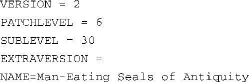
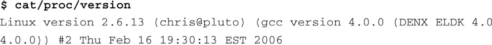

### 4.1.1　内核版本

你可以从很多地方获得Linux内核源码和相关软件。你家附近的书店里也许会有讲述Linux的书，这些书附带的光盘中有各种版本的Linux源码。你也可以从网站下载内核本身，甚至完整的Linux发行版。Linux内核的官方网站是<a class="my_markdown" href="['http://www.kernel.org']">www.kernel.org</a>。你会常常听到主线（mainline）代码或主线内核这样的词，它们指的就是网站kernel.org上提供下载的源码树。

很长时间以来，人们使用的Linux版本都一直是2.6。在开发的早期阶段，开发人员选择了一种编号系统来区分两种内核代码树，一种是针对开发和实验的非稳定版本，另一种是可供生产和使用的稳定版本。这种编号命名方式包含主版本号、次版本号和序列号。在2.6版本之前，次版本号是偶数，表示稳定版本；次版本号是奇数，则表示它是一个开发版本。例如：

+ Linux 2.4.x——稳定内核版本；
+ Linux 2.5.x——实验（开发）版本；
+ Linux 2.6.x——稳定内核版本。

目前，Linux 2.6内核没有单独的开发分支。所有新的特性、改进和错误修正都是通过一系列开发人员的层层检验和过滤，而最终合入到由Andrew Morton和Linus Torvalds维护的顶层Linux源码树中。

很容易可以判断出你使用的内核版本。内核源码树的顶层目录中包含一个makefile<a class="my_markdown" href="['#anchor044']">[4]</a>文件，这个文件的开始几行详细说明了内核的版本号。对于2.6.30的内核发布版本，这几行的内容如下：

<a class="my_markdown" href="['#ac044']">[4]</a>　我们很快就会介绍内核构建系统和makefile。

在这个makefile文件的后面，以上宏会用来定义一个描述内核版本号的宏，就像这样：

在内核构建系统的很多地方都使用这个宏来表示内核版本。在最近的内核中，这个宏的使用范围已经缩小，仅限于脚本目录中的几个地方了。它已经被一个更完整的描述字符串KERNELRELEASE所取代。这个字符串不仅包含了内核版本号，还包含了一个与源码版本控制工具git有关的标记，这是Linux内核采用的源码版本控制系统。

内核源码树里有好几个地方都用到了KERNELRELEASE。这个宏也被编译进了内核镜像，这样，从控制台就可以查询它的值了。在一个运行Linux的系统中，在命令行提示符后输入以下命令，就可以查询到内核的发布信息：

关于内核版本，还有最后一点需要注意：可在你自己的内核项目中自定义 `EXTRAVERSION` 字段、便于记录和跟踪内核版本号。例如，如果你正在开发一些新的内核特性，可以像以下这样设置 `EXTRAVERSION` ：

随后，当你使用命令cat /proc/version时，你会看到Linux version 2.6.13-foo，而这会帮助你区分出自己内核的开发版本。

