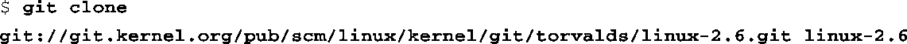

### 4.1.3　使用git下载内核代码

下载最新Linux内核代码的最简便的方法是使用git。Linux内核社区选定这个工具程序作为内核源码的版本管理系统。大多数主流Linux桌面发行版都带有git。例如，在Ubuntu<a class="my_markdown" href="['#anchor045']">[5]</a>中，可以输入以下命令，将git安装到你的桌面PC或笔记本上：

<a class="my_markdown" href="['#anchor046']">[6]</a>

<a class="my_markdown" href="['#ac045']">[5]</a>　参考你的Linux发行版的相关文档，查看如何在系统中安装git。

<a class="my_markdown" href="['#ac046']">[6]</a>　注意一下，在你的发行版中，这可能指的是别的软件包。不幸的是，git这个名字和另一个软件包（GNU Interactive Tool）的名字是相同的。

当你的系统中安装好git后，可以使用命令git clone来克隆一个git源码树：

这条命令的执行结果是创建一个名为linux-2.6的子目录，位于你所输入命令的当前目录中。这个子目录中包含了一个克隆自kernel.org的内核源码树。有很多专门用于学习git的教程和网站。你可以登录Jeff Garzik的网站，从以下教程开始学习：http://linux.yyz.us/git-howto.html。

