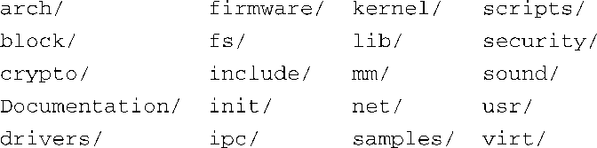

### 4.2.1　顶层源码目录

在这本书中，我们常常会提到顶层源码目录。这时，我们指的是内核源码树的最高一层目录。在一台电脑上，它可能存放于任意位置，但如果这台电脑是一个桌面Linux工作站，则它通常处于/usr/src/linux-x.y.z，其中x.y.z代表内核的版本号。本书使用简短的…/来代表顶层内核源码目录。

顶层源码目录包含以下列出的子目录。（为清晰和简洁起见，我们省略了非目录项和那些用于源码控制的目录。）

这些目录中的大多数都另外包含了几层子目录，在其中存放源码、makefile和配置文件。到目前为止，Linux内核源码树的最大分支位于.../drivers目录。在这个目录中，你可以找到Linux支持众多硬件设备的驱动代码，支持的设备包括各种以太网卡，USB控制器等。你可能已经猜到了，.../arch子目录是第二大分支，其中包含的代码文件支持20多种处理器架构。

顶层Linux子目录中还有一些其他文件，包括顶层makefile，一个隐藏的配置文件（.config文件，我们将在4.3.1节介绍），以及与内核构建无关的信息性文件。最后，介绍两个重要的构建目标（build target）文件：System.map和vmlinux，内核构建成功后，在顶层源码目录中会生成这两个文件，其中vmlinux是内核主体（kernel proper）。下一节会讲述这两个文件。

