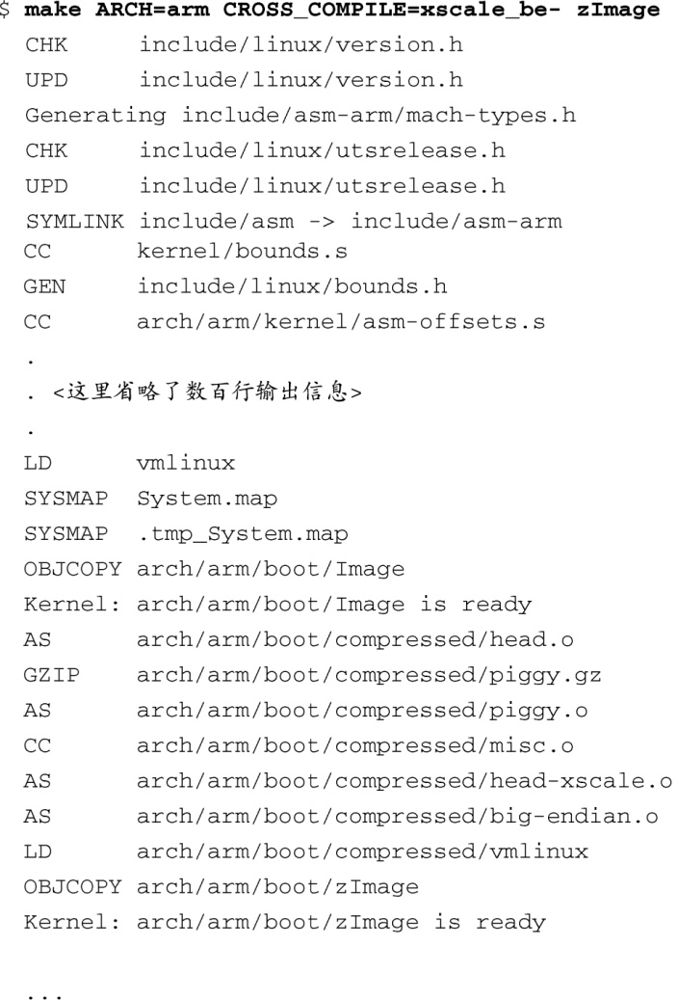

### 4.2.2　编译内核

Liunx内核代码庞大而复杂，理解这些代码是一项令人生畏的工作。它的代码量太大了，以至于不能简单地通过“走查”代码的方法来理解代码的含义。内核的多线程和抢占（preemption）特性使得代码分析更加复杂。实际上，即使是找出内核的入口点（进入内核时执行的第一行代码）都不容易。有一种方法可以帮助我们理解大的二进制镜像的结构，那就是考察它的构建成员。

内核构建系统在成功构建内核后，会生成一些公共文件以及一个或多个与具体架构相关的二进制模块。无论采用什么架构，构建内核后总是会生成公共文件。有两个重要的公共文件是System.map和vmlinux。前一个文件有助于调试内核，并且非常有趣。它包含了一个人类可读的内核符号的列表以及它们各自的地址。后一个文件是一个与具体架构相关的可执行文件，而且符合ELF格式。这个文件是由顶层内核makefile文件针对具体架构生成的。如果在编译内核时包含了用于调试的符号信息，这些信息会保存在vmlinux镜像中。实际上，虽然它是一个ELF格式的可执行文件，这个文件几乎从不直接用于引导系统，很快你就会看到这一点。

代码清单4-1中显示了内核构建时的一部分输出信息，其中，我们将内核代码的目标架构配置为ARM XScale，并执行 `make` 命令进行构建。内核代码是针对ADI Engineering公司的Coyote参考板进行配置的，这块参考板上使用了基于ARM核心的英特尔IXP425网络处理器，配置内核代码的命令为：

这个命令并没有构建内核；它只是将内核源码树的架构配置为XScale，为后面的内核构建做准备。这个命令基于文件ixp4xx_defconfig中的默认值生成一个默认配置文件（.config文件），用于内核构建。在4.3节中，我们还会详细讲述内核代码的配置过程。

针对我们这里的讨论内容，代码清单4-1中只显示了所有输出信息的最前面和最后面几行。

代码清单4-1　内核构建时的输出信息

我们从构建命令的具体调用方式开始讨论。命令行中同时指定了目标架构（ARCH=arm）和工具链<a class="my_markdown" href="['#anchor047']">[7]</a>（CROSS_COMPILE=xscale_be-）。这就强制make使用XScale工具链<a href="#anchor048" id="ac048">[8]</a>来构建内核镜像，并使用内核源码树的arm分支来编译生成镜像中与架构相关的部分。我们同时也指定了一个目标文件，称为zImage。很多架构都使用zImage来命名构建出的目标文件，在第5章中，我们会介绍它。如今，主流内核在构建时会自动生成合适的默认目标文件，因此，你可能不需要在命令行中指定zImage或其他目标了。

<a class="my_markdown" href="['#ac047']">[7]</a>　当然，你的工具链的前缀可能和这里的不同。

<a class="my_markdown" href="['#ac048']">[8]</a>　实际上，这只是在makefile文件中的CC、LD和AR等名称前加上 `CROSS_COMPILE` 的值。

接下来，你可能会注意到，构建过程中每个步骤所使用的实际命令都被隐藏了，取而代之的是一些简写的符号。这样做的目的是使构建输出信息更加清晰，从而使开发人员将更多注意力集中在构建过程中出现的问题上，特别是编译器的告警信息。在构建早期的内核源码时，每一个编译或链接命令都将信息逐字逐句地输出到控制台上，通常每一步都会有好几行输出。这样带来的问题是输出信息过多，开发者会迷失在一堆杂乱无章的信息中，忽略编译器的告警信息。显然，新的构建系统在这方面做了改进，因为构建过程的异常情况很容易被发现。如果你希望或是需要查看完整的构建步骤，可以在 `make` 命令行中定义 `V=1` 而使其输出详细的信息：

为清晰起见，我们已经在代码清单4-1中省略了大部分编译和链接步骤。（这个构建包含了1000多个独立的编译、链接和其他命令。如果列出所有这些命令，会占用大量篇幅。）当构建和编译生成所有的中间文件及程序库之后，它们被组合到一个大的ELF文件中，这个文件就是我们的构建目标，称为vmlinux。虽然它与具体的架构有关，但vmlinux是一个公共目标。所有Linux支持的架构在构建时都会生成这个文件，并且它位于顶层源码目录中，很容易找到。

