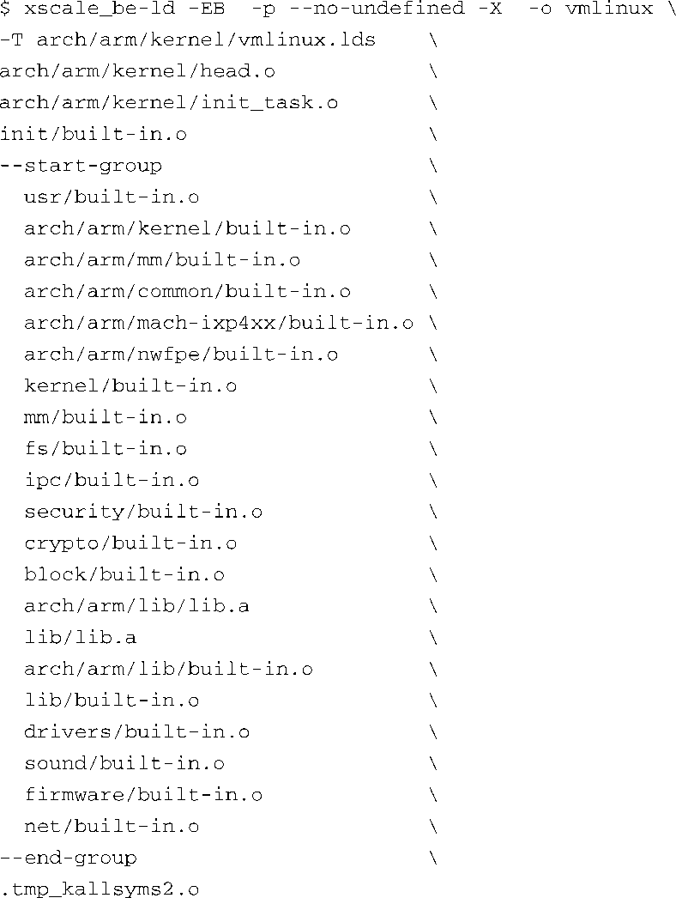

### 4.2.3　内核主体：vmlinux

注意代码清单4-1中的以下这一行：

vmlinux文件就是实际的内核主体（kernel proper）。它是一个完全独立的单一ELF镜像。也就是说，vmlinux这个二进制文件不包含任何未解析的外部引用。当有合适的环境（通过一个用于引导Linux内核的引导加载程序）可以执行它时，它会引导硬件单板并在上面运行，生成功能完备的内核。（实际上，我们很少直接使用ELF目标文件vmlinux，而是使用它的压缩形式。压缩文件可由代码清单4-1中的最后几个步骤生成。关于这一点，我们很快还会详细说明。）

有这样一条哲理：理解一个系统之前你必须先理解它的组成部分，照此说法，我们先来看一下vmlinux内核对象的内部构造。代码清单4-2显示了构建过程的链接阶段所使用的命令，ELF对象vmlinux就是在这个阶段生成的。我们调整了代码清单4-2的格式，将其分成很多行（我们使用了UNIX系统里的续行符“\”），这样看起来会更加清晰可读。但如果没有这些续行符，这就是在代码清单4-1的构建过程中，链接生成vmlinux时所产生的输出信息。如果你是手动输入命令来构建内核的话，这会是你在命令行中使用的链接命令。

代码清单4-2　链接阶段：vmlinux

