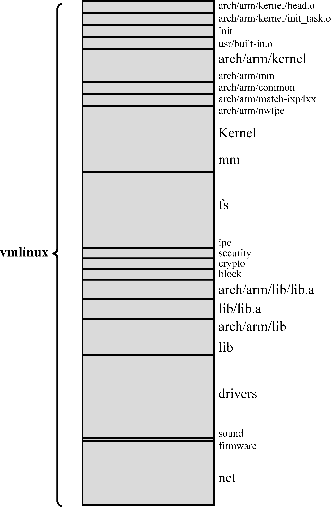

### 4.2.4　内核镜像的组成部分

从代码清单4-2可知 `vmlinux` 镜像是由多个二进制镜像组合生成的。现在，理解其中每个成员的作用并不重要。重要的是理解这个内核镜像的顶层结构，看它是由哪些成员组成的。在代码清单4-2中，链接命令第一行指定了输出文件（-o vmlinux）。第二行指定了链接器脚本文件（-T vmlinux.lds），这个文件详细规定了如何链接生成内核二进制镜像<a class="my_markdown" href="['#anchor049']">[9]</a>。

<a class="my_markdown" href="['#ac049']">[9]</a>　链接器脚本文件使用特殊的语法。详细信息可以从GNU链接器的相关文档中获得。

代码清单4-2中从第三行开始指定了多个对象模块，是它们组成了最终的二进制镜像。注意其中指定的第一个对象为 `head.o` 。此对象是由.../arch/arm/kernel/head.S文件汇编生成的，这是一个与具体架构相关的，用汇编语言编写的源文件，用于完成非常底层的内核初始化。如果你想寻找内核执行的第一行代码，从这个文件开始搜索是很明智的，因为，经过这个链接阶段， `head.o` 会最终成为内核镜像的第一部分。我们会在第5章详细考察内核的初始化过程。

接下来的对象 `init_task.o` ，用于建立内核所需的初始的线程和进程结构。在这个对象之后，是很多对象模块的集合，而且每个模块都有个共同的名字： `built-in.o` 。然而，你会注意到这些 `built-in.o` 对象是由内核源码树的不同部分编译生成的， `built-in.o` 对象名之前的不同文件路径说明了这一点。内核镜像中会包含这些二进制对象。一幅示意图也许会更清楚地说明这里描述的内容。

图4-1显示了 `vmlinux` 镜像是由哪些二进制对象所组成的。它包含了链接阶段的每一行所包含的内容。考虑到空间有限，图中各个部分的大小并不成比例，但依然可以看出这些成员之间的相对大小。有些成员很小。比如，sound和firmware都各只占8 B，因为它们是空的对象文件。（sound被编译成模块，而且这次构建中不包含firmware。）

也许你并不会感到惊讶，3个最大的二进制成员分别是由文件系统代码、网络代码和内置设备驱动程序代码编译生成的。如果你将内核代码和架构相关内核代码编译出的对象放在一起，它们合起来就成为了第二大二进制组件。这个成员中包含了调度器、进程及线程管理、定时器管理和其他核心的内核功能。当然，内核也会包含一些与具体架构相关的功能，比如底层的上下文切换、硬件层中断和定时器的处理、处理器异常的处理等。这些内容在.../arch/arm/kernel中可以找到。

需要牢记的是，我们是在分析一个具体的内核构建的例子。在这个特定的例子中，我们构建了一个具体针对ARM XScale架构的内核，更确切地说，是针对ADI Engineering公司参考板上的英特尔IXP425网络处理器。我们可以看到，在图4-1中，与具体机器相关的二进制成员是arch/arm/mach-ixp4xx。内核镜像中包含了与具体架构相关的部分，这个部分是由架构和机器类型（处理器/参考板）决定的，类型不同，生成的二进制成员就不同，从而最终的 `vmlinux` 镜像的组成也会略有差别。明白了一个例子后，其他架构的情况就很容易理解了。

<b class="my_markdown">图4-1　 `vmlinux` 镜像的组成成员</b>

为了帮助你理解内核源码树的功能划分，表4-1列出了图4-1中的每个成员，并描述了组成 `vmlinux` 镜像的每个二进制组件。

表4-1　 `vmlinux` 镜像的成员

| 成员 | 描述 |
| :-----  | :-----  | :-----  | :-----  |
| `arch/arm/kernel/head.o` | 内核中与具体架构相关的启动代码 |
| `arch/arm/kernel/init_task.o` | 内核所需的初始的线程和任务结构体 |
| `init/built-in.o` | 主要的内核初始化代码，请参考第5章 |
| `usr/built-in.o` | 内置的 `initramfs` 镜像，请参考第6章 |
| `arch/arm/kernel/built-in.o` | 与具体架构相关的内核代码 |
| `arch/arm/mm/built-in.o` | 与具体架构相关的内存管理代码 |
| `arch/arm/common/built-in.o` | 与具体架构相关的通用代码，因架构而异 |
| `arch/arm/mach-ixp4xx/built-in.o` | 与具体机器相关的代码，主要用于初始化 |
| `arch/arm/nwfpe/built-in.o` | 与具体架构相关的浮点运算模拟（floating-point emulation）代码 |
| `kernel/built-in.o` | 内核自身的通用部分 |
| `mm/built-in.o` | 内存管理代码的通用部分 |
| `fs/built-in.o` | 文件系统代码 |
| `ipc/built-in.o` | 进程间通信，比如SysV IPC |
| `security/built-in.o` | Linux安全组件 |
| `crypto/built-in.o` | 加密API |
| `block/built-in.o` | 内核块设备层的核心代码 |
| `arch/arm/lib/lib.a` | 与具体架构相关的通用程序库，因架构而异 |
| `lib/lib.a` | 通用的内核辅助函数 |
| `arch/arm/lib/built-in.o` | 与具体架构相关的辅助函数 |
| `lib/built-in.o` | 通用的程序库函数 |
| `drivers/built-in.o` | 所有的内置驱动，不包含可加载的模块 |
| `sound/built-in.o` | 声音驱动 |
| `firmware/built-in.o` | 驱动固件对象 |
| `net/built-in.o` | Linux网络 |
| `.tmp_kallsyms2.o` | 内核符号表 |

当我们谈论内核主体时，指的就是vmlinux镜像文件（处于顶层内核源码目录中）。正如前面所说的，很少有平台直接使用它来引导系统。主要是因为我们引导系统所使用的镜像一般都是经过压缩的，引导加载程序至少要能够解压这个镜像。很多平台都需要不同类型的接入点以便实现代码解压。我们会在第5章中了解到，对于不同的架构、机器类型、引导加载程序和引导需求，这个镜像文件会有不同的组成方式。

