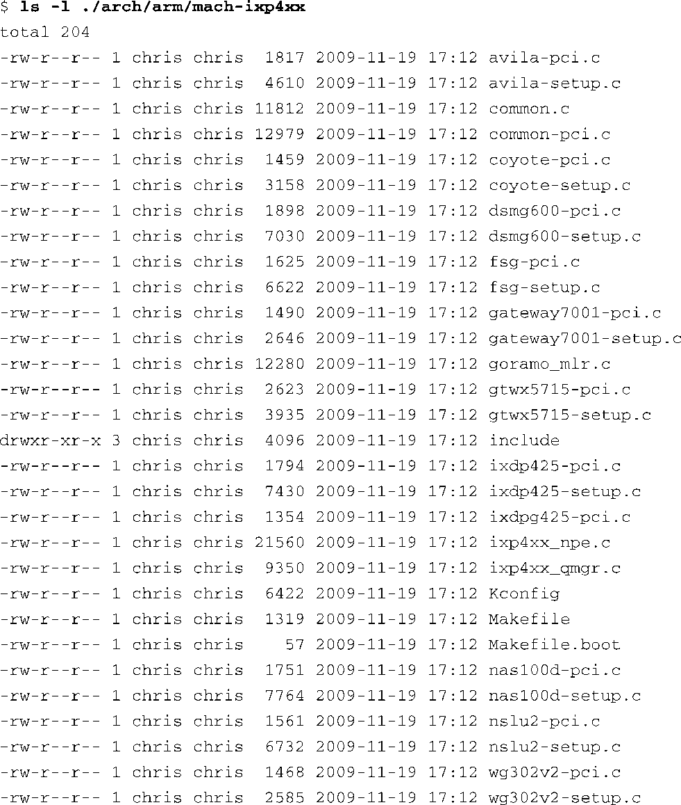

### 4.2.5　子目录的布局

现在，你已经知道了内核镜像的组成部分，让我们来看一个具有代表性的内核子目录。代码清单4-3中显示了mach-ix-p4xx子目录的详细内容。这个子目录处于内核源码树的.../arch/arm分支中，而此分支包含了与ARM架构相关的代码。

代码清单4-3　内核子目录

代码清单4-3显示的目录内容中，有两个文件很常见，可以在很多内核子目录中看到，它们是Makefile和Kconfig。这两个文件推动内核的配置和构建过程。让我们看看它们是如何工作的。

