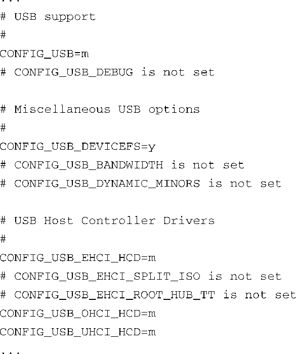

### 4.3.1　.config文件

我们在前面介绍过，.config文件用于构建Linux内核镜像的配置蓝图。在一个Linux项目初期，你很可能会花费大量精力来创建适于你的嵌入式平台的配置。有几种编辑器，既有基于文本的，也有基于图形界面的，专门用于编辑内核配置文件。使用这些编辑器生成的配置会被写入到一个名为.config的配置文件中，这个文件位于顶层Linux源码目录，并用于内核构建。

你也许已经花了大量的时间来完善内核配置，因此，保护好配置文件很重要。有几个 `make` 命令会删除配置文件而不给出任何警告。最常见的就是 `make distclean` 。这个 `make` 目标的设计初衷是让内核源码树回到原始的、未配置的状态。这包括删除源码树中所有的配置数据，当然也会删除原先的.config文件。

你也许知道，在Linux文件系统中，如果一个文件的文件名以点号（.）开头，那么它就是一个隐藏文件。不幸的是，.config这么重要的文件是个隐藏文件，这让很多开发者尝尽了苦头。如果你在没有备份.config文件的情况下就执行 `make distclean` 或 `make mrproper` 命令，你就会体会到我们的痛苦。（已经提醒过你了——记得备份.config文件！）

.config文件是一组格式定义简单的文件。代码清单4-4显示了一个.config文件的片段，这个文件来自最近的Linux内核版本。

代码清单4-4　Linux 2.6内核的.config文件片段

要理解.config文件，你需要理解Linux内核的一个重要特征。Linux采用单体（monolithic）内核结构。也就是说，整个内核是由代码编译并静态链接生成的，是一个单一的可执行文件。然而，也可以编译一组源码文件，并通过增量链接<a class="my_markdown" href="['#anchor0411']">[11]</a>的方式生成一个对象模块，它可以动态加载到运行的内核中。内核一般通过这种方式来支持大多数常见的设备驱动程序。在Linux中，它们被称为可加载模块，也常被统称为设备驱动程序。当内核启动完成后，可以使用特定应用程序将可加载模块动态安装到运行的内核中。

<a class="my_markdown" href="['#ac0411']">[11]</a>　增量式链接技术用于生成一个对象模块，目的是将它再次链接到另一个对象中。这样的话，在增量式链接之后，未解析的符号保持原样，不会产生错误信息——这些符号将在下一个链接阶段得到解析。

掌握了这些知识后，我们再回头看一下代码清单4-4。这个配置文件（.config）片段中显示了关于USB子系统的配置。第一个配置选项， `CONFIG_USB=m` ，说明这个内核配置中包含了USB子系统，并且它会被编译成一个可动态加载的模块（ `=m` ）。当内核启动完成后，我们可以使用工具加载它。这个选项的另一个值是 `=y` ，在这种情况下，USB模块会被编译和静态链接到内核镜像中，成为它的一部分。在这种情况下，USB子系统会被最终编译到.../drivers/built-in.o中，这是个复合二进制对象，代码清单4-2和图4-1中都可以看到它。细心的读者会发现，如果一个设备驱动程序被配置成可加载的模块，它的代码不会被编译到内核主体中，而是被编译成一个独立的可加载的模块，并在内核启动完成后被安装到运行的内核中。

注意代码清单4-4中的 `CONFIG_USB_DEVICEFS=y` 声明。这个配置选项所表示的含义稍有不同。在这种情况下， `USB_DEVICEFS` （配置选项一般采用这种缩写方式）并不代表一个独立的模块，而是指一个可以在USB驱动中启用或禁止的特性。这个选项并不一定会合成被编译到内核主体中（ `=y` ）的模块。相反，它能启用一个或多个特性，这些特性作为额外的对象模块被编译到USB设备驱动程序这个总的模块中。通常，通过配置编辑器中的帮助文本，或是配置编辑器中显示的配置选项之间的层次结构，我们可以更清楚地看出这种差别。

