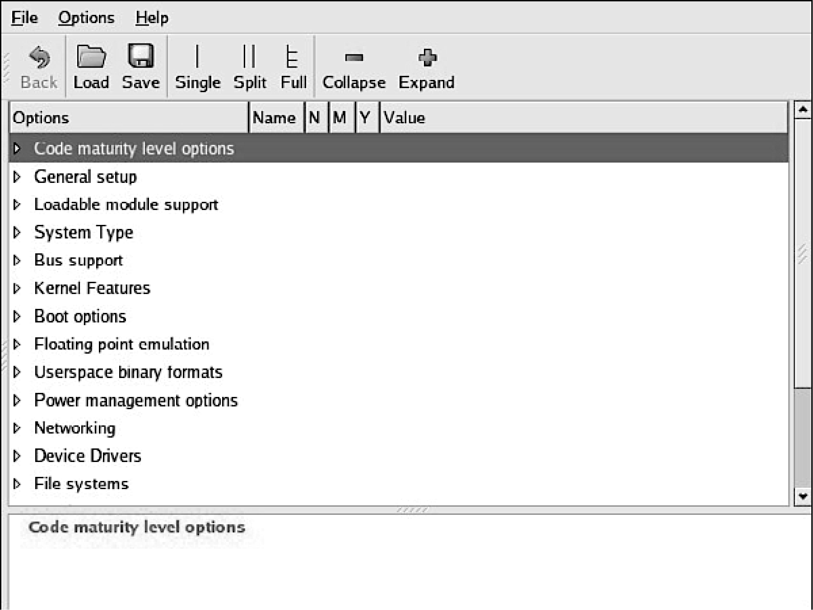
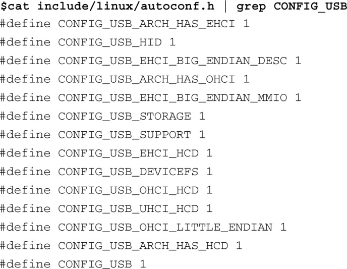

### 4.3.2　配置编辑器

早期的内核使用一种简单的、基于命令行的脚本来配置内核。这种方法很麻烦，即使对于早期的内核也是这样，那时配置参数比现在少很多。如今，内核仍然支持这种命令行式的配置方法，但使用起来不方便，至少是很繁琐。使用这种方式配置一个最近的内核，你需要在命令行中回答超过900个问题。对于脚本中的每个问题，你都需要输入你的选择，并按回车。更糟糕的是，如果你犯一个错误，就不能备份配置；你必须从头开始。如果你在第899个问题上犯了错误，这就太让人沮丧了。

在某些情况下，如在一个没有图形显示的嵌入式系统上构建内核，使用命令行方式的配置工具不可避免，但本书作者会竭尽全力找个方法避开它。

内核配置子系统包含几个配置目标，用于 `make` 命令。实际上，最新的内核版本包含了11个这样的配置目标。我们在这里一一列出，并概述其作用，其中的文本说明来自命令 `make`  `help` 的输出信息：

+ config——使用基于命令行的程序来更新当前配置；
+ menuconfig——使用基于菜单的程序来更新当前配置；
+ xconfig——使用基于QT的前端更新当前配置；
+ gconfig——使用基于GTK的前端更新当前配置；
+ oldconfig ——以现有的.config文件为基础来更新当前配置；
+ silentoldconfig ——与oldconfig相同，但不输出任何信息；
+ randconfig ——创建新的配置文件，其中包括所有配置选项的随机答案；
+ defconfig——创建新的配置文件，其中包括所有配置选项的默认答案；
+ allmodconfig——创建新的配置文件，尽可能地将选项配置成模块；
+ allyesconfig——创建新的配置文件，将所有选项配置成yes；
+ allnoconfig——创建新的配置文件，将所有选项配置成no，即最小化的配置。

这些配置目标都位于makefile文件中，由make命令使用。开始的4个配置目标会启动一种配置编辑器程序，如前所述。由于篇幅的原因，在本章及后续章节，我们将讨论重点放在基于GTK的前端图形界面程序上。你也可以使用其他的配置编辑器达到同样的效果。

在命令行中，进入顶层内核目录<a class="my_markdown" href="['#anchor0412']">[12]</a>，并输入命令make gconfig，你就可以启动这个配置编辑器。图4-2显示了gconfig运行时展现在开发者面前的顶层配置菜单。从这里开始，你可以访问每个可用的配置参数，并生成一个定制的内核配置。

<b class="my_markdown">图4-2　顶层内核配置</b>

<a class="my_markdown" href="['#ac0412']">[12]</a>　我们前面说过，你可以任选一个配置编辑器，比如make xconfig或make menuconfig。

当你退出配置编辑器时，它会提示你是否保存修改。如果选择保存修改，全局配置文件.config就会被更新（如果不存在，则会被创建）。我们在前面介绍过，顶层makefile会使用这个.config文件来构建内核。

大多数内核软件模块也通过.config文件间接地读取配置内容，原理如下。在构建过程中，构建系统会处理这个.config文件，并生成一个名为autoconf.h的C语言头文件，放在目录.../include/linux中，这个文件是自动生成的。尽量不要直接修改这个文件，因为当配置有变动并且新的构建开始后，你所做的修改就丢失了。很多内核源文件直接使用预处理指令 `#include` 来包含这个文件。代码清单4-5显示了这个头文件中与USB相关的一部分内容。内核构建文件在每条内核编译命令行中都包含了这个autoconf.h文件，具体是使用了编译命令gcc的 `-include` 选项，如下所示：

各个内核模块就是通过这种方式来访问内核配置的。

代码清单4-5　Linux autoconf.h

如果你还没有尝试过的话，不妨进入顶层源码目录，执行命令make gconfig，并尝试使用这个配置工具，从中了解Linux开发人员用到的大量配置选项。只要不保存所做的修改，当你退出配置编辑器时，这些修改就会丢失，所以你可以随意研究，而不用担心这会修改你的内核配置<a class="my_markdown" href="['#anchor0413']">[13]</a>。很多配置参数都包含了有用的说明文本，可以增强你对各种配置选项的理解。

<a class="my_markdown" href="['#ac0413']">[13]</a>　不过，最好还是先备份一下原来的.config文件。

