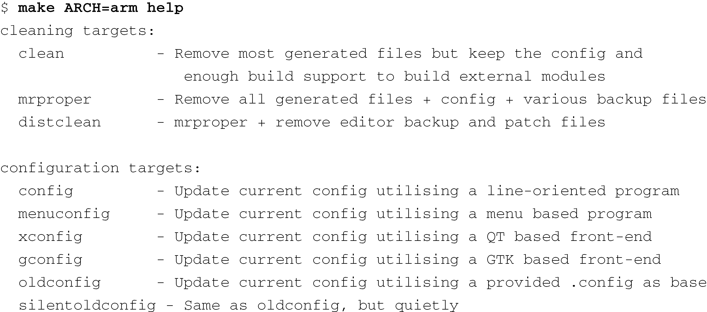
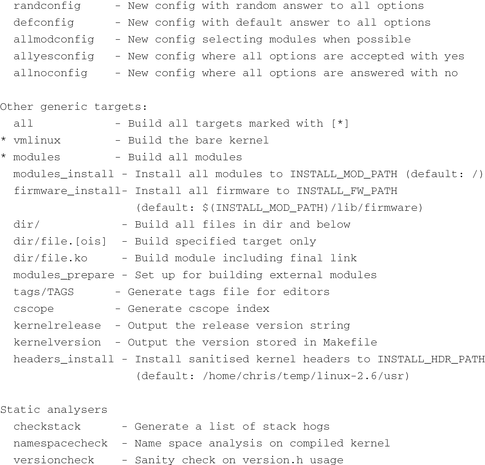
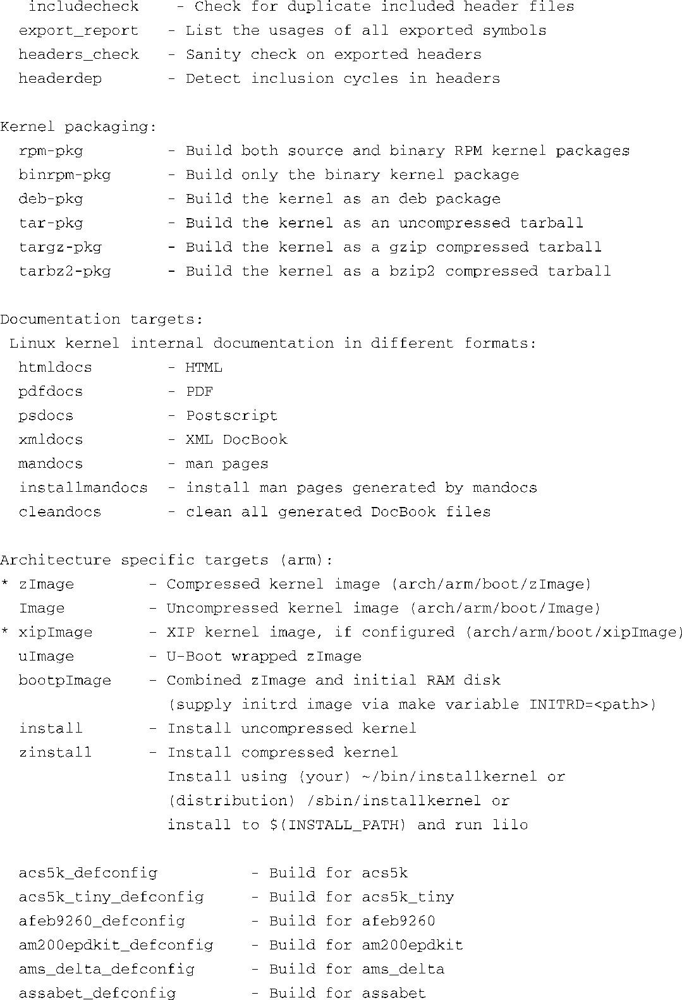
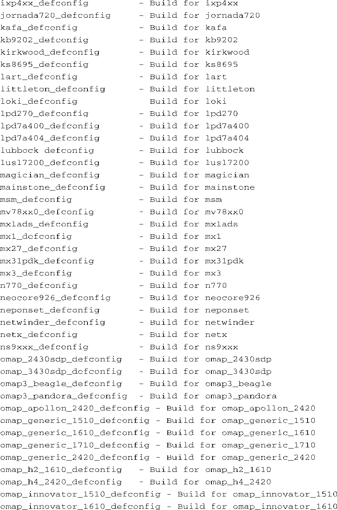
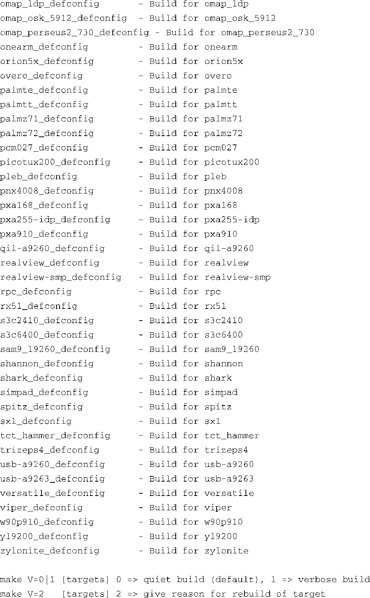
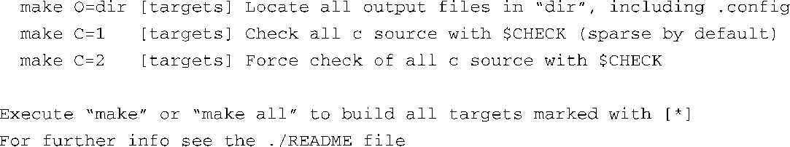

### 4.3.3　Makefile目标

在顶层Linux源码目录中输入命令 `make help` ，它会显示一长串从源码树中生成的目标列表。最常见的使用 `make` 的方式是不指定目标。在这种情况下，它会生成内核ELF文件vmlinux和针对所选架构的默认二进制镜像（例如，x86架构的 `bzImage` ）。使用 `make` 时，如果不指定目标，它也会编译所有由配置文件指定的设备驱动程序模块（内核可加载模块）。

很多架构和机器类型都需要一个二进制镜像目标，而这个目标与具体使用的架构和引导加载程序有关。比较常见的这类目标是 `zImage` 。对于很多架构来说，这就是默认的二进制镜像目标，可以被加载到目标嵌入式系统中并运行。新手常犯的一个错误就是将 `bzImage` 指定为 `make` 的目标。然而， `bzImage` 目标是针对x86/PC架构的。有一个常见的错误观点，认为 `bzImage` 是指经过压缩工具bzip2压缩过的镜像，其实不然， `bzImage` 是指大（big）的 `zImage` 。在这里，我们不打算讨论老式PC架构的具体细节，你只要知道bzImage只适用于PC兼容机就足够了，这些机器中包含了工业标准的PC型BIOS。

代码清单4-6中显示了在最新的Linux内核代码中执行make help时的输出信息。从这个代码清单可以看出，有很多目标可以使用。代码清单中列出了每个目标，并简要介绍了作用。需要特别注意的是，即使是 `help` 目标（在执行命令 `make help` 时，我们指定了 `help` 为 `make` 的目标）也是与具体架构相关的。如果你在执行make help时指定了不同的架构，其输出的代码清单也会不同。代码清单4-6显示了指定ARM架构时的输出信息，你可以从命令行中看到如何指定这个架构。

代码清单4-6　Makefile目标

这里列出的目标中可能有许多你永远都用不上。然而，知道有这些目标存在是有好处的。在代码清单4-6中，目标前有个星号（ `*` ），表示此目标会默认构建。同样注意一下代码清单中很多以 `_defconfig` 结尾的目标（ `*_defconfig` ），它们都代表了默认配置。回想一下，在4.2.2节中，我们预先配置原始内核源码树时所使用的命令：执行 `make` 命令，并同时指定架构和默认配置。那里使用的默认配置是ixp4xx_defconfig，而我们可以在上面的代码清单中找到这个ARM目标。如果你想找到针对某个内核版本和架构的所有默认配置，这是个不错的方法。

