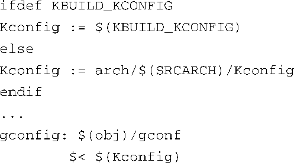
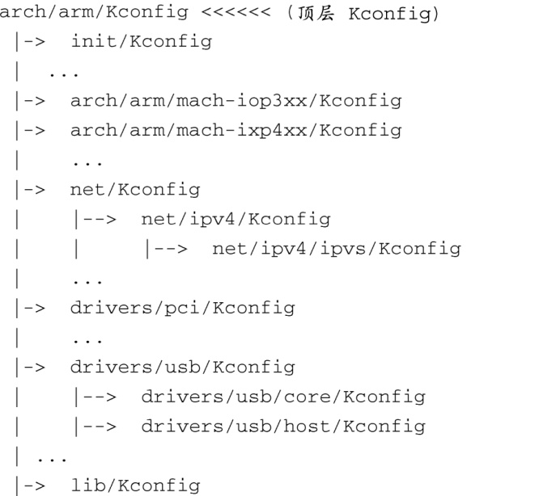
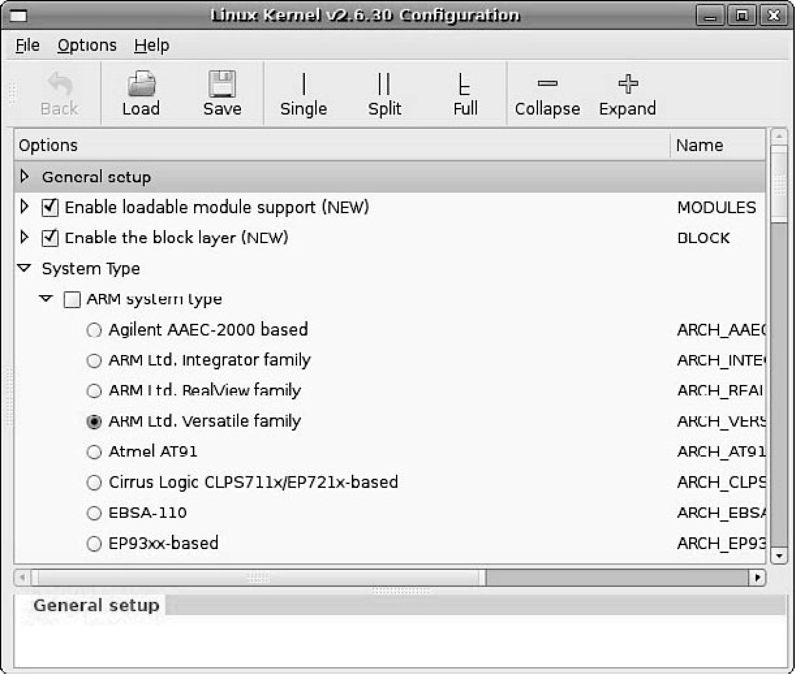

### 4.4　内核配置

差不多有300个内核子目录都包含了名为Kconfig（或者是个带扩展名的类似名称，比如Kconfig.ext）的文件。这个文件用于配置其所在目录的源码的特性。Kconfig中的每个配置参数都有附带的帮助文本，配置子系统会解析Kconifg的内容，并提示用户做出配置选择。

配置工具（比如前面介绍的gconf）会读取各个子目录中的Kconfig文件，首先读取的是arch子目录中的Kconfig文件。它是在Kconfig的makfile<a class="my_markdown" href="['#anchor0414']">[14]</a>中读取的，这个makefile包含了与下列内容类似的相关条目：

<a class="my_markdown" href="['#ac0414']">[14]</a>　这个makefile文件位于内核源码树中，具体路径位为.../scripts/kconfig/Makefile。——译者注

根据你选择的具体架构，gconf会读取该架构对应的Kconfig文件，并将其内容作为顶层配置定义。Kconfig文件中包含了很多类似这样的指令行：

这条指令告诉配置编辑器，从内核源码树的其他位置读取另一个Kconfig文件。每种架构都包含很多这样的Kconfig文件；这些Kconfig组合起来成为一个完整的配置集合，当用户配置内核时，配置集合会以菜单的形式展现在用户面前。每个Kconfig文件都可以随意指定处于源码树其他位置的Kconfig文件。配置工具——这里是gconf——会递归读取所有这些链接在一起的Kconfig文件，并相应地构造出配置时所用的菜单结构。

代码清单4-7是一个树状结构视图，其中列出了与ARM架构相关的部分Kconfig文件。这个例子使用了最新的Linux 2.6源码树，其内核配置是由473个不同的Kconfig文件定义的。为了节省篇幅和表达清晰，代码清单中省略了其中大多数文件，目的是显示出整体的结构。如果将它们全部列出，需要占用好几页纸。

代码清单4-7　针对ARM架构的部分Kconfig文件

看一下代码清单4-7，.../arch/arm/Kconfig这个文件会包含像这样的一行：

net/Kconfig文件会包含像这样的一行：

还可以看到其他诸如此类的情况。

正如我们在前面所提到的，这些Kconfig文件组合在一起决定了配置的菜单结构和配置选项，当用户配置内核时会看到它们。图4-3显示了一个使用配置工具（gconf）的例子，其中配置的内核是针对ARM架构的。

<b class="my_markdown">图4-3　使用gconf 配置内核时的屏幕显示</b>

