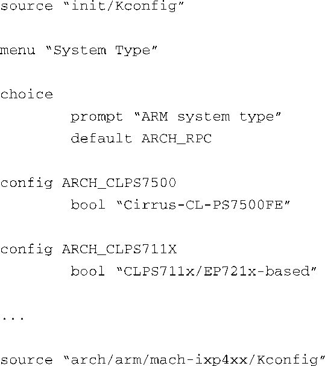
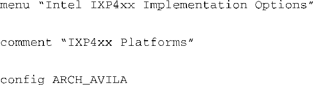
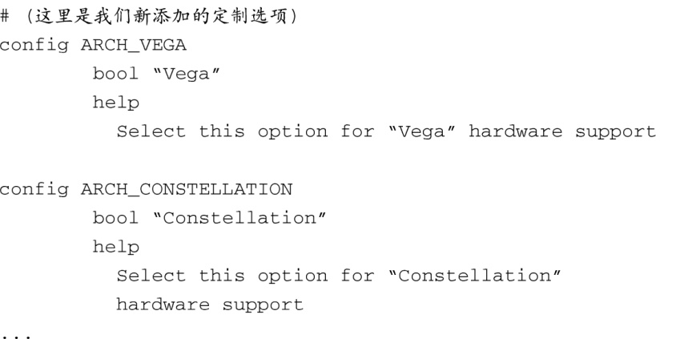
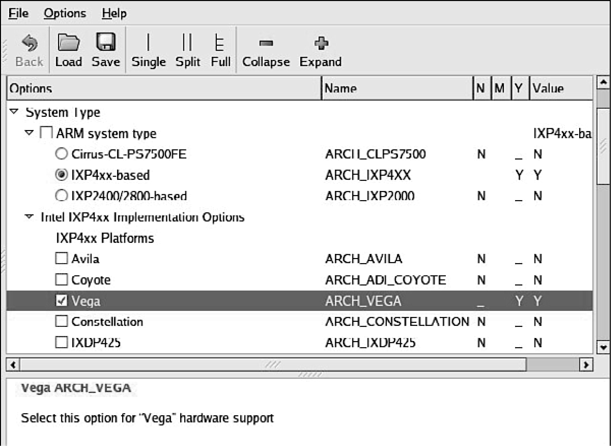
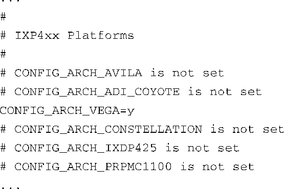

### 4.4.1　定制配置选项

很多嵌入式开发人员都需要在Linux内核中添加一些特性，以支持特别的定制硬件。使用我们刚刚介绍的配置管理系统，可以更方便地定制和添加特性。快速地浏览一个典型的Kconfig文件，就可以从中看出配置脚本语言的结构。举例来说，假设你有两个硬件平台，它们都基于IXP425网络处理器，你的工程团队分别称呼它们为Vega和Constellation。每块板卡上都有特定的硬件设备，而这些设备必须在内核引导早期得到初始化。让我们看看添加这些配置选项是多么容易，而后在内核配置时，开发者会看到这些新添加的选项。代码清单4-8显示了ARM架构的顶层Kconfig文件的一个片段。

代码清单4-8　.../arch/arm/Kconfig的一个片段

在这个Kconfig文件片段中，可以看到这里定义了一个名为System Type的菜单项。在ARM system type提示之后有一系列与ARM架构相关的选择项。文件的最后通过 `source` 指令包含了具体与IXP4xx相关的一些Kconfig定义。你可以在arch/arm/mach-ixp4xx/Kconfig中添加定制的配置开关。代码清单4-9显示了后面这个文件的一个片段。同样，为了提高可读性，同时也为了方便，我们省略了不相关的内容，用省略号表示。

代码清单4-9　.../arch/arm/mach-ixp4xx/Kconfig的一个片段

图4-4显示了运行gconf工具时（通过命令 `make ARCH=arm gconfig` ）所看到的修改结果。做了这些简单的修改之后，配置编辑器现在就包含了针对新的硬件平台的两个选项<a class="my_markdown" href="['#anchor0415']">[15]</a>。过一会儿，你就会了解到如何在源码树中使用这些配置信息，从而有条件地选择那些支持新板卡的对象。

<b class="my_markdown">图4-4　定制配置选项</b>

<a class="my_markdown" href="['#ac0415']">[15]</a>　为了让图片能够适合纸张的大小，我们去除了很多ARM system type和Intel IXP4xx Implementation Options下的选项。

在配置编辑器（在这个例子中是gconf）运行起来后，如果你选择支持两个定制硬件平台中的一个，那么.config文件中就会包含对应这些新选项的宏定义。同所有的内核配置选项一样，每个宏定义都是以CONFIG_开头，以表示这是个内核配置选项。结果是.config文件中定义了两个新的配置选项，并记录了它们的状态。代码清单4-10中显示了新的.config文件，其中包含了新添加的配置选项。

代码清单4-10　定制的 .config文件的一个片段

注意一下与Vega和Constellation硬件平台相关的两个新配置选项。如图4-4所示，选择支持Vega，在.config文件中，可以看到一个新的 `CONFIG_` 选项（ `CONFIG_ARCH_VEGA` ）被选中，它代表Vega板，并且它的值被设置为y。同样也注意到，文件中还有一个与Constellation相关的 `CONFIG_` 选项，但它未被选中。

