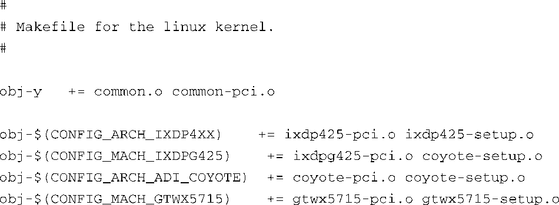

### 4.4.2　内核Makefile

在构建内核时，makefile会扫描配置文件，并根据其内容决定需要进入哪些目录和编译哪些源文件。在前面的例子中，我们想对两个定制硬件平台（Vega和Constellation）添加支持，为了完成这个任务，我们来看一下相关的makefile，它会读取配置文件并根据其中的定制选项而采取行动。

因为在这个例子中你是在处理与硬件相关的选项，现假设有两个硬件设置模块，分别称为vega_setup.c和constellation_setup.c，代表了两块定制硬件板。我们已经将这两个C源文件放在了内核源码树的.../arch/arm/mach-ixp4xx子目录中。代码清单4-11显示了这个目录中的makefile的完整内容，这个makefile来自一个最新的内核版本。

代码清单4-11　.../arch/arm/mach-ixp4xx内核子目录中的Makefile

这个makefile之简单也许会让你感到惊讶。而仅仅为此，内核构建系统的开发人员就已经做了大量的工作。对于只是想在内核中为定制硬件添加支持的普通开发人员，内核构建系统的良好设计让这类定制工作很容易<a class="my_markdown" href="['#anchor0416']">[16]</a>。

<a class="my_markdown" href="['#ac0416']">[16]</a>　实际上，内核构建系统是很复杂的，但这个复杂性被巧妙地隐藏起来了，一般的开发人员不需要关心。

看一下这个makefile，我们的目的是基于配置选项有条件地引入新的硬件设置函数，而我们该如何做到这一点是显而易见的。只需将下面两行加到makefile的末尾就大功告成了：

完成这些步骤后，我们的工作就完成了。我们在内核中简单地添加了一些设置函数，以支持具体的定制的硬件。采用类似方法，你应该能够自行修改内核的配置/构建系统了。

