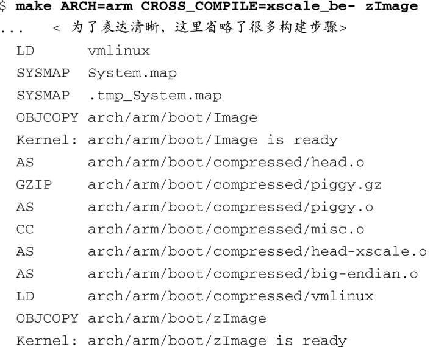
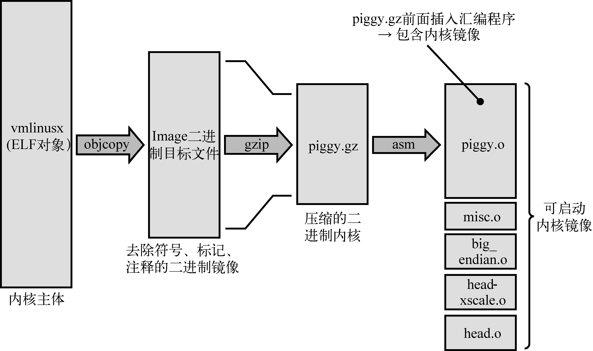

### 5.1　合成内核镜像：Piggy及其他

系统加电时，嵌入式系统中的引导加载程序首先获得处理器的控制权。当它完成一些底层的硬件初始化后，会将控制权转交给Linux内核。在系统的开发阶段，为了方便开发，这个过程可能需要开发人员手动参与（例如，引导加载程序可以与用户交互，提示用户输入加载或引导命令，并按用户的指示继续执行），而当系统开发完成，并投入生产后，这个过程一般是自动完成的。第7章会专门论述这个主题，我们将详细的讨论留到那个章节。

第4章研究了组成Linux内核镜像的成员。回想一下内核的构建过程，不管采用哪种架构，构建时都会生成一些通用文件，其中之一就是名为vmlinux的ELF二进制文件。这个二进制文件就是单体内核（monolithic kernel）本身，我们也称它为内核主体。实际上，当我们在内核的链接阶段研究vmlinux的构成时，我们就指出如何找到内核执行的第一行代码。对于大多数架构来说，这行代码可以在一个名为head.S（或类似的名字）的汇编语言源文件中找到。在内核代码的Power架构（powerpc）分支中，可以找到好几个版本的head.S，这取决于具体的处理器类型。例如，AMCC 440系列处理器使用名为head_4xx.S的文件来完成初始化。

有些架构和引导加载程序可以直接引导vmlinux内核镜像。例如，那些基于Power架构并使用U-Boot引导加载程序的平台通常可以直接引导 `vmlinux` 镜像<a class="my_markdown" href="['#anchor051']">[1]</a>（将其格式从ELF转换成二进制之后，你很快就会看到）。对于其他架构和引导加载程序的组合，可能还需要一些额外的功能来建立合适的上下文，并提供必要的工具以加载和引导内核。

<a class="my_markdown" href="['#ac051']">[1]</a>　除非引导时间很重要，内核镜像几乎都是以压缩的形式存储的。在这种情况下，镜像可能会被称为 `uImage` ，它是一个压缩后的vmlinux文件加上一个U-Boot头部，请参考第7章。

代码清单5-1显示了内核构建过程中的最后一些详细步骤，这次构建采用的硬件平台基于ADI Engineering公司的Coyote参考平台，而这个平台包含英特尔的IXP425网络处理器。代码清单使用了内核构建系统的简洁输出形式，这也是默认的形式。我们在第4章中指出，这些简写符号很有用，帮助我们更容易地发现构建过程中出现的错误和警告。

代码清单5-1　最后的内核构建步骤： ARM/IXP425 (Coyote)

在代码清单5-1的第3行中，构建系统链接生成了 `vmlinux` 镜像（内核主体）。之后，构建系统处理了很多其他对象模块。其中包括 `head.o` 、 `piggy.o` <a class="my_markdown" href="['#anchor052']">[2]</a>以及与具体架构相关的 `head-xscale.o` 等。（代码清单中每行开头的简写符号或标签表明了这一行的具体动作。例如， `AS` 表明构建系统调用了汇编器<a href="#anchor053" id="ac053">[3]</a>， `GZIP` 表明是在进行压缩，等等。）一般来说，这些对象模块都是和具体架构相关的（这个例子中是ARM/XScale），并且包含了一些底层函数，用于在特定架构上引导内核。表5-1详细描述了代码清单5-1中的各个组件。

<a class="my_markdown" href="['#ac052']">[2]</a>　Piggy一开始是用来描述piggyback的，在这里，二进制内核镜像依附到启动加载程序，以生成合成的内核镜像。

<a class="my_markdown" href="['#ac053']">[3]</a>　汇编器的英文是assembler，AS是其简写。 ——译者注

<b class="my_markdown">表5-1　ARM/XScale 底层与具体架构相关的对象</b>

| 组件 | 描述 |
| :-----  | :-----  | :-----  | :-----  |
| `vmlinux` | ELF格式的内核主体，包含符号、注释、调试信息（如果编译时使用了– `g` 选项）和与架构相关的部分 |
| `System.map` | 基于文本的内核符号表，针对 `vmlinux` 模块 |
| `.tmp_System.map` | 生成这个文件只是为了对 `System.map` 进行完好性检查；否则，不会用于最后的构建镜像中 |
| `Image` | 二进制内核模块，去除了符号、标记和注释 |
| `head.o` | 与ARM相关的启动代码，对所有的ARM处理器通用。引导加载程序会将控制权交给这个对象 |
| `piggy.gz` | 经过gzip压缩的Image文件 |
| `piggy.o` | 将文件piggy.gz进行汇编后生成的对象<a class="my_markdown" href="['#anchor054']">[4]</a>，这样它就可以和下一个对象 `misc.o` 链接在一起了 |
| `misc.o` | 其中包含了用于解压内核镜像 `piggy.gz` 的函数，另外，我们在一些架构上常会看到的引导消息“Uncompressing Linux . . .Done”也是由它产生的 |
| `head-xscale.o` | 专门针对XScale处理器家族的处理器初始化 |
| `big-endian.o` | 这是个汇编语言编写的小程序，用于将XScale处理器转换到大端字节序模式 |
| `vmlinux` | 合成内核镜像。遗憾的是，这个名字选的不好，它和内核主体的名字重复了；这两者并不一样，这个二进制镜像是由内核主体和表格中的对象链接生成的。具体请看文中的解释 |
| `zImage` | 最终的合成内核镜像，由引导加载程序加载。请看下文的分析 |

<a class="my_markdown" href="['#ac054']">[4]</a>　piggy.gz包含在arch/arm/boot/compressed/piggy.S汇编语言源文件中，汇编器通过汇编piggy.S来生成 `piggy.o` 。 ——译者注

让我们来看一张示意图，以帮助你理解镜像的结构以及下面要讨论的内容。图5-1显示了镜像的组成成员，以及在内核构建过程中它们如何改变形态，直至最终生成了一个可引导的内核镜像。下面的几节详细描述这些成员和流程。

<b class="my_markdown">图5-1　合成内核镜像的结构</b>

