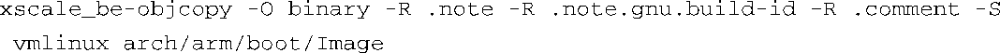

### 5.1.1　 `Image` 对象

当内核ELF文件vmlinux构建成功之后，内核构建系统继续处理表5-1中列出的目标。 `Image` 对象是由 `vmlinux` 对象生成的。去除掉ELF文件vlinnux中的冗余段（标记和注释），并去掉所有可能存在的调试符号，就是Image了。下面这条命令用于该用途：

其中的 `-O` 选项指示 `objcopy` 生成一个二进制文件； `-R` 选项删除ELF文件中的.no- te、.note.gnu.build-id和.comment这3个段； `-S` 选项用于去除调试符号。注意， `objcopy` 以ELF的镜像 `vmlinux` 为输入，生成名为Image的目标二进制文件。总而言之， `Image` 只不过是将内核主体从ELF转换成二进制形式，并去除了调试信息和前面提到的.note*和.comment段。

