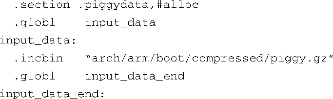

### 5.1.2　与具体架构相关的对象

按照构建次序，接下来会编译很多小模块，包括几个由汇编语言源文件编译的对象（ `head.o` <a class="my_markdown" href="['#anchor055']">[5]</a>、 `head-xscale.o` 等），它们完成底层具体和架构及处理器相关的一些任务。表5-1中概述了这些对象。特别需要注意的是创建 `piggy.o` 对象的流程。首先使用 `gzip` 命令对Image文件（二进制内核镜像）进行压缩：

<a class="my_markdown" href="['#ac055']">[5]</a>　这里的head.o是由arch/arm/boot/compressed/head.S编译而来的，我们前面提到vmlinux的最前面部分也是一个head.o，它是由arch/arm/kernel/head.S编译而来的，两者有所不同。 ——译者注

这个命令创建了一个名为piggy.gz的新文件，它只不过是二进制内核镜像Image的压缩版。图5-1以图形的方式生动地显示了这个过程。接下来发生的事情相当有趣。这时，汇编器汇编名为piggy.S的汇编语言文件，而这个文件中包含了一个对压缩文件piggy.gz的引用。从本质上说，二进制内核镜像以负载的形式依附在了一个底层的启动加载程序（bootstrap loader）<a class="my_markdown" href="['#anchor056']">[6]</a>之上，采用汇编语言编写的。启动加载程序先初始化处理器和必需的内存区域，然后解压二进制内核镜像（piggy.gz），并将解压后的内核镜像（Image）加载到系统内存的合适位置，最后将控制权转交给它。代码清单5-2显示了汇编语言源文件.../arch/arm/boot/compressed/piggy.S的完整内容。

代码清单5-2　汇编文件 piggy.S

<a class="my_markdown" href="['#ac056']">[6]</a>　注意不要将它与引导加载程序（bootloader）混淆，可以将启动加载程序看做是第2阶段的加载程序，而将引导加载程序本身看做是第1阶段的加载程序。

这个汇编语言源文件虽然很简短，但其中包含了不易被发现的复杂内容。汇编器汇编这个文件并生成一个ELF格式的镜像piggy.o，该镜像包含一个名为.piggydata的段，这个文件的作用是将压缩后的二进制内核镜像（piggy.gz）放到这个段中，成为其内容。该文件通过汇编器的预处理指令 `.incbin` 将piggy.gz包含进来， `.incbin` 类似于C语言中的 `#include` 文件指令，只不过它包含的是二进制数据。总之，该汇编语言文件的作用是将压缩的二进制内核镜像（ `piggy.gz` ）放进另一个镜像<a class="my_markdown" href="['#anchor057']">[7]</a>（ `piggy.o` ）中。注意文件中的两个标签——input_data和input_data_end。启动加载程序利用它们来确定包含的内核镜像的边界。

<a class="my_markdown" href="['#ac057']">[7]</a>　原文中说放在启动加载程序中，其实是放在了piggy.o中。——译者注

